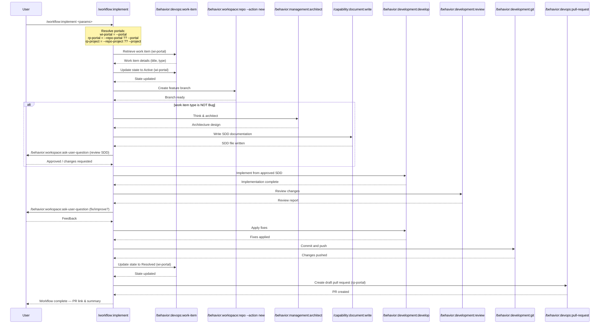

## PURPOSE

Execute a complete implementation workflow that orchestrates multiple development commands in sequence. This generic, reusable workflow enables developers to implement work items following consistent patterns from requirements retrieval through pull request creation.

## PORTAL RESOLUTION

Before executing any phase, resolve the effective portals:

- **Work item portal** (`wi-portal`): always `--portal`. Used for work item read/update operations.
- **Repo portal** (`rp-portal`): `--repo-portal` if provided, otherwise falls back to `--portal`.
- **Repo project** (`rp-project`): `--repo-project` if provided, otherwise falls back to `--project`.

This separation supports transition scenarios where work items live in one portal (e.g., Azure DevOps) while the code repository is hosted on another (e.g., GitHub).

## WORKFLOW PHASES

1. **Retrieve Work Item**: Fetch work item details and requirements

   - Call `/behavior:devops:work-item --work-item <work-item> --portal <wi-portal> --project <project>`
   - Obtain title, description, type (Bug or other), and acceptance criteria
   - Pass retrieved context to implementation phase
   - **MANDATORY** Work item description must not be empty
   - Change work item state to **Active** via `/behavior:devops:work-item --work-item <work-item> --portal <wi-portal> --project <project> --action update --state Active`

2. **Create Feature Branch**: Setup feature branch from target branch

   - Call `/behavior:workspace:repo --action new --repo <repo> --target-branch <target-branch> --branch <working-branch>`
   - Verify branch is ready for code changes and target branch is up to date

3. **Think & Architect**: Analyze requirements and design the solution

   - **SKIP this phase if work item type is Bug**
   - Call `/behavior:management:architect --description "<description>" --context "<work-item-details>"`
   - Clarify all requirements with the user before proceeding
   - Call `/behavior:workspace:ask-user-question --question "<clarifying question about requirements>"`
   - Produce a concise architecture design covering only what is relevant to the feature
   - **MANDATORY** All open questions must be resolved before proceeding to documentation

4. **Write Documentation**: Produce the SDD documentation from the architecture design

   - **SKIP this phase if work item type is Bug**
   - Call `/capability:document:write --context "<architecture-output>" --output local`
   - Generate one concise Specification Driven Design (SDD) document for the feature
   - **MANDATORY** Documentation must be written to file before user approval phase

5. **Wait User Approval**: Wait for the user to review and make changes to the SDD documentation

   - **SKIP this phase if work item type is Bug**
   - Call `/behavior:workspace:ask-user-question --question "Please review the SDD documentation and confirm to proceed or describe changes needed"`

6. **Implement Feature**: Execute development based on approved SDD documentation or description

   - Call `/behavior:development:develop --repo <repo> --branch <working-branch> --task "<description>"`
   - Implement functionality with comprehensive testing
   - Ensure code follows language-specific standards

7. **Review Changes**: Review all developed changes

   - Call `/behavior:development:review --repo <repo> --branch <working-branch>`
   - Call `/behavior:workspace:ask-user-question --question "What would you like to fix or improve?" --options "Continue as-is; Describe fixes needed"`
   - Call `/behavior:development:develop --repo <repo> --branch <working-branch> --task "Fix review issues"`

8. **Commit and Push**: Stage, commit, and push all changes

   - Call `/behavior:development:git --repo <repo> --branch <working-branch> --action commit-push --message "feat: <description> [#<work-item>]"`
   - Push changes to remote origin
   - Change work item state to **Resolved** via `/behavior:devops:work-item --work-item <work-item> --portal <wi-portal> --project <project> --action update --state Resolved`

9. **Create Draft Pull Request**: Open pull request

   - Call `/behavior:devops:pull-request --portal <rp-portal> --project <rp-project> --repo <repo> --source-branch <working-branch> --target-branch <target-branch> --work-item <work-item> --draft`
   - Link PR to original work item

## DELEGATION

**MANDATORY**: Always invoke the agents defined in this command's frontmatter for their designated responsibilities. Never skip, replace, or simulate their behavior directly.

- `zzaia-task-clarifier` — Analyze work item requirements and clarify acceptance criteria
- `zzaia-workspace-manager` — Manage feature branch creation and worktree setup
- `zzaia-developer-specialist` — Implement feature based on approved SDD documentation
- `zzaia-tester-specialist` — Validate build quality and test coverage

## WORKFLOW DIAGRAM



## ACCEPTANCE CRITERIA

- Work item details successfully retrieved and passed to implementation phase
- Work item state changed to Active at start of workflow
- Feature branch created from target branch with correct naming
- Think & Architect, Write Documentation, and Wait User Approval phases skipped for Bug type work items
- Implementation executes with full work item context and description
- All code changes committed with conventional format referencing work item
- Work item state changed to Resolved after final commit and push
- Pull request created linking feature branch to target branch with work item reference
- When `--repo-portal` is omitted, `--portal` is used for all operations (backwards compatible)
- When `--repo-portal` is provided, work item operations use `--portal` and repo/PR operations use `--repo-portal`
- Workflow execution provides clear output at each phase with status and results

## EXAMPLES

```
# All operations on Azure DevOps (original behaviour, unchanged)
/workflow:implement --work-item 1605 --portal azure --project my-project --repo order-service --target-branch develop --working-branch feature/implement-providers-entities --description "Implement provider entities following order-service pattern with repository pattern and comprehensive unit tests"

# Work items on Azure DevOps, repo and PR on GitHub (transition scenario)
/workflow:implement --work-item 2249 --portal azure --project my-project --repo bloquo-platform-monorepo --repo-portal github --repo-project my-org --target-branch develop --working-branch feature/BGX-2249-some-feature --description "Implement feature following monorepo conventions"

# All operations on GitHub
/workflow:implement --work-item 1607 --portal github --project my-org/my-project --repo order-service --target-branch main --working-branch feature/fix-authentication-bug --description "Fix authentication token refresh issue and add regression tests"
```

## OUTPUT

- Phase status reports with completion indicators
- Work item details retrieved in phase 1
- Feature branch reference and ready status
- Implementation summary with test results
- Git commit hash and push confirmation
- Pull request URL and link to work item
