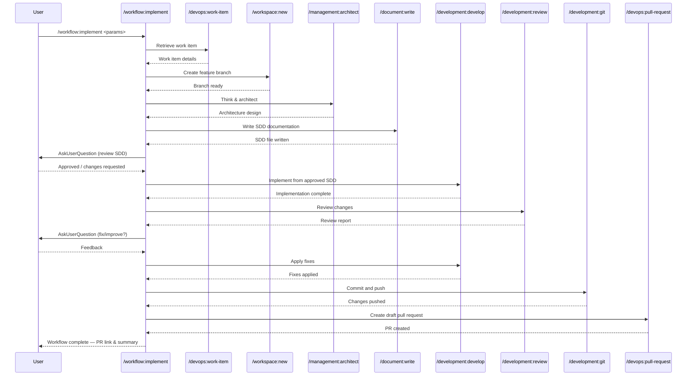

## PURPOSE

Execute a complete implementation workflow that orchestrates multiple development commands in sequence. This generic, reusable workflow enables developers to implement work items following consistent patterns from requirements retrieval through pull request creation.

## WORKFLOW PHASES 

1. **Retrieve Work Item**: Fetch work item details and requirements

   - Call `/devops:work-item` with workitem parameter
   - Obtain title, description, and acceptance criteria
   - Pass retrieved context to implementation phase
   - **MANDATORY**  Must use the work item descriptions and it must not be empty 

2. **Create Feature Branch**: Setup feature branch from target branch

   - Call `/workspace:new` with repository_name, target_branch, new_branch_name parameters
   - Prepare worktree for development
   - Verify branch is ready for code changes
   - Verify that the target branch is updated

3. **Think & Architect**: Analyze requirements and design the solution

   - Call `/management:architect` with branch, work directory, and description parameters
   - Clarify all requirements with the user before going to next phase
   - Use the tool **AskUserQuestion** to inquiry the user for clarifying questions
   - Produce a concise architecture design covering only what is relevant to the feature
   - **MANDATORY** All open questions must be resolved before proceeding to documentation

4. **Write Documentation**: Produce the SDD documentation from the architecture design

   - Call `/document:write` with the architecture output from phase 3 as input
   - Generate one concise Specification Driven Design (SDD) document for the feature
   - **MANDATORY** Documentation must be written to file before user approval phase

5. **Wait User Approval**: Wait for the user to review and make changes to the SDD documentation

   - User should make changes to SDD before next phase
   - Use the tool **AskUserQuestion** to inquiry the user answers

6. **Implement Feature**: Execute development based on SDD documentation

   - Call `/development:develop` in branch_name with approved SDD documentation
   - Implement functionality with comprehensive testing
   - Ensure code follows language-specific standards

7. **Review Changes**: Review all developed changes

   - Call `/development:review` for all developed changes
   - Use the tool **AskUserQuestion** to inquiry the user answers about what to fix or improve
   - Call `/development:develop` to fix or improve the code

8. **Commit and Push**: Stage, commit, and push all changes

   - Call `/development:git` with branch parameter
   - Create conventional commit message referencing work item
   - Push changes to remote origin

9. **Create Draft Pull Request**: Open pull request

   - Call `/devops:pull-request` with source_branch, target_branch, work-item parameters to create a draft pull request
   - Link PR to original work item

## DELEGATION

**MANDATORY**: Always invoke the agents defined in this command's frontmatter for their designated responsibilities. Never skip, replace, or simulate their behavior directly.

- `zzaia-task-clarifier` — Analyze work item requirements and clarify acceptance criteria
- `zzaia-repository-manager` — Manage feature branch creation and worktree setup
- `zzaia-developer-specialist` — Implement feature based on approved SDD documentation
- `zzaia-tester-specialist` — Validate build quality and test coverage

## WORKFLOW DIAGRAM



## ACCEPTANCE CRITERIA

- Work item details successfully retrieved and passed to implementation phase
- Feature branch created from target branch with correct naming
- Implementation executes with full work item context and description
- All code changes committed with conventional format referencing work item
- Pull request created linking feature branch to target branch with work item reference
- workflow execution provides clear output at each phase with status and results

## EXAMPLES

```
/implement workitem=1605 target_branch=develop branch_name=feature/implement-providers-entities description="Implement provider entities following order-service pattern with repository pattern and comprehensive unit tests"

/implement workitem=1606 target_branch=develop branch_name=feature/add-provider-api description="Add provider API endpoints with CRUD operations, validation, and integration tests"

/implement workitem=1607 target_branch=main branch_name=feature/fix-authentication-bug description="Fix authentication token refresh issue and add regression tests"
```

## OUTPUT

- Phase status reports with completion indicators
- Work item details retrieved in phase 1
- Feature branch reference and ready status
- Implementation summary with test results
- Git commit hash and push confirmation
- Pull request URL and link to work item
