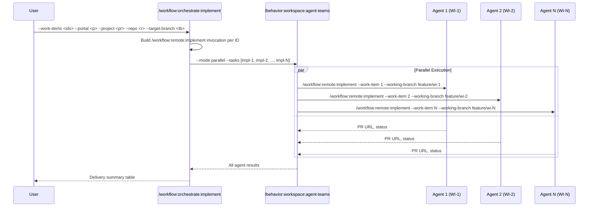

## PURPOSE

Build one `/workflow:remote:implement` invocation per work-item ID and hand the full task list to `/behavior:workspace:agent-teams`. The orchestrator owns only parameter composition and result consolidation — all work-item retrieval, branching, and PR logic live inside `remote:implement`.

## EXECUTION

1. **Compose task list**

   - Split `--work-items` into individual IDs
   - For each ID build the full invocation string:
     ```
     /workflow:remote:implement --work-item <id> --portal <portal> --project <project> --repo <repo> --target-branch <target-branch> --working-branch feature/wi-<id> --description <description>
     ```
   - Collect all strings as the `--tasks` value

2. **Dispatch to agent-teams**

   - Call `/behavior:workspace:agent-teams` with:
     - `--mode parallel` (or `sequential` when `--sequential` flag is provided)
     - `--context` = portal + project + repo + target-branch + description
     - `--tasks` = comma-separated invocation strings from step 1
     - `--description` = "Implement work items [ids] in parallel"

3. **Consolidate results**

   - Collect PR URL and status from each agent
   - Present delivery table: work-item → branch → PR URL → status
   - Report per-item failures without halting other tracks

## DELEGATION

**MANDATORY**: Invoke the agents defined in frontmatter for their designated responsibilities.

- `zzaia-devops-specialist` — Manage PR operations and DevOps interactions within each parallel track
- `zzaia-developer-specialist` — Execute `/workflow:remote:implement` for each assigned work item

## WORKFLOW DIAGRAM



## ACCEPTANCE CRITERIA

- Task list built without any work-item pre-retrieval — all parameters come from user input
- Each task string is a complete, self-contained `/workflow:remote:implement` invocation
- `--working-branch` derived as `feature/wi-<id>` per item
- `--sequential` flag switches agent-teams mode from parallel to sequential
- Consolidated delivery table covers all items with PR URLs and status
- Per-item failures reported without halting other tracks

## EXAMPLES

```
/workflow:orchestrate:implement --work-items 1605,1606,1607 --portal azure --project my-project --repo order-service --target-branch develop --description "Implement provider module features"

/workflow:orchestrate:implement --work-items 1610,1611 --portal github --project my-org/my-project --repo api-gateway --target-branch main --sequential
```

## OUTPUT

- Retrieval summary: count of work items loaded with titles and derived branches
- Parallel execution status report: agent assignments and task dispatch confirmation
- Consolidated delivery table:

| Work Item | Branch | PR URL | Status |
|-----------|--------|--------|--------|
| 1605 | feature/provider-auth | https://... | completed |
| 1606 | feature/provider-config | https://... | completed |
| 1607 | feature/provider-sync | https://... | failed |

- Failure report (if any) with work-item ID and error context
