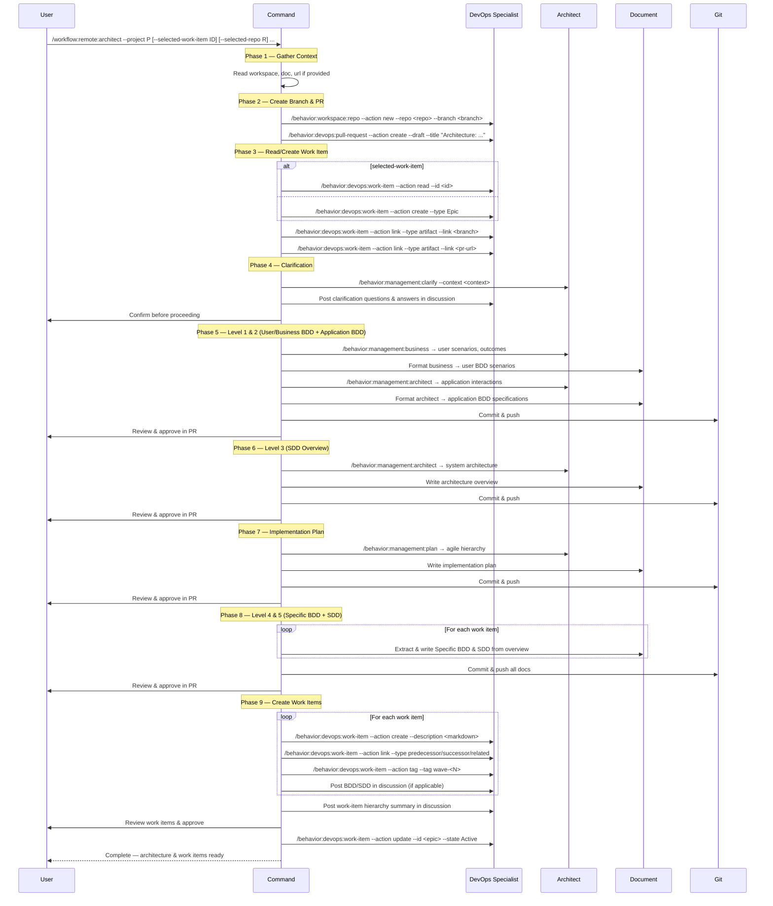

## PURPOSE

Orchestrate architectural documentation and work-item hierarchy creation for a selected work item using Specification Driven Design (SDD). All documentation is committed to a documentation-only branch with pull request review gates at every phase. Decomposes requirements through BDD analysis, architectural design, and agile planning into a parallelizable hierarchy of work items. Enables human and agent collaboration through Azure DevOps discussions and pull request comments, gating every structural change behind user approval.

## WORKFLOW PHASES

### Phase 1 | Gather Repository and Referenced Documentation

1. **Workspace repositories**: If `workspace` is provided, split by `;` and inspect each local path using the `Read` tool for source code, configs, and existing docs
2. **Local documents**: If `doc` is provided, split by `;` and for each path call `/capability:document:read --file <path>` to inject local document context
3. **Online references**: If `url` is provided, split by `;` and for each URL call `/behavior:websearch --query "<url>"` to fetch and inject URL context
4. **Description context**: If `description` is provided, include as additional architectural context
5. Enrich architectural context with all retrieved materials before proceeding

### Phase 2 | Create Selected Branch and Pull Request

1. **If `selected-branch` is provided AND `selected-repo` is provided**:
   - Call `/behavior:workspace:repo --action new --repo <selected-repo> --branch <selected-branch> --source-branch <target-branch|main>` to create the branch
   - Call `/behavior:devops:pull-request --action create --portal azure --project <project> --repo <selected-repo> --source-branch <selected-branch> --target-branch <target-branch|main> --draft --title "Architecture: <feature-description>"` to create the PR
   - Continue to Phase 3

2. **If only `selected-repo` is provided** (no `selected-branch`):
   - Generate branch name in pattern `plan/<feature-description>` from description or work item title
   - Call `/behavior:workspace:repo --action new --repo <selected-repo> --branch plan/<feature-description> --source-branch <target-branch|main>` to create the branch
   - Call `/behavior:devops:pull-request --action create --portal azure --project <project> --repo <selected-repo> --source-branch plan/<feature-description> --target-branch <target-branch|main> --draft --title "Architecture: <feature-description>"` to create the PR
   - Continue to Phase 3

3. **If neither `selected-repo` nor `selected-branch` is provided**:
   - Call `/behavior:workspace:ask-user-question --question "Provide the repository name (--selected-repo) and optionally a branch name (--selected-branch) for documentation storage" --options "Type repo and branch below"`
   - Use the provided values and repeat Phase 2

### Phase 3 | Read or Create Selected Work Item

1. **If `selected-work-item` is provided**:
   - Call `/behavior:devops:work-item --action read --id <selected-work-item> --project <project>` to retrieve Title, Description, Discussions, linked work items
   - Call `/behavior:devops:work-item --action link --id <selected-work-item> --project <project> --type "artifact" --link <branch-reference>` to link documentation branch
   - Call `/behavior:devops:work-item --action link --id <selected-work-item> --project <project> --type "artifact" --link <pr-url>` to link pull request
   - Collect all context for subsequent phases

2. **If `selected-work-item` is NOT provided**:
   - Call `/behavior:devops:work-item --action create --project <project> --type Epic --title "<feature-description>" --description "<description-context-with-branch-and-pr-reference>" --status New` to create a new Epic with start date, selected branch reference, and PR link
   - Capture returned work item ID as `selected-work-item`
   - Call `/behavior:devops:work-item --action link --id <selected-work-item> --project <project> --type "artifact" --link <branch-reference>` to link documentation branch
   - Call `/behavior:devops:work-item --action link --id <selected-work-item> --project <project> --type "artifact" --link <pr-url>` to link pull request
   - Use `selected-work-item` for all subsequent phases

### Phase 4 | Clarification

1. Call `/behavior:management:clarify --context "<all-gathered-context>"` to generate critical clarification questions
2. Call `/behavior:devops:work-item --action post-discussion --id <selected-work-item> --project <project>` to post all clarification questions as a numbered list in discussion
3. Call `/behavior:workspace:ask-user-question --question "How would you like to provide answers to the clarification questions?" --options "a) Choose best answers automatically; b) Check selected work-item discussion for answers; c) Provide all answers in the prompt; d) Other"`
4. **If answered in the prompt**: Call `/behavior:devops:work-item --action post-discussion --id <selected-work-item> --project <project>` to post all answers in discussion
5. **If answered via discussion**: Call `/behavior:devops:work-item --action read-discussion --id <selected-work-item> --project <project>` to read all answers
6. **If choose best answers**: Generate best answers from context analysis and post them in discussion for user validation
7. **MANDATORY**: All questions and answers must be present in selected work-item discussion before proceeding
8. Call `/behavior:devops:work-item --action post-discussion --id <selected-work-item> --project <project>` to post that Phase 4 Clarification is finished

### Phase 5 | Generate Behavior Documentation (User BDD and Application BDD)

1. Call `/behavior:management:business --context "<all-gathered-context-with-clarification-answers>"` to generate business-level behavior flows and scenarios
2. Call `/capability:document:write --template bdd-scenarios --title "<feature-description> User BDD Scenarios" --context "<business-bdd-output>" --output docs/user-bdd-scenarios.md` to format and write user BDD document
3. Call `/behavior:management:architect --context "<all-gathered-context-with-clarification-answers>"` to generate holistic architectural design 
4. Call `/capability:document:write --template bdd-scenarios --title "<feature-description> Application BDD Specifications" --context "<architect-output>" --output docs/application-bdd-specifications.md` to format architect output as application-level BDD specifications
5. Call `/behavior:development:git --action commit-push --repository <selected-repo> --branch <selected-branch> --message "docs: add behavior documentation (user and application BDD) for <feature-description>"`
6. Call `/behavior:workspace:ask-user-question --question "Review the user BDD and application BDD documents in the pull request. How would you like to proceed?" --options "a) Continue; b) Make changes from pull-request comments; c) Make changes from prompt; d) Other"`
7. **If changes requested**: Update the documents, commit and push, and reply to PR comments
8. Call `/behavior:workspace:ask-user-question --question "Review the updated behavior documents. How would you like to proceed?" --options "a) Continue; b) Make changes from pull-request comments; c) Make changes from prompt; d) Other"`
9. **MANDATORY**: User must confirm behavior documentation is ready before proceeding
10. Call `/behavior:devops:work-item --action post-discussion --id <selected-work-item> --project <project>` to post the behavior documentation as final and that Phase 5 is finished

### Phase 6 | Generate Specification Documentation (SDD)

1. Call `/behavior:management:architect --context "<all-context-with-bdd-and-clarification>"` to generate the complete system architecture
2. Call `/capability:document:write --template architecture-overview --title "<feature-description> Architecture" --context "<sdd-output>" --output docs/architecture-overview.md` to write the overall architecture document
3. Call `/behavior:development:git --action commit-push --repository <selected-repo> --branch <selected-branch> --message "docs: add architecture overview for <feature-description>"`
4. Call `/behavior:workspace:ask-user-question --question "Review the SDD document in the pull request. How would you like to proceed?" --options "a) Continue; b) Make changes from pull-request comments; c) Make changes from prompt; d) Other"`
5. **If changes requested**: Update the SDD document, commit and push, and reply to PR comments
6. Call `/behavior:workspace:ask-user-question --question "Review the updated SDD document. How would you like to proceed?" --options "a) Continue; b) Make changes from pull-request comments; c) Make changes from prompt; d) Other"`
7. **MANDATORY**: User must confirm SDD is ready before proceeding
8. Call `/behavior:devops:work-item --action post-discussion --id <selected-work-item> --project <project>` to post the SDD as final and that Phase 6 is finished

### Phase 7 | Generate Plan

1. Call `/behavior:management:plan --work-description "<bdd-and-sdd-combined-context>"` to decompose into a parallelizable agile hierarchy taking into account BDD and SDD
2. Call `/capability:document:write --template implementation-plan --title "<feature-description> Implementation Plan" --context "<plan-output>" --output docs/implementation-plan.md` to write the plan document
3. Call `/behavior:development:git --action commit-push --repository <selected-repo> --branch <selected-branch> --message "docs: add implementation plan for <feature-description>"`
4. Call `/behavior:workspace:ask-user-question --question "Review the PLAN document in the pull request. How would you like to proceed?" --options "a) Continue; b) Make changes from pull-request comments; c) Make changes from prompt; d) Other"`
5. **If changes requested**: Update the PLAN document, commit and push, and reply to PR comments
6. Call `/behavior:workspace:ask-user-question --question "Review the updated PLAN document. How would you like to proceed?" --options "a) Continue; b) Make changes from pull-request comments; c) Make changes from prompt; d) Other"`
7. **MANDATORY**: User must confirm PLAN is ready before proceeding
8. Call `/behavior:devops:work-item --action post-discussion --id <selected-work-item> --project <project>` to post the PLAN as final and that Phase 7 is finished

### Phase 8 | Generate Per-Work-Item Documentations (Specific BDD and Specific SDD)

Hierarchy reminder: Level 4 (Specific BDD scoped to services/features/user stories) and Level 5 (Specific SDD scoped to services/features/user stories) are generated here, following the overview-level designs from Phases 5 & 6.

1. For each work item defined in the plan, create a hierarchical folder structure mirroring the agile hierarchy: `docs/<feature-id>/<user-story-id>/<task-id>/` for task-level, `docs/<feature-id>/<user-story-id>/` for user-story-level, `docs/<feature-id>/` for feature-level
2. For each work item folder, generate Specific BDD (behavior scoped to that work item) and Specific SDD (architecture scoped to that work item):
   - `/capability:document:write --template bdd-scenarios --title "<work-item-title> Specific BDD" --context "<work-item-context-extracted-from-overview>" --output docs/<hierarchy-path>/bdd-specifications.md` — behavior scenarios this work item must implement
   - `/capability:document:write --template service-architecture --title "<work-item-title> Specific SDD" --context "<work-item-architecture-extracted-from-overview>" --output docs/<hierarchy-path>/service-architecture.md` — architecture and design details for this work item
   - `/capability:document:write --template service-data-model --title "<work-item-title> Data Model" --context "<data-ownership-and-consistency-for-this-work-item>" --output docs/<hierarchy-path>/data-model.md` when data modeling applies
   - `/capability:document:write --template event-notification --title "<work-item-title> Domain Events" --context "<event-catalog-for-this-work-item>" --output docs/<hierarchy-path>/domain-events.md` when event-driven patterns apply
3. Call `/behavior:development:git --action commit-push --repository <selected-repo> --branch <selected-branch> --message "docs: add work item specifications (specific BDD and SDD) for <feature-description>"`
4. Call `/behavior:workspace:ask-user-question --question "Review all per-work-item specifications (specific BDD and specific SDD) in the pull request. How would you like to proceed?" --options "a) Continue; b) Make changes from pull-request comments; c) Make changes from prompt; d) Other"`
5. **If changes requested**: Update the specifications, commit and push, and reply to PR comments
6. Call `/behavior:workspace:ask-user-question --question "Review the updated per-work-item specifications. How would you like to proceed?" --options "a) Continue; b) Make changes from pull-request comments; c) Make changes from prompt; d) Other"`
7. **MANDATORY**: User must confirm all per-work-item specifications are ready before proceeding
8. Call `/behavior:devops:work-item --action post-discussion --id <selected-work-item> --project <project>` to post that all per-work-item specifications (Level 4 & 5 of hierarchy) are ready and Phase 8 is finished

### Phase 9 | Create Work Items

1. Following the approved plan and selected branch documentation:
2. For each work item in the plan (in hierarchical order), can be done in batch:
   - Generate markdown description including:
     - Concise title with reference to the work-item documentation folder
     - Clear business context and problem statement
     - Success criteria and acceptance conditions
     - Dependencies on other work items (predecessor/successor relationships)
     - Wave assignment (Wave 1, Wave 2, etc.)
     - Working repository
     - Suggested branch if applicable
     - Reference to related documentation folder: `docs/<feature-id>/<story-id>/<task-id>/`
   - Call `/behavior:devops:work-item --action create --project <project> --type <type> --title "<work-item-title>" --description "<markdown-formatted-description>" --status New --parent <parent-work-item-id>` with start date and links
   - Call `/behavior:devops:work-item --action link --id <new-work-item-id> --project <project> --type "predecessor" --link-id <predecessor-work-item-id>` for each predecessor dependency
   - Call `/behavior:devops:work-item --action link --id <new-work-item-id> --project <project> --type "successor" --link-id <successor-work-item-id>` for each successor dependency
   - Call `/behavior:devops:work-item --action link --id <new-work-item-id> --project <project> --type "related" --link-id <related-work-item-id>` for cross-linked work items
   - **Only for leaf-level tasks** (final in execution chain): Include suggested implementation branch names in description with pattern `feature/<work-item-identifier>/<task-name>`
   - Call `/behavior:devops:work-item --action tag --id <new-work-item-id> --project <project> --tag "wave-<wave-number>"` to add wave assignment tag
3. Call `/behavior:devops:work-item --action post-discussion --id <selected-work-item> --project <project>` to post complete work-item hierarchy with all IDs, dependencies, wave assignments, and documentation folder references
4. Call `/behavior:workspace:ask-user-question --question "Review all created work items in Azure DevOps. How would you like to proceed?" --options "a) Continue; b) Make changes from selected work-item discussion; c) Make changes from prompt; d) Other"`
5. **If changes requested**: Update work items based on feedback
6. Call `/behavior:devops:work-item --action update --id <selected-work-item> --project <project> --state Active` to set the selected work item to Active
7. Call `/behavior:devops:work-item --action post-discussion --id <selected-work-item> --project <project>` to post that the selected work item is ready to be implemented and Phase 9 is finished

## WORKFLOW



## ACCEPTANCE CRITERIA

**Hierarchy of Thinking Validation:**
- Phase 5 generates Level 1 (User/Business BDD) and Level 2 (Application BDD) — observable user scenarios and inter-app interactions
- Phase 6 generates Level 3 (SDD Overview) — complete system architecture with bounded contexts, consistency strategies, event flows
- Phase 8 generates Level 4 (Specific BDD per work item) and Level 5 (Specific SDD per work item) — behavior and architecture scoped to individual services/features/user stories

**Execution Gates:**
- All provided context sources (workspace, doc, url, description) integrated before any design begins
- Documentation branch created via `workspace:repo --action new` with draft pull request before any commits
- Selected work item read or created with branch and PR artifact links before proceeding
- Clarification questions and answers fully captured in selected work-item discussion
- User approval gate enforced at every phase before proceeding

**Architecture Quality Standards (applied at all levels):**
- Designs grounded in Domain Driven Design (bounded contexts, aggregates, ubiquitous language, domain events)
- Clean Architecture applied with clear layer separation (Domain/Application/Infrastructure/Presentation)
- SOLID principles enforced (single responsibility, open/closed, Liskov, interface segregation, dependency inversion)
- Vertical slice architecture considered for feature alignment
- Event-driven eventual consistency patterns specified where applicable

**Documentation Completeness:**
- User/Business BDD documents (Level 1) committed, reviewed via PR, posted as final
- Application BDD documents (Level 2) committed, reviewed via PR, posted as final
- SDD overview document (Level 3) committed, reviewed via PR, posted as final
- Plan document committed, reviewed via PR, posted as final
- Per-work-item Specific BDD documents (Level 4) committed with appropriate templates
- Per-work-item Specific SDD documents (Level 5) committed with appropriate templates
- Data models, domain events, and integration patterns documented per work item

**Work Item Creation:**
- All child work items created with:
  - Markdown-formatted descriptions with business context, success criteria, dependencies
  - Wave tags (wave-1, wave-2, etc.) for parallelization grouping
  - Documentation folder references (docs/<feature-id>/<story-id>/<task-id>/)
  - Predecessor/successor/related relationships for dependency tracking
  - Suggested implementation branches only for leaf-level tasks (pattern: feature/<work-item-id>/<task-name>)
  - Specific BDD and SDD documentation posted in discussion (extracted from overview)
  - Status New and parent work-item links
- Selected work item set to Active after all child work items are created
- Phase completion posted in selected work-item discussion at every phase boundary

**Integrity:**
- Leaf-level tasks designed as independent, parallelizable pull requests with implementation branch suggestions
- No implementation code stored in the documentation branch
- All architectural decisions and risks explicitly documented

## EXAMPLES

```
/workflow:remote:architect --project MyProject --selected-work-item 2001 --selected-repo my-docs --selected-branch plan/notification-service --target-branch main --description "Multi-tenant notification service with email, SMS, and push channels"

/workflow:remote:architect --project MyProject --selected-repo my-docs --doc "./docs/requirements.pdf;./docs/wireframes.png" --workspace "./workspace/payments.worktrees/master;./workspace/gateway.worktrees/master"

/workflow:remote:architect --project MyProject --selected-work-item 1850 --selected-repo architecture-docs --description "Refactor payment gateway" --url "https://docs.stripe.com/api;https://docs.adyen.com/api" --workspace ./workspace/payments.worktrees/master
```

## OUTPUT

- Phase completion status posted in work-item discussion at each step
- Documentation branch with all committed artifacts (user BDD, application BDD, SDD, plan, per-work-item docs)
- Draft pull request with all documentation for review
- Work item chain summary with hierarchy visualization and wave assignments
- List of created child work items with:
  - IDs, types, titles, and discussion links
  - Markdown-formatted descriptions with business context and success criteria
  - Predecessor/successor and related work-item links
  - Wave assignments (wave-1, wave-2, etc.)
  - Documentation folder references for each work item
  - Suggested implementation branches (leaf-level tasks only)
- Parallelization map indicating which tasks can run concurrently by wave
- Dependency graph showing predecessor, successor, and related relationships
- Selected work item set to Active status upon completion
