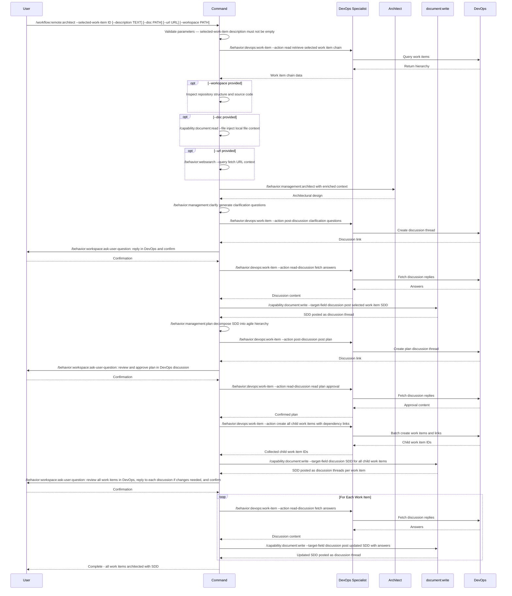

## PURPOSE

Orchestrate architectural documentation and work-item hierarchy creation for a given selected work item using Specification Driven Design (SDD). Decomposes requirements into a parallelizable hierarchy of work items, each with embedded SDD documentation at the appropriate abstraction level (Epic → Feature → User Story → Task). Enables human and agent team collaboration through Azure DevOps discussions, gating every structural change behind user approval before proceeding.

## WORKFLOW PHASES

1. **Retrieve Work Item Chain**
   - Call `/behavior:devops:work-item --action read --id <selected-work-item> --project <project>`
   - Collect Title, Description, Acceptance Criteria from each level (Epic → Feature → User Story → Task)
   - **MANDATORY** Selected work item description must not be empty before proceeding

2. **Gather Repository and Referenced Documentation**
   - If `workspace` is provided: inspect the local path using the `Read` tool for source code, configs, and existing docs
   - If `doc` is provided: call `/capability:document:read --file <doc>` to inject local document context
   - If `url` is provided: call `/behavior:websearch --query "<url>"` to fetch and inject URL context
   - Enrich architectural context with all retrieved materials

3. **Generate Selected Work Item Architecture**
   - Call `/behavior:management:architect --work-description "<description>"` (include `--work-directory <workspace>` only if `workspace` is provided)
   - Call `/behavior:management:clarify --context "<architectural-design-output>"` to generate critical clarification questions
   - Call `/behavior:devops:work-item --action post-discussion --id <selected-work-item> --project <project>` to post all clarification questions as a numbered list
   - **MANDATORY** Do NOT create child work items or update descriptions before user responds

4. **Validate Selected Work Item Documentation**
   - Call `/behavior:workspace:ask-user-question --question "Reply to the Azure DevOps discussion with your answers, then confirm to continue"`
   - Call `/behavior:devops:work-item --action read-discussion --id <selected-work-item> --project <project>` to read all discussion answers
   - Call `/capability:document:write --template service-architecture --title "<work-item-title>" --work-item <selected-work-item> --target-field discussion` to post the finalized SDD as a discussion thread
   - Call `/behavior:devops:work-item --action update --id <selected-work-item> --project <project> --description "<finalized-sdd-content>"` to sync description with discussion content
   - Call `/behavior:devops:work-item --action post-discussion --id <selected-work-item> --project <project>` to reply confirming description was updated with all discussion answers

5. **Plan Child Work Item Hierarchy**
   - Call `/behavior:management:plan --work-description "<finalized-sdd-content>"` to decompose into a parallelizable agile hierarchy
   - Call `/behavior:devops:work-item --action post-discussion --id <selected-work-item> --project <project>` to post the full plan (hierarchy, dependency graph, parallelization map) as a discussion
   - **MANDATORY** Do NOT create any child work items before the user approves the plan

6. **Validate Plan**
   - Call `/behavior:workspace:ask-user-question --question "Reply to the plan discussion in Azure DevOps with your feedback, then confirm to continue"`
   - Call `/behavior:devops:work-item --action read-discussion --id <selected-work-item> --project <project>` to read all plan approval/feedback from the discussion

7. **Create Child Work Items**
   - Call `/behavior:devops:work-item --action create --project <project>` to create all work items with dependency links (`related`, `consumes-from`) per the approved plan
   - Collect all returned child work item IDs before proceeding
   - For each child work item ID: call `/capability:document:write --template service-architecture --title "<child-work-item-title>" --work-item <child-work-item-id> --target-field discussion`

8. **Validate Overall Architecture**
   - Call `/behavior:workspace:ask-user-question --question "Review all work items in Azure DevOps and reply to each individual discussion if changes are needed, then confirm to continue"`
   - For each work item:
     - Call `/behavior:devops:work-item --action read-discussion --id <child-work-item-id> --project <project>` to read answers from its individual discussion
     - Call `/capability:document:write --template service-architecture --title "<work-item-title>" --work-item <child-work-item-id> --target-field discussion` to post the updated SDD as a discussion thread
     - Call `/behavior:devops:work-item --action update --id <child-work-item-id> --project <project> --description "<updated-sdd-content>"` to sync description with the updated SDD
     - Call `/behavior:devops:work-item --action post-discussion --id <child-work-item-id> --project <project>` to reply confirming what changed in description based on discussion observations

## WORKFLOW



## ACCEPTANCE CRITERIA

- Selected work item description validated as non-empty before any phase proceeds
- Selected work item chain retrieved and understood
- All provided optional context sources (workspace, doc, url) integrated into architectural context before design begins
- Selected work item SDD discussion posted before any structural changes
- Selected work item description updated with finalized markdown SDD
- Work-item plan (hierarchy, dependency graph, parallelization map) posted as discussion on selected work item
- Plan validated via DevOps discussion before any child work items are created
- Child work items created with SDD documentation embedded in descriptions from the start
- All child work item IDs captured before SDD write loop begins
- Dependency links established between child work items per the validated plan
- Overall architecture validated by user reviewing individual work item discussions before completion
- All work item SDDs updated with answers from their individual Azure DevOps discussions
- Leaf-level tasks designed as independent, parallelizable pull requests

## EXAMPLES

```
/workflow:remote:architect --selected-work-item 2001 --project MyProject --description "Multi-tenant notification service with email, SMS, and push channels"

/workflow:remote:architect --selected-work-item 1850 --project MyProject --doc ./docs/requirements.pdf

/workflow:remote:architect --selected-work-item 2200 --project MyProject --description "Refactor payment gateway integration" --url https://docs.stripe.com/api --workspace ./workspace/payments.worktrees/master
```

## OUTPUT

- Phase completion status at each step
- Work item chain summary with hierarchy visualization
- SDD discussion thread links for selected and child work items
- Finalized work item descriptions with embedded markdown SDD
- List of created child work items with IDs, types, and dependencies
- Parallelization map indicating which tasks can run concurrently
- Dependency graph showing consumes-from and related relationships
- Revised SDD documents per work item incorporating discussion feedback from Phase 8
