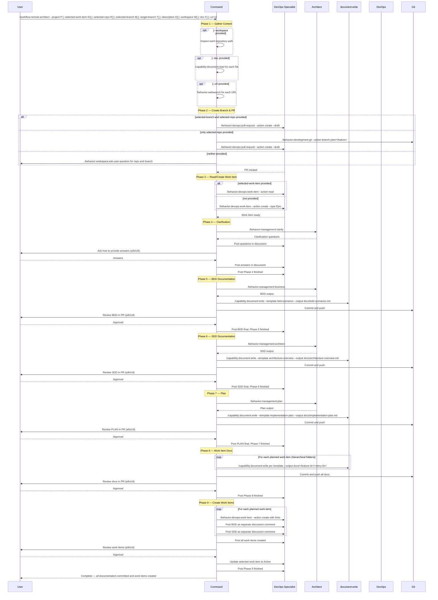

## PURPOSE

Orchestrate architectural documentation and work-item hierarchy creation for a selected work item using Specification Driven Design (SDD). All documentation is committed to a documentation-only branch with pull request review gates at every phase. Decomposes requirements through BDD analysis, architectural design, and agile planning into a parallelizable hierarchy of work items. Enables human and agent collaboration through Azure DevOps discussions and pull request comments, gating every structural change behind user approval.

## WORKFLOW PHASES

### Phase 1 | Gather Repository and Referenced Documentation

1. **Workspace repositories**: If `workspace` is provided, split by `;` and inspect each local path using the `Read` tool for source code, configs, and existing docs
2. **Local documents**: If `doc` is provided, split by `;` and for each path call `/capability:document:read --file <path>` to inject local document context
3. **Online references**: If `url` is provided, split by `;` and for each URL call `/behavior:websearch --query "<url>"` to fetch and inject URL context
4. **Description context**: If `description` is provided, include as additional architectural context
5. Enrich architectural context with all retrieved materials before proceeding

### Phase 2 | Create Selected Branch and Pull Request

1. **If `selected-branch` is provided AND `selected-repo` is provided**:
   - Call `/behavior:devops:pull-request --action create --portal azure --project <project> --repo <selected-repo> --source-branch <selected-branch> --target-branch <target-branch|main> --draft --title "Architecture: <feature-description>"` to create the PR
   - Continue to Phase 3

2. **If only `selected-repo` is provided** (no `selected-branch`):
   - Generate branch name in pattern `plan/<feature-description>` from description or work item title
   - Call `/behavior:development:git --action branch --repository <selected-repo> --branch plan/<feature-description> --source-branch <target-branch|main>`
   - Call `/behavior:devops:pull-request --action create --portal azure --project <project> --repo <selected-repo> --source-branch plan/<feature-description> --target-branch <target-branch|main> --draft --title "Architecture: <feature-description>"` to create the PR
   - Continue to Phase 3

3. **If neither `selected-repo` nor `selected-branch` is provided**:
   - Call `/behavior:workspace:ask-user-question --question "Provide the repository name (--selected-repo) and optionally a branch name (--selected-branch) for documentation storage" --options "Type repo and branch below"`
   - Use the provided values and repeat Phase 2

### Phase 3 | Read or Create Selected Work Item

1. **If `selected-work-item` is provided**:
   - Call `/behavior:devops:work-item --action read --id <selected-work-item> --project <project>` to retrieve Title, Description, Discussions, linked work items
   - Collect all context for subsequent phases

2. **If `selected-work-item` is NOT provided**:
   - Call `/behavior:devops:work-item --action create --project <project> --type Epic --title "<feature-description>" --description "<description-context-with-branch-and-pr-reference>" --status New` to create a new Epic with start date, selected branch reference, and PR link
   - Use the returned work item ID as `selected-work-item` for all subsequent phases

### Phase 4 | Clarification

1. Call `/behavior:management:clarify --context "<all-gathered-context>"` to generate critical clarification questions
2. Call `/behavior:devops:work-item --action post-discussion --id <selected-work-item> --project <project>` to post all clarification questions as a numbered list in discussion
3. Call `/behavior:workspace:ask-user-question --question "How would you like to provide answers to the clarification questions?" --options "a) Choose best answers automatically; b) Check selected work-item discussion for answers; c) Provide all answers in the prompt; d) Other"`
4. **If answered in the prompt**: Call `/behavior:devops:work-item --action post-discussion --id <selected-work-item> --project <project>` to post all answers in discussion
5. **If answered via discussion**: Call `/behavior:devops:work-item --action read-discussion --id <selected-work-item> --project <project>` to read all answers
6. **If choose best answers**: Generate best answers from context analysis and post them in discussion for user validation
7. **MANDATORY**: All questions and answers must be present in selected work-item discussion before proceeding
8. Call `/behavior:devops:work-item --action post-discussion --id <selected-work-item> --project <project>` to post that Phase 4 Clarification is finished

### Phase 5 | Generate Business Behavior Documentation (BDD)

1. Call `/behavior:management:business --context "<all-gathered-context-with-clarification-answers>"` to generate all business-related behavior flows
2. Call `/capability:document:write --template bdd-scenarios --title "<feature-description> BDD Scenarios" --context "<bdd-output>" --output docs/bdd-scenarios.md` to write the BDD document
3. Call `/behavior:development:git --action commit-push --repository <selected-repo> --branch <selected-branch> --message "docs: add BDD scenarios for <feature-description>"`
4. Call `/behavior:workspace:ask-user-question --question "Review the BDD document in the pull request. How would you like to proceed?" --options "a) Continue; b) Make changes from pull-request comments; c) Make changes from prompt; d) Other"`
5. **If changes requested**: Update the BDD document, commit and push, and reply to PR comments
6. Call `/behavior:workspace:ask-user-question --question "Review the updated BDD document. How would you like to proceed?" --options "a) Continue; b) Make changes from pull-request comments; c) Make changes from prompt; d) Other"`
7. **MANDATORY**: User must confirm BDD is ready before proceeding
8. Call `/behavior:devops:work-item --action post-discussion --id <selected-work-item> --project <project>` to post the BDD as final and that Phase 5 is finished

### Phase 6 | Generate Specification Documentation (SDD)

1. Call `/behavior:management:architect --work-description "<all-context-with-bdd>" --context "<clarification-answers-and-bdd-output>"` to generate the complete system architecture
2. Call `/capability:document:write --template architecture-overview --title "<feature-description> Architecture" --context "<sdd-output>" --output docs/architecture-overview.md` to write the overall architecture document
3. Call `/behavior:development:git --action commit-push --repository <selected-repo> --branch <selected-branch> --message "docs: add architecture overview for <feature-description>"`
4. Call `/behavior:workspace:ask-user-question --question "Review the SDD document in the pull request. How would you like to proceed?" --options "a) Continue; b) Make changes from pull-request comments; c) Make changes from prompt; d) Other"`
5. **If changes requested**: Update the SDD document, commit and push, and reply to PR comments
6. Call `/behavior:workspace:ask-user-question --question "Review the updated SDD document. How would you like to proceed?" --options "a) Continue; b) Make changes from pull-request comments; c) Make changes from prompt; d) Other"`
7. **MANDATORY**: User must confirm SDD is ready before proceeding
8. Call `/behavior:devops:work-item --action post-discussion --id <selected-work-item> --project <project>` to post the SDD as final and that Phase 6 is finished

### Phase 7 | Generate Plan

1. Call `/behavior:management:plan --work-description "<bdd-and-sdd-combined-context>"` to decompose into a parallelizable agile hierarchy taking into account BDD and SDD
2. Call `/capability:document:write --template implementation-plan --title "<feature-description> Implementation Plan" --context "<plan-output>" --output docs/implementation-plan.md` to write the plan document
3. Call `/behavior:development:git --action commit-push --repository <selected-repo> --branch <selected-branch> --message "docs: add implementation plan for <feature-description>"`
4. Call `/behavior:workspace:ask-user-question --question "Review the PLAN document in the pull request. How would you like to proceed?" --options "a) Continue; b) Make changes from pull-request comments; c) Make changes from prompt; d) Other"`
5. **If changes requested**: Update the PLAN document, commit and push, and reply to PR comments
6. Call `/behavior:workspace:ask-user-question --question "Review the updated PLAN document. How would you like to proceed?" --options "a) Continue; b) Make changes from pull-request comments; c) Make changes from prompt; d) Other"`
7. **MANDATORY**: User must confirm PLAN is ready before proceeding
8. Call `/behavior:devops:work-item --action post-discussion --id <selected-work-item> --project <project>` to post the PLAN as final and that Phase 7 is finished

### Phase 8 | Generate Work Item Documentations

1. For each work item defined in the plan, create a hierarchical folder structure mirroring the agile hierarchy: `docs/<feature-work-item-identifier>/<user-story-work-item-identifier>/` using names related to work-item identification for easy review. Feature-level docs go in `docs/<feature-id>/`, user-story-level docs go in `docs/<feature-id>/<user-story-id>/`, and task-level docs go in `docs/<feature-id>/<user-story-id>/<task-id>/`
2. For each work item folder, generate the appropriate documentation using `/capability:document:write`:
   - `/capability:document:write --template bdd-scenarios --title "<work-item-title> BDD" --context "<work-item-specific-context>" --output docs/<hierarchy-path>/bdd-scenarios.md` when behavioral scenarios apply
   - `/capability:document:write --template service-architecture --title "<work-item-title> SDD" --context "<work-item-specific-context>" --output docs/<hierarchy-path>/service-architecture.md` when service architecture applies
   - `/capability:document:write --template service-data-model --title "<work-item-title> Data Model" --context "<work-item-specific-context>" --output docs/<hierarchy-path>/data-model.md` when data model documentation applies
   - `/capability:document:write --template event-notification --title "<work-item-title> Events" --context "<work-item-specific-context>" --output docs/<hierarchy-path>/event-notification.md` when event-driven patterns apply
3. Call `/behavior:development:git --action commit-push --repository <selected-repo> --branch <selected-branch> --message "docs: add work item documentation for <feature-description>"`
4. Call `/behavior:workspace:ask-user-question --question "Review all work item documentation in the pull request. How would you like to proceed?" --options "a) Continue; b) Make changes from pull-request comments; c) Make changes from prompt; d) Other"`
5. **If changes requested**: Update the documents, commit and push, and reply to PR comments
6. Call `/behavior:workspace:ask-user-question --question "Review the updated documentation. How would you like to proceed?" --options "a) Continue; b) Make changes from pull-request comments; c) Make changes from prompt; d) Other"`
7. **MANDATORY**: User must confirm all documentation is ready before proceeding
8. Call `/behavior:devops:work-item --action post-discussion --id <selected-work-item> --project <project>` to post that all work item documentations are ready and Phase 8 is finished

### Phase 9 | Create Work Items

1. Following the approved plan and selected branch documentation:
2. For each work item in the plan:
   - Call `/behavior:devops:work-item --action create --project <project> --type <type> --title "<work-item-title>" --description "<bdd-and-sdd-summary>" --status New --parent <parent-work-item-id>` with start date, work-item links, and relationships
   - Call `/behavior:devops:work-item --action post-discussion --id <new-work-item-id> --project <project>` to post the BDD documentation as a separate discussion comment (if applicable for this work item)
   - Call `/behavior:devops:work-item --action post-discussion --id <new-work-item-id> --project <project>` to post the SDD documentation as a separate discussion comment (if applicable for this work item)
3. Call `/behavior:devops:work-item --action post-discussion --id <selected-work-item> --project <project>` to post that all work items were created with their IDs and links
4. Call `/behavior:workspace:ask-user-question --question "Review all created work items in Azure DevOps. How would you like to proceed?" --options "a) Continue; b) Make changes from selected work-item discussion; c) Make changes from prompt; d) Other"`
5. **If changes requested**: Update work items based on feedback
6. Call `/behavior:devops:work-item --action update --id <selected-work-item> --project <project> --state Active` to set the selected work item to Active
7. Call `/behavior:devops:work-item --action post-discussion --id <selected-work-item> --project <project>` to post that the selected work item is ready to be implemented and Phase 9 is finished

## WORKFLOW



## ACCEPTANCE CRITERIA

- All provided context sources (workspace, doc, url, description) integrated before any design begins
- Documentation branch created or validated with draft pull request before any commits
- Selected work item read or created with branch and PR references before proceeding
- Clarification questions and answers fully captured in selected work-item discussion
- BDD document committed to selected branch, reviewed via PR, and posted as final in discussion
- SDD document committed to selected branch, reviewed via PR, and posted as final in discussion
- Plan document committed to selected branch, reviewed via PR, and posted as final in discussion
- Per-work-item documentation folders committed with appropriate templates (BDD, SDD, data model, events)
- User approval gate enforced at every phase before proceeding
- All child work items created with title, description, BDD/SDD documentation in discussion, start date, links, and status New
- Selected work item set to Active after all child work items are created
- Phase completion posted in selected work-item discussion at every phase boundary
- Leaf-level tasks designed as independent, parallelizable pull requests
- No implementation code stored in the documentation branch

## EXAMPLES

```
/workflow:remote:architect --project MyProject --selected-work-item 2001 --selected-repo my-docs --selected-branch plan/notification-service --target-branch main --description "Multi-tenant notification service with email, SMS, and push channels"

/workflow:remote:architect --project MyProject --selected-repo my-docs --doc "./docs/requirements.pdf;./docs/wireframes.png" --workspace "./workspace/payments.worktrees/master;./workspace/gateway.worktrees/master"

/workflow:remote:architect --project MyProject --selected-work-item 1850 --selected-repo architecture-docs --description "Refactor payment gateway" --url "https://docs.stripe.com/api;https://docs.adyen.com/api" --workspace ./workspace/payments.worktrees/master
```

## OUTPUT

- Phase completion status posted in work-item discussion at each step
- Documentation branch with all committed artifacts (BDD, SDD, plan, per-work-item docs)
- Draft pull request with all documentation for review
- Work item chain summary with hierarchy visualization
- List of created child work items with IDs, types, dependencies, and discussion links
- Parallelization map indicating which tasks can run concurrently
- Dependency graph showing consumes-from and related relationships
- Selected work item set to Active status upon completion
