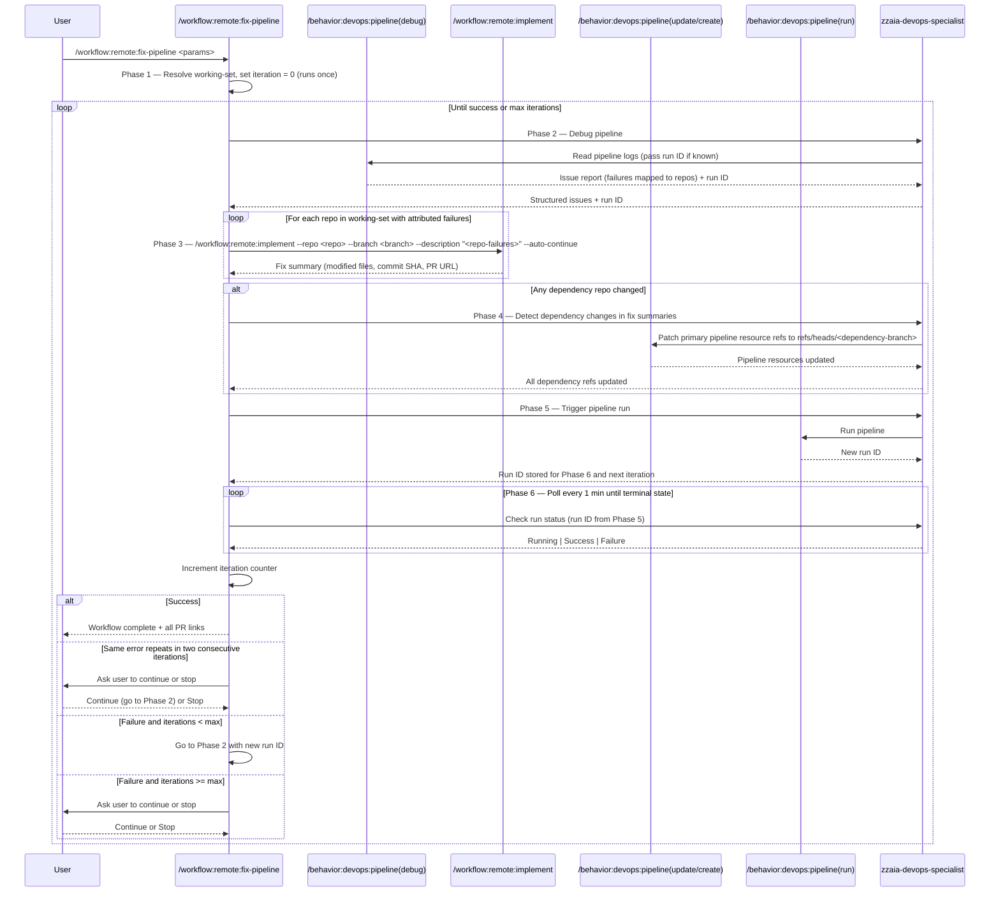

## PURPOSE

Automate iterative pipeline repair by cycling through debug, fix, and re-run phases until the pipeline completes successfully. Each iteration collects structured issue reports from pipeline logs, implements targeted fixes, triggers a new run, and evaluates results. The loop terminates on success or when max iterations is reached.

## WORKFLOW PHASES

1. **Initialize Loop** — Resolve parameters and set iteration counter; no pipeline calls in this phase

   - Set iteration counter to 0 and record start time
   - If `--file` is provided, resolve git worktree context to infer `--project`, `--repo`, `--branch`, and `--pipeline` from remote URL, current branch, and YAML filename
   - If `--deps` is provided, parse it into a list of `{repo, branch}` pairs to form the **working-set** alongside the primary `{repo, branch}`
   - If `--deps` is not provided, inspect pipeline YAML `resources.repositories` and `extends.repository` blocks to auto-detect referenced repos; for each detected repo, use the `ref` field value in the YAML as the branch (strip `refs/heads/` prefix); if no `ref` field is present, use the primary `--branch`; add each `{repo, branch}` pair to the working-set
   - Store working-set, parameters, and iteration counter in session state — this phase runs exactly once

2. **Debug Pipeline** — Collect structured failure report for the current run

   - Call `/behavior:devops:pipeline --action debug` with `--portal <portal> --project <project> --pipeline <pipeline> --branch <branch>`; if `--run` was provided (or a run ID was captured in a previous iteration), include `--run <run-id>`; omit the argument when no run ID is known, letting the behavior resolve the latest run
   - Capture structured issue report with all failed steps, errors, and warnings; map each failure to the repo in the working-set that owns the affected file
   - Record the run ID returned by this call for use in subsequent iterations
   - Record initial issue count for this iteration

3. **Implement Fixes** — Invoke `remote:implement` once per repo in the working-set

   - For each `{repo, branch}` in the working-set that has failures attributed to it:
     - Call `/workflow:remote:implement` with:
       - `--portal <portal> --project <project> --repo <repo> --working-branch <branch> --target-branch <target-branch|main>`
       - `--description "Fix pipeline failures: <failures-attributed-to-this-repo>"`
       - `--work-item <work-item>` if provided; omit otherwise
       - `--auto-continue`
     - `remote:implement` returns a fix summary containing: list of modified files (with repo and relative path), commit SHA, and PR URL
   - Invoke all `remote:implement` calls sequentially in dependency order (dependency repos first, primary repo last)
   - Collect all fix summaries for use in Phase 4

4. **Configure Template Resource** — Point the primary pipeline to dependency branches when a referenced pipeline was changed

   - Inspect fix summaries from Phase 3: a dependency repo was changed if any modified file's repo matches a repo in the working-set other than the primary repo
   - **If no dependency repo was changed**: skip this phase entirely and proceed to Phase 5
   - **If one or more dependency repos were changed**:
     - For each changed dependency repo, call `/behavior:devops:pipeline --action update` to patch the primary pipeline's `resources.repositories` entry for that repo, setting `ref` to `refs/heads/<dependency-branch>`
     - If the primary pipeline does not yet have a `resources.repositories` entry for a dependency repo, call `/behavior:devops:pipeline --action create` to register a minimal validation pipeline that includes the dependency branch reference
     - Set `<pipeline>` to the updated/created pipeline for all subsequent phases
   - **MANDATORY** Every dependency repo `ref` in the primary pipeline must target `refs/heads/<dependency-branch>` before triggering any run — never rely on default branches while dependency changes are unmerged

5. **Re-run Pipeline** — Trigger a new pipeline run; do not wait here

   - Call `/behavior:devops:pipeline --action run` with `--portal <portal> --project <project> --pipeline <pipeline> --branch <branch>`
   - Capture the new run ID from the response and store it for Phase 6 and the next iteration's Phase 2
   - Proceed immediately to Phase 6; do not poll or wait in this phase

6. **Poll Run Status** — Poll until a terminal state is reached

   - Wait 1 minute, then call `/behavior:devops:pipeline --action debug` with the run ID captured in Phase 5 to check run status
   - Repeat polling every 1 minute until the run reaches a terminal state (Success or Failure)
   - Do not interrupt the user during polling
   - Parse final run result: **Success** or **Failure**
   - Increment iteration counter

7. **Loop Control** — Decide next action

   - **On Success**: stop loop and report completion summary with all PR links from Phase 3
   - **On Failure and iterations < max**: go to Phase 2 with the run ID captured in Phase 5
   - **On Failure and iterations >= max**: ask user whether to continue or stop; stop if user declines
   - **On unresolvable failure** — defined as: the same error message (exact match on error text, ignoring line numbers and timestamps) appears in the issue reports of two consecutive iterations for the same repo and step — ask user whether to continue or stop; stop if user declines

## DELEGATION

**MANDATORY**: Always invoke the agents defined in this command's frontmatter for their designated responsibilities. Never skip, replace, or simulate their behavior directly.

- `zzaia-devops-specialist` — Debug pipeline logs, trigger runs, poll run status, and confirm completion
- Workspace setup, fix implementation, commit/push, and PR creation are fully delegated to `/workflow:remote:implement`

## WORKFLOW DIAGRAM



## ACCEPTANCE CRITERIA

- Workflow resolves a **working-set** of `{repo, branch}` pairs from `--deps` or by auto-detecting `resources.repositories` / `extends.repository` references in the primary pipeline YAML; branch is taken from the YAML `ref` field or falls back to `--branch`
- Phase 1 runs exactly once — initialization context (working-set, parameters, counter) is preserved across all iterations without re-parsing
- Workflow successfully orchestrates `/behavior:devops:pipeline --action debug`, one `/workflow:remote:implement` per repo in the working-set (with attributed failures), `/behavior:devops:pipeline --action update/create`, and `/behavior:devops:pipeline --action run` in sequence
- `remote:implement` is called in dependency order — dependency repos are fixed and pushed before the primary repo
- Loop continues until pipeline succeeds or max iterations is reached
- Each iteration extracts new run ID from Phase 5 pipeline run response and uses it in the next Phase 2 debug call
- Pipeline failures are attributed to the repo that owns the affected file; each `/workflow:remote:implement` invocation receives only the failures belonging to its repo
- Phase 5 only triggers the run; all polling happens exclusively in Phase 6
- Pipeline status is polled automatically every 1 minute — user is never interrupted during polling
- User is asked to continue only when: max iterations reached OR the same error message (exact match, ignoring line numbers and timestamps) appears in two consecutive iteration reports for the same repo and step
- When a dependency repo is changed, the primary pipeline's `resources.repositories` `ref` for that repo is updated to `refs/heads/<dependency-branch>` before any run is triggered — no PR approval is required
- On pipeline success, workflow reports completion with all PR links produced by `remote:implement` invocations
- Iteration counter and safety limit are enforced; counter is never reset between iterations
- Agents are invoked for their designated responsibilities, never skipped or simulated

## EXAMPLES

```
/workflow:remote:fix-pipeline --portal azure --file /home/user/workspace/myrepo.worktrees/feature/my-feature/azure-pipelines.yml

/workflow:remote:fix-pipeline --portal azure --project MyProject --pipeline build-pipeline --repo my-repo --branch feature/fix

/workflow:remote:fix-pipeline --portal azure --project MyProject --pipeline deploy-prod --repo my-repo --branch feature/fix --deps pipeline-templates:feature/fix,shared-lib:feature/fix --target-branch main --max-iterations 3

/workflow:remote:fix-pipeline --portal azure --project MyProject --pipeline 42 --repo my-repo --branch feature/fix --run 1850
```

## OUTPUT

Per-iteration summary:
- Iteration number and start time
- Issues found per repo (count and descriptions)
- Fixes applied per repo (modified files, commit SHA, PR URL)
- Run result (Success / Failure)

Final report:
- Total iterations and total time elapsed
- Complete list of all changes made across all repos and iterations
- All PR links produced across all `remote:implement` invocations
