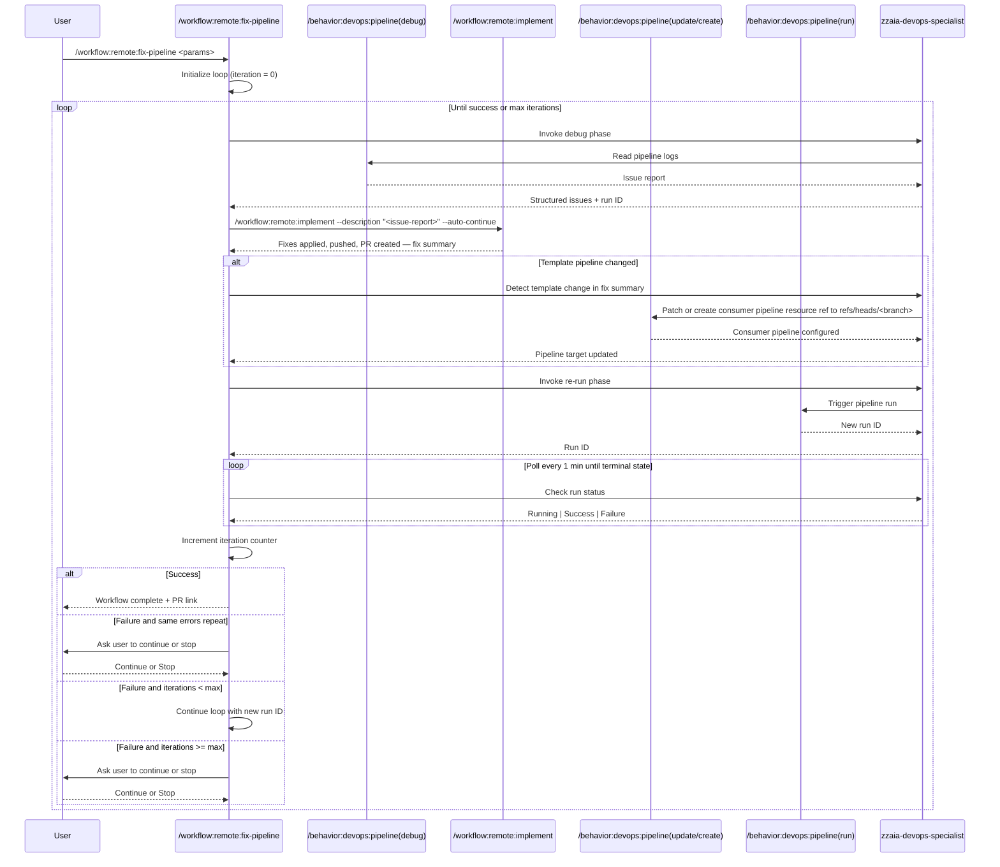

## PURPOSE

Automate iterative pipeline repair by cycling through debug, fix, and re-run phases until the pipeline completes successfully. Each iteration collects structured issue reports from pipeline logs, implements targeted fixes, triggers a new run, and evaluates results. The loop terminates on success or when max iterations is reached.

## WORKFLOW PHASES

1. **Initialize Loop** — Resolve parameters and set iteration counter to 0

   - If `--file` is provided, resolve git worktree context to infer `--project`, `--repo`, `--branch`, and `--pipeline` from remote URL, current branch, and YAML filename
   - Call `/behavior:devops:pipeline --action debug` with `--portal <portal> --project <project> --pipeline <pipeline> --run <run> --branch <branch>`
   - Capture structured issue report with all failed steps, errors, and warnings
   - Track returned run ID for subsequent phases
   - **MANDATORY** Record iteration 1 start time and initial issue count

2. **Implement Fixes** — Delegate workspace setup, development, commit/push, and PR creation to `remote:implement`

   - Call `/workflow:remote:implement` for each working repo with:
     - `--portal <portal> --project <project> --repo <repo> --working-branch <branch> --target-branch <target-branch|main>`
     - `--description "Fix pipeline failures: <issue-report-from-phase-1>"`
     - `--work-item <work-item>` if provided; omit otherwise (remote:implement skips work-item retrieval)
     - `--auto-continue` to suppress interactive review confirmation
   - `remote:implement` handles: branch worktree setup, fix implementation, commit, push, review, and pull request creation
   - Capture fix summary from `remote:implement` output for use in Phase 3

3. **Configure Template Resource** — Point a consumer pipeline to the template branch when a template pipeline was changed

   - Inspect the fix summary from Phase 2 to determine whether any modified file is a shared pipeline template (e.g. resides under `templates/`, `pipeline-templates/`, or is referenced via `extends:` in another YAML)
   - **If no template pipeline was changed**: skip this phase entirely and proceed to Phase 4
   - **If a template pipeline was changed**:
     - Identify (or create) a consumer pipeline whose YAML references the changed template via an `extends:` or `resources.repositories` block
     - Call `/behavior:devops:pipeline --action update` to patch the consumer pipeline's resource repository `ref` to `refs/heads/<branch>` so it consumes the template directly from the working branch
     - If no consumer pipeline exists, call `/behavior:devops:pipeline --action create` to register a minimal validation pipeline in the same project that references the template branch as a repository resource
     - Set `<pipeline>` to this consumer pipeline for all subsequent phases so validation runs against the branch instead of the merged template
   - **MANDATORY** The consumer pipeline `ref` must target `refs/heads/<branch>` before triggering any run — never rely on the default branch while template changes are unmerged

4. **Re-run Pipeline** — Trigger new pipeline run on target branch

   - Call `/behavior:devops:pipeline --action run` with `--portal <portal> --project <project> --pipeline <pipeline> --branch <branch>`
   - Capture new run ID and wait for completion
   - **MANDATORY** Extract run ID from response for next debug phase

5. **Evaluate Result** — Poll pipeline run status automatically

   - Wait 1 minute, then call `/behavior:devops:pipeline --action debug` to check run status
   - Repeat polling every 1 minute until run reaches a terminal state (Success or Failure)
   - Parse run result: **Success** or **Failure**
   - Increment iteration counter

6. **Loop Control** — Decide next action

   - **On Success**: stop loop and report completion summary with PR link from Phase 2
   - **On Failure and iterations < max**: Go back to Phase 1 with new run ID
   - **On Failure and iterations >= max**: Ask user whether to continue or stop; stop if user declines
   - **On unresolvable failure** (same errors repeat across iterations): Ask user whether to continue or stop

## DELEGATION

**MANDATORY**: Always invoke the agents defined in this command's frontmatter for their designated responsibilities. Never skip, replace, or simulate their behavior directly.

- `zzaia-devops-specialist` — Debug pipeline logs, trigger runs, poll run status, and confirm completion
- Workspace setup, fix implementation, commit/push, and PR creation are fully delegated to `/workflow:remote:implement`

## WORKFLOW DIAGRAM



## ACCEPTANCE CRITERIA

- Workflow successfully orchestrates `/behavior:devops:pipeline --action debug`, `/workflow:remote:implement`, `/behavior:devops:pipeline --action update/create`, and `/behavior:devops:pipeline --action run` in sequence
- Loop continues until pipeline succeeds or max iterations is reached
- Each iteration extracts new run ID from pipeline run response and uses it in next debug phase
- Pipeline issue report is passed as `--description` to `/workflow:remote:implement` with `--auto-continue`; `remote:implement` handles branch setup, implementation, commit, push, review, and PR creation
- Pipeline status is polled automatically every 1 minute — user is never interrupted during polling
- User is asked to continue only when: max iterations reached OR same errors repeat across iterations
- When a template pipeline is changed, a consumer pipeline is configured to reference the template branch as a resource before any run is triggered — no PR approval is required to validate the changes
- On pipeline success, workflow reports completion with the PR link produced by `remote:implement`
- Iteration counter and safety limit are enforced
- Per-iteration summary includes iteration number, issue count, fixes applied, and run result
- Final report lists all changes made across all iterations and total time elapsed
- Agents are invoked for their designated responsibilities, never skipped or simulated

## EXAMPLES

```
/workflow:remote:fix-pipeline --portal azure --file /home/user/workspace/myrepo.worktrees/feature/my-feature/azure-pipelines.yml

/workflow:remote:fix-pipeline --portal azure --project MyProject --pipeline build-pipeline

/workflow:remote:fix-pipeline --portal azure --project MyProject --pipeline deploy-prod --branch feature/my-feature --max-iterations 3

/workflow:remote:fix-pipeline --portal azure --project MyProject --pipeline 42 --run 1850
```

## OUTPUT

- Per-iteration summary: iteration #, issues found, fixes applied, run result
- Final success report with total iterations, complete list of all changes made, and PR link
