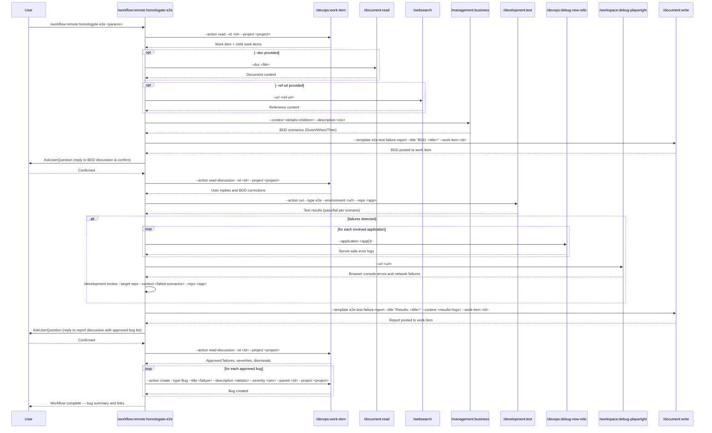

## PURPOSE

Orchestrate end-to-end homologation testing by retrieving work item details, generating BDD scenarios from acceptance criteria, executing tests against a live URL, correlating failures with New Relic diagnostics, and creating bug work items for each failure.

## WORKFLOW PHASES

1. **Retrieve Work Item**: Fetch work item, acceptance criteria, and all child work items

   - Call `/devops:work-item --action read --id <work-item> --project <project>`
   - Retrieve full hierarchy: title, description, acceptance criteria, and all child work items
   - **MANDATORY**: description must not be empty

2. **Gather Referenced Documentation**: Enrich testing context with external materials if provided

   - If `--doc` provided: Call `/document:read --doc <doc>`
   - If `--ref-url` provided: Call `/websearch --url <ref-url>`
   - Compile retrieved content into testing context

3. **Generate BDD Documentation**: Translate acceptance criteria and child work items into BDD scenarios

   - Call `/management:business --context "<work-item-details + child-work-items>" --description "<provided-description>"`
   - Produce Given/When/Then scenarios covering all acceptance criteria and child items
   - Call `/document:write --template e2e-test-failure-report --title "BDD Scenarios: <work-item-title>" --work-item <work-item> --target-field discussion` to post BDD as work item description
   - **MANDATORY**: Do NOT proceed to testing before user confirmation

4. **Validate BDD**: Confirm generated BDD scenarios are correct before testing

   - Use **AskUserQuestion** to ask user to reply to the BDD in the work item discussion and confirm to continue
   - Call `/devops:work-item --action read-discussion --id <work-item> --project <project>` to retrieve user replies and any BDD changes requested
   - Apply any corrections from discussion replies before proceeding to testing

5. **Execute E2E Tests**: Run E2E tests against the target URL following validated BDD scenarios

   - Call `/development:test --action run --type e2e --environment <url> --repo <application>`
   - Capture all pass/fail results, response times, error details per scenario
   - Log test execution summary

6. **Retrieve Diagnostic Logs**: Collect all available diagnostics if failures occurred

   - If failures detected:
     - Call `/devops:debug-new-relic --application <application[i]>` for each involved application to retrieve server-side errors and anomalies
     - Call `/workspace:debug-playwright --url <url>` to retrieve browser console errors, network failures, and page snapshots from the E2E session
     - Call `/development:review --target repo --context "failures related to <failed-scenarios>" --repo <application[i]>` to inspect local workspace source for code issues relevant to the failures
   - Correlate all findings (New Relic, browser, local) with failed test scenarios

7. **Generate Test Result Report**: Document all test outcomes and diagnostics

   - Call `/document:write --template e2e-test-failure-report --title "E2E Test Results: <work-item-title>" --context "<test-results + new-relic-logs>" --work-item <work-item> --target-field discussion`
   - **MANDATORY**: Report must be posted before user validation

8. **Validate Report and Define Bugs**: Review failures and decide which bugs to create

   - Use **AskUserQuestion** to ask user to reply to the report in the work item discussion with the approved bug list
   - Call `/devops:work-item --action read-discussion --id <work-item> --project <project>` to retrieve user replies with approved failures, severity adjustments, and dismissals
   - Compile the final approved bug list from discussion replies before proceeding
   - **MANDATORY**: Do NOT create any bug work items before user explicitly approves the final list

9. **Create Bug Work Items**: Create one bug work item per approved failure

   - For each approved failure: Call `/devops:work-item --action create --type Bug --title "<failure-description>" --description "<steps-to-reproduce + expected-vs-actual + new-relic-evidence>" --severity <severity> --parent <work-item> --project <project>`
   - Provide summary list of all created bug IDs with links

## DELEGATION

**MANDATORY**: Always invoke the agents defined in this command's frontmatter for their designated responsibilities. Never skip, replace, or simulate their behavior directly.

- `zzaia-devops-specialist` — Retrieve work items, post discussions as discussion threads, create child bug work items
- `zzaia-tester-specialist` — Execute E2E tests against the target URL, capture results and error details
- `zzaia-document-specialist` — Generate BDD scenarios, create test result documentation

## WORKFLOW DIAGRAM



## ACCEPTANCE CRITERIA

- Work item and all child work items retrieved with non-empty description
- BDD scenarios generated, posted to work item, and approved by user before tests run
- E2E tests executed against target URL with full pass/fail capture per scenario
- Test failures correlated with New Relic diagnostics across all involved applications
- Test result report generated and posted to work item before user validation
- User explicitly reviews report and approves the final bug list with severities before any creation
- Bug work items created only for user-approved failures with full evidence and parent link
- All sub-command invocations delegate to designated agents

## EXAMPLES

```
/workflow:remote:homologate-e2e --work-item 12345 --project MyProject --url https://staging.myapp.com --application MyApp

/workflow:remote:homologate-e2e --work-item 67890 --project MyProject --url https://staging.myapp.com --application MyApp --description "Critical path homologation" --doc /path/to/requirements.md

/workflow:remote:homologate-e2e --work-item 54321 --project MyProject --url https://qa.myapp.com --application MyApp --ref-url https://example.com/acceptance-criteria
```

## OUTPUT

- Phase 1: Work item details with acceptance criteria
- Phase 3: BDD scenarios posted as discussion thread
- Phase 5: Test execution report with pass/fail counts and timing
- Phase 6: New Relic diagnostics showing errors and anomalies (if failures)
- Phase 7: Comprehensive test result report posted as discussion
- Phase 8: Summary list of created bug work item IDs with Azure DevOps links
