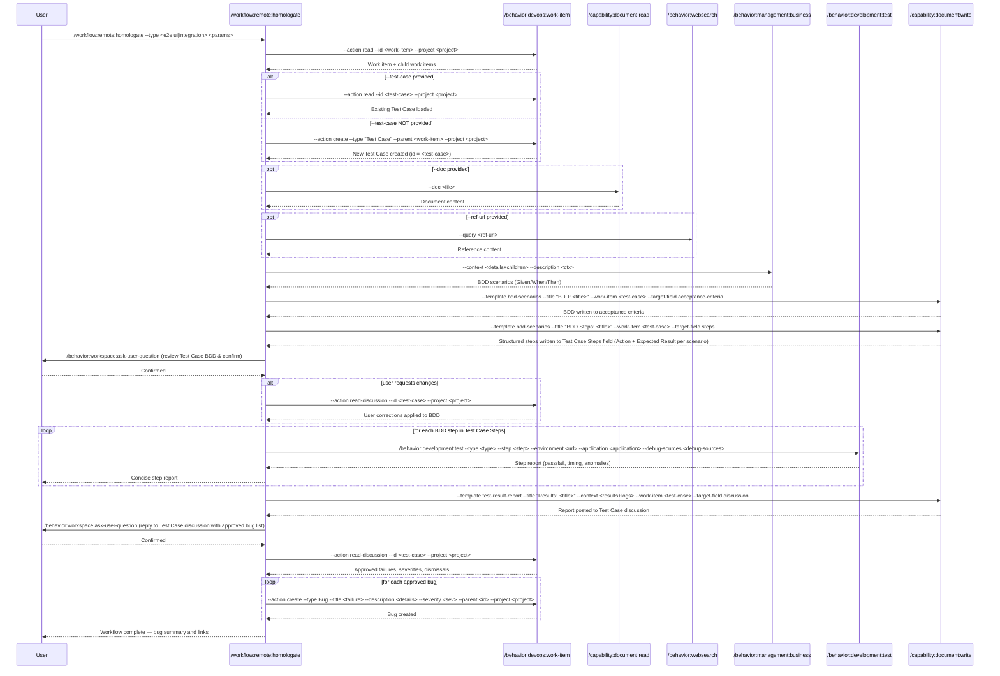

## PURPOSE

Orchestrate homologation testing by retrieving work item details, generating BDD scenarios from acceptance criteria, executing tests against a live URL, correlating failures with diagnostics, and creating bug work items for each approved failure.

The objective of this workflow is to check for inconsistencies, quality issues, unexpected errors, accordance with the BDD flows, and possible improvements to implementations, no need to understand what was fixed or not, this workflow is meant to report the current status of the system.

## TEST TYPES

| `--type` | Scope | Tool |
|----------|-------|------|
| `e2e` | API end-to-end interaction — validates backend contracts and service flows | Direct API Calls |
| `ui` | Browser/UI interaction — validates user-facing flows via browser automation | Playwright |

## WORKFLOW PHASES

1. **Retrieve Work Item and Resolve Test Case**: Fetch work item details and ensure a Test Case exists

   - Call `/behavior:devops:work-item --action read --id <work-item> --project <project>`
   - Retrieve full hierarchy: title, description, acceptance criteria, and all child work items
   - **MANDATORY**: description must not be empty
   - **MANDATORY**: work item is **read-only** — no updates, comments, or writes to the work item in any phase
   - If `--test-case` provided: Call `/behavior:devops:work-item --action read --id <test-case> --project <project>` to load existing Test Case
   - If `--test-case` NOT provided: Call `/behavior:devops:work-item --action create --type "Test Case" --title "Test Case: <work-item-title>" --parent <work-item> --project <project>` to create a new Test Case linked as child — use its ID as `<test-case>` for all subsequent phases

2. **Gather Referenced Documentation**: Enrich testing context with external materials if provided

   - If `--doc` provided: Call `/capability:document:read --doc <doc>`
   - If `--ref-url` provided: Call `/behavior:websearch --query <ref-url>`
   - Compile retrieved content into testing context

3. **Generate BDD Documentation**: Translate acceptance criteria and child work items into detailed BDD scenarios with full API metadata

   - Call `/behavior:management:business --context "<work-item-details + child-work-items>" --description "<provided-description>"`
   - Produce Given/When/Then scenarios appropriate for `--type` (API flows for e2e, UI flows for ui, contract flows for integration)
   - **Each scenario MUST include the following detail level:**
     - Full API call block per `When` step: HTTP method, full URL with path/query parameters, all required headers (Authorization scheme, Content-Type, Accept), request body schema with field types and example values (for POST/PUT/PATCH)
     - Expected HTTP status code per `Then` step
     - Full response schema with all field names, types, and constraints (required/nullable)
     - Explicit validation assertions: what to assert, how to compare, and what constitutes a pass (e.g., `assert response.every(x => x.isActive === true)`)
     - Codebase reference: controller file path and line number where the endpoint is defined
     - Business rule(s) enforced by this scenario (BR-XX)
   - For `e2e` type: include a curl-equivalent example block per scenario for direct reproducibility
   - For scenarios covering multiple data combinations (e.g., validating all payment systems): use `Scenario Outline` with an `Examples` table listing every expected value
   - Call `/capability:document:write --template bdd-scenarios --title "BDD Scenarios: <work-item-title>" --work-item <test-case> --target-field acceptance-criteria` to write BDD as the Test Case acceptance criteria
   - Call `/capability:document:write --template bdd-scenarios --title "BDD Steps: <work-item-title>" --work-item <test-case> --target-field steps` to write each BDD scenario as a structured Test Case Step: **Action** = Given/When block (full API call with curl), **Expected Result** = Then block (assertions and response schema). One step per scenario, using the Azure DevOps Steps field (Microsoft.VSTS.TCM.Steps)
   - After writing acceptance criteria and steps, call `/capability:document:write --template bdd-scenarios --title "BDD Metadata: <work-item-title>" --work-item <test-case> --target-field discussion` to post a supplemental comment containing:
     - Endpoint catalog table (method, route, controller file:line, response type)
     - Full DTO/response schemas with all field names and types
     - Authentication requirements (scheme, token source)
     - Business rules mapping (rule ID → scenario name)
     - Out-of-scope items and deferred edge cases
   - **MANDATORY**: Do NOT proceed to testing before user confirmation

4. **Validate BDD**: Confirm generated BDD scenarios are correct before testing

   - Call `/behavior:workspace:ask-user-question --question "Review the BDD scenarios in the Test Case and confirm to continue or describe changes needed"`
   - If user indicates changes:
     - Call `/behavior:devops:work-item --action read-discussion --id <test-case> --project <project>` to retrieve requested corrections
     - Apply all corrections to the BDD scenarios
     - Call `/capability:document:write --template bdd-scenarios --title "BDD Scenarios: <work-item-title>" --work-item <test-case> --target-field acceptance-criteria` to update Test Case steps with corrected scenarios
     - Call `/behavior:devops:work-item --action post-discussion --id <test-case> --project <project>` to reply confirming what was updated in Test Case steps based on observations

5. **Execute Tests**: Iterate over each BDD step in the Test Case Steps and execute individually

   - For each step in Test Case Steps (in order):
     - Call `/behavior:development:test --type <type> --step "<step>" --environment <url> --application <application> --debug-sources <debug-sources> [--source-metadata <source>]`
     - Display concise step report immediately: step name, result (pass/fail), response time, anomalies

6. **Correlate Step Findings**: Consolidate all per-step diagnostic data into a unified findings list

   - Aggregate all per-step results, New Relic logs, and Playwright logs collected in Phase 5
   - Classify each anomaly or failure by severity and affected BDD scenario
   - Prepare correlated evidence for the Phase 7 report

7. **Generate Test Result Report**: Document all test outcomes and diagnostics

   - Call `/capability:document:write --template test-result-report --title "<type> Test Results: <work-item-title>" --context "<test-results + diagnostic-logs>" --work-item <test-case> --target-field discussion`
   - **MANDATORY**: Report must be posted before user validation

8. **Validate Report and Define Bugs**: Review failures and decide which bugs to create

   - Call `/behavior:workspace:ask-user-question --question "Reply to the test result report in the Test Case discussion with the approved bug list, then confirm to continue"`
   - Call `/behavior:devops:work-item --action read-discussion --id <test-case> --project <project>` to retrieve user replies with approved failures, severity adjustments, and dismissals
   - Compile the final approved bug list from discussion replies before proceeding
   - **MANDATORY**: Do NOT create any bug work items before user explicitly approves the final list

9. **Create Bug Work Items**: Create one bug work item per approved failure

   - For each approved failure: Call `/behavior:devops:work-item --action create --type Bug --title "<failure-description>" --description "<steps-to-reproduce + expected-vs-actual + diagnostic-evidence>" --severity <severity> --parent <test-case> --project <project>`
   - Call `/behavior:devops:work-item --action post-discussion --id <test-case> --project <project>` to reply confirming all created bug IDs and any dismissed failures, ensuring the discussion reflects the final state
   - Provide summary list of all created bug IDs with links

## DELEGATION

**MANDATORY**: Always invoke the agents defined in this command's frontmatter for their designated responsibilities. Never skip, replace, or simulate their behavior directly.

- `zzaia-devops-specialist` — Retrieve work items, post discussions, create child bug work items
- `zzaia-document-specialist` — Generate BDD scenarios, create test result documentation

## WORKFLOW DIAGRAM



## ACCEPTANCE CRITERIA

- Work item and all child work items retrieved with non-empty description
- Test Case resolved: existing one loaded if `--test-case` provided, otherwise a new Test Case created as child of the work item
- BDD scenarios generated appropriate to the test type and written to both Test Case acceptance criteria and Test Case Steps field (Microsoft.VSTS.TCM.Steps)
- Each BDD step executed in sequence with diagnostics collected per step regardless of pass/fail
- Concise step report displayed in prompt after each step execution
- All step findings correlated and classified by severity
- Test result report generated and posted as work item discussion before user validation
- User explicitly reviews report and approves the final bug list with severities before any creation
- Bug work items created only for user-approved failures with full evidence and parent link
- All sub-command invocations delegate to designated agents

## EXAMPLES

```
/workflow:remote:homologate --work-item 12345 --project MyProject --url https://staging.myapp.com --application MyApp --type e2e --debug-sources new-relic

/workflow:remote:homologate --work-item 67890 --project MyProject --url https://staging.myapp.com --application MyApp --type ui --debug-sources new-relic --description "Validate checkout user flow"

/workflow:remote:homologate --work-item 11111 --project MyProject --url https://qa.myapp.com --application MyApp --type ui --debug-sources sqs --source-metadata orders-queue

/workflow:remote:homologate --work-item 22222 --project MyProject --url https://qa.myapp.com --application MyApp --type ui --ref-url https://example.com/acceptance-criteria
```

## OUTPUT

- Phase 1: Work item details with acceptance criteria and child items
- Phase 3: BDD scenarios written to Test Case steps field
- Phase 5: Concise per-step report displayed in prompt after each BDD step (result, timing, anomalies)
- Phase 6: Correlated findings list classified by severity across all steps
- Phase 7: Comprehensive test result report posted as work item discussion
- Phase 9: Summary list of created bug work item IDs with Azure DevOps links
