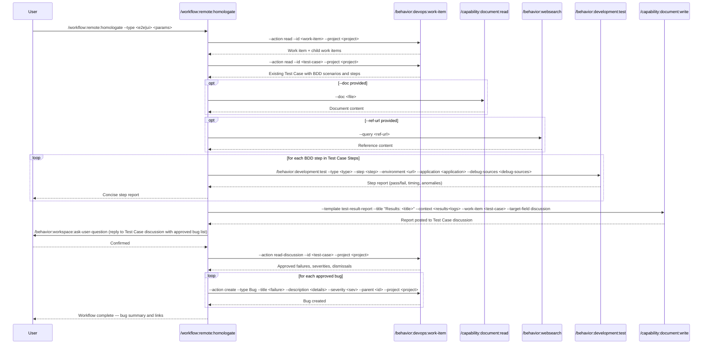

## PURPOSE

Orchestrate homologation testing by retrieving work item details, executing BDD scenarios from an existing Test Case against a live URL, correlating failures with diagnostics, and creating bug work items for each approved failure.

The objective of this workflow is to check for inconsistencies, quality issues, unexpected errors, accordance with the BDD flows, and possible improvements to implementations. This workflow is meant to report the current status of the system.

## TEST TYPES

| `--type` | Scope | Tool |
|----------|-------|------|
| `e2e` | API end-to-end interaction — validates backend contracts and service flows | Direct API Calls |
| `ui` | Browser/UI interaction — validates user-facing flows via browser automation | Playwright |

## WORKFLOW PHASES

1. **Retrieve Work Item and Load Test Case**: Fetch work item details and load the existing Test Case

   - Call `/behavior:devops:work-item --action read --id <work-item> --project <project>`
   - Retrieve full hierarchy: title, description, acceptance criteria, and all child work items
   - **MANDATORY**: description must not be empty
   - **MANDATORY**: work item is **read-only** — no updates, comments, or writes to the work item in any phase
   - Call `/behavior:devops:work-item --action read --id <test-case> --project <project>` to load the existing Test Case with its BDD scenarios and steps

2. **Gather Referenced Documentation**: Enrich testing context with external materials if provided

   - If `--doc` provided: Call `/capability:document:read --doc <doc>`
   - If `--ref-url` provided: Call `/behavior:websearch --query <ref-url>`
   - Compile retrieved content into testing context

3. **Execute Tests**: Iterate over each BDD step in the Test Case Steps and execute individually

   - For each step in Test Case Steps (in order):
     - Call `/behavior:development:test --type <type> --step "<step>" --environment <url> --application <application> --debug-sources <debug-sources> [--source-metadata <source>]`
     - Display concise step report immediately: step name, result (pass/fail), response time, anomalies

4. **Correlate Step Findings**: Consolidate all per-step diagnostic data into a unified findings list

   - Aggregate all per-step results, logs, and Playwright logs collected in Phase 3
   - Classify each anomaly or failure by severity and affected BDD scenario
   - Prepare correlated evidence for the Phase 5 report

5. **Generate Test Result Report**: Document all test outcomes and diagnostics

   - Call `/capability:document:write --template test-result-report --title "<type> Test Results: <work-item-title>" --context "<test-results + diagnostic-logs>" --work-item <test-case> --target-field discussion`
   - **MANDATORY**: Report must be posted before user validation

6. **Validate Report and Define Bugs**: Review failures and decide which bugs to create

   - Call `/behavior:workspace:ask-user-question --question "Reply to the test result report in the Test Case discussion with the approved bug list, then confirm to continue"`
   - Call `/behavior:devops:work-item --action read-discussion --id <test-case> --project <project>` to retrieve user replies with approved failures, severity adjustments, and dismissals
   - Compile the final approved bug list from discussion replies before proceeding
   - **MANDATORY**: Do NOT create any bug work items before user explicitly approves the final list

7. **Create Bug Work Items**: Create one bug work item per approved failure

   - For each approved failure: Call `/behavior:devops:work-item --action create --type Bug --title "<failure-description>" --description "<steps-to-reproduce + expected-vs-actual + diagnostic-evidence>" --severity <severity> --parent <test-case> --project <project>`
   - Call `/behavior:devops:work-item --action post-discussion --id <test-case> --project <project>` to reply confirming all created bug IDs and any dismissed failures
   - Provide summary list of all created bug IDs with links

## DELEGATION

**MANDATORY**: Always invoke the agents defined in this command's frontmatter for their designated responsibilities. Never skip, replace, or simulate their behavior directly.

- `zzaia-devops-specialist` — Retrieve work items, post discussions, create child bug work items
- `zzaia-document-specialist` — Create test result documentation

## WORKFLOW DIAGRAM



## ACCEPTANCE CRITERIA

- Work item and all child work items retrieved with non-empty description
- Existing Test Case loaded with BDD scenarios and steps
- Each BDD step executed in sequence with diagnostics collected per step regardless of pass/fail
- Concise step report displayed in prompt after each step execution
- All step findings correlated and classified by severity
- Test result report generated and posted as work item discussion before user validation
- User explicitly reviews report and approves the final bug list with severities before any creation
- Bug work items created only for user-approved failures with full evidence and parent link
- All sub-command invocations delegate to designated agents

## EXAMPLES

```
/workflow:remote:homologate --work-item 12345 --project MyProject --url https://staging.myapp.com --application MyApp --type e2e --test-case 99001 --debug-sources new-relic

/workflow:remote:homologate --work-item 67890 --project MyProject --url https://staging.myapp.com --application MyApp --type ui --test-case 99002 --debug-sources new-relic --description "Validate checkout user flow"

/workflow:remote:homologate --work-item 11111 --project MyProject --url https://qa.myapp.com --application MyApp --type e2e --test-case 99003 --debug-sources sqs --source-metadata orders-queue

/workflow:remote:homologate --work-item 22222 --project MyProject --url https://qa.myapp.com --application MyApp --type e2e --test-case 99004 --debug-sources cloud-watch --ref-url https://example.com/acceptance-criteria
```

## OUTPUT

- Phase 1: Work item details with acceptance criteria and loaded Test Case steps
- Phase 3: Concise per-step report displayed in prompt after each BDD step (result, timing, anomalies)
- Phase 4: Correlated findings list classified by severity across all steps
- Phase 5: Comprehensive test result report posted as work item discussion
- Phase 7: Summary list of created bug work item IDs with Azure DevOps links
