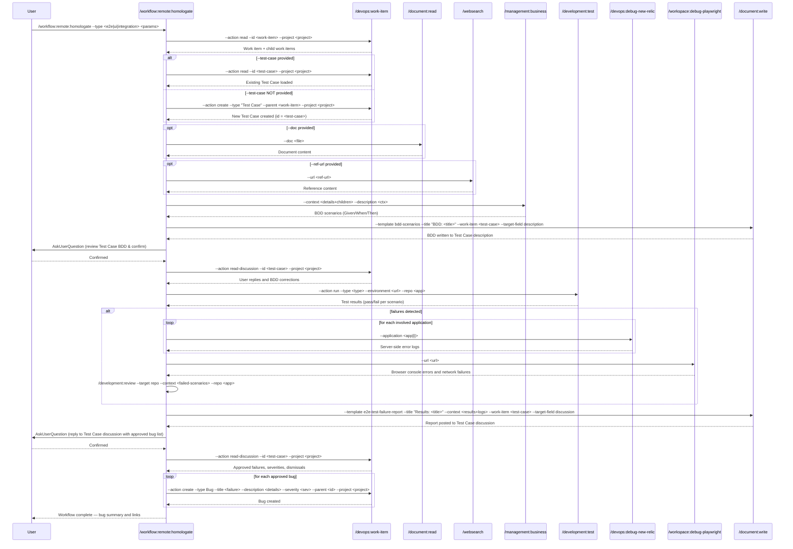

## PURPOSE

Orchestrate homologation testing by retrieving work item details, generating BDD scenarios from acceptance criteria, executing tests against a live URL, correlating failures with diagnostics, and creating bug work items for each approved failure.

## TEST TYPES

| `--type` | Scope | Tool |
|----------|-------|------|
| `e2e` | API end-to-end interaction — validates backend contracts and service flows | API client / k6 |
| `ui` | Browser/UI interaction — validates user-facing flows via browser automation | Playwright |
| `integration` | Service integration — validates inter-service communication and contracts | k6 / NBomber |

## WORKFLOW PHASES

1. **Retrieve Work Item and Resolve Test Case**: Fetch work item details and ensure a Test Case exists

   - Call `/devops:work-item --action read --id <work-item> --project <project>`
   - Retrieve full hierarchy: title, description, acceptance criteria, and all child work items
   - **MANDATORY**: description must not be empty
   - **MANDATORY**: work item is **read-only** — no updates, comments, or writes to the work item in any phase
   - If `--test-case` provided: Call `/devops:work-item --action read --id <test-case> --project <project>` to load existing Test Case
   - If `--test-case` NOT provided: Call `/devops:work-item --action create --type "Test Case" --title "Test Case: <work-item-title>" --parent <work-item> --project <project>` to create a new Test Case linked as child — use its ID as `<test-case>` for all subsequent phases

2. **Gather Referenced Documentation**: Enrich testing context with external materials if provided

   - If `--doc` provided: Call `/document:read --doc <doc>`
   - If `--ref-url` provided: Call `/websearch --url <ref-url>`
   - Compile retrieved content into testing context

3. **Generate BDD Documentation**: Translate acceptance criteria and child work items into BDD scenarios

   - Call `/management:business --context "<work-item-details + child-work-items>" --description "<provided-description>"`
   - Produce Given/When/Then scenarios appropriate for `--type` (API flows for e2e, UI flows for ui, contract flows for integration)
   - Call `/document:write --template bdd-scenarios --title "BDD Scenarios: <work-item-title>" --work-item <test-case> --target-field description` to write BDD as the Test Case description
   - **MANDATORY**: Do NOT proceed to testing before user confirmation

4. **Validate BDD**: Confirm generated BDD scenarios are correct before testing

   - Use **AskUserQuestion** to ask user to review the BDD in the Test Case and confirm to continue
   - Call `/devops:work-item --action read-discussion --id <test-case> --project <project>` to retrieve user replies and any BDD changes requested
   - Apply any corrections from discussion replies before proceeding to testing

5. **Execute Tests**: Run tests against the target URL following validated BDD scenarios

   - If authentication is required (login, token, credential): Use **AskUserQuestion** to ask the user to provide the credential or perform the manual login in the Playwright session before proceeding
   - Call `/development:test --action run --type <type> --environment <url> --repo <application>`
   - For `ui` type: Playwright browser automation drives UI interactions
   - For `e2e` type: API client validates endpoint contracts and service flows
   - Capture all pass/fail results, response times, error details per scenario

6. **Retrieve Diagnostic Logs**: Collect all available diagnostics if failures occurred

   - If failures detected:
     - Call `/devops:debug-new-relic --application <application[i]>` for each involved application
     - Call `/workspace:debug-playwright --url <url>` to retrieve browser logs (always for `ui` type; conditional for others)
     - Call `/development:review --target repo --context "failures related to <failed-scenarios>" --repo <application[i]>`
   - Correlate all findings (New Relic, browser, local) with failed test scenarios

7. **Generate Test Result Report**: Document all test outcomes and diagnostics

   - Call `/document:write --template e2e-test-failure-report --title "<type> Test Results: <work-item-title>" --context "<test-results + diagnostic-logs>" --work-item <test-case> --target-field discussion`
   - **MANDATORY**: Report must be posted before user validation

8. **Validate Report and Define Bugs**: Review failures and decide which bugs to create

   - Use **AskUserQuestion** to ask user to reply to the report in the Test Case discussion with the approved bug list
   - Call `/devops:work-item --action read-discussion --id <test-case> --project <project>` to retrieve user replies with approved failures, severity adjustments, and dismissals
   - Compile the final approved bug list from discussion replies before proceeding
   - **MANDATORY**: Do NOT create any bug work items before user explicitly approves the final list

9. **Create Bug Work Items**: Create one bug work item per approved failure

   - For each approved failure: Call `/devops:work-item --action create --type Bug --title "<failure-description>" --description "<steps-to-reproduce + expected-vs-actual + diagnostic-evidence>" --severity <severity> --parent <test-case> --project <project>`
   - Provide summary list of all created bug IDs with links

## DELEGATION

**MANDATORY**: Always invoke the agents defined in this command's frontmatter for their designated responsibilities. Never skip, replace, or simulate their behavior directly.

- `zzaia-devops-specialist` — Retrieve work items, post discussions, create child bug work items
- `zzaia-tester-specialist` — Execute tests against the target URL, capture results and error details
- `zzaia-document-specialist` — Generate BDD scenarios, create test result documentation

## WORKFLOW DIAGRAM



## ACCEPTANCE CRITERIA

- Work item and all child work items retrieved with non-empty description
- Test Case resolved: existing one loaded if `--test-case` provided, otherwise a new Test Case created as child of the work item
- BDD scenarios generated appropriate to the test type and written to Test Case description
- Tests executed against target URL with full pass/fail capture per scenario
- Test failures correlated with New Relic, browser, and local diagnostics
- Test result report generated and posted as work item discussion before user validation
- User explicitly reviews report and approves the final bug list with severities before any creation
- Bug work items created only for user-approved failures with full evidence and parent link
- All sub-command invocations delegate to designated agents

## EXAMPLES

```
/workflow:remote:homologate --work-item 12345 --project MyProject --url https://staging.myapp.com --application MyApp --type e2e

/workflow:remote:homologate --work-item 67890 --project MyProject --url https://staging.myapp.com --application MyApp --type ui --description "Validate checkout user flow"

/workflow:remote:homologate --work-item 54321 --project MyProject --url https://qa.myapp.com --application MyApp --type integration --doc /path/to/requirements.md

/workflow:remote:homologate --work-item 11111 --project MyProject --url https://qa.myapp.com --application MyApp --type ui --ref-url https://example.com/acceptance-criteria
```

## OUTPUT

- Phase 1: Work item details with acceptance criteria and child items
- Phase 3: BDD scenarios posted as work item discussion
- Phase 5: Test execution results with pass/fail counts and timing per scenario
- Phase 6: Diagnostic report (New Relic, browser, local) correlated to failures
- Phase 7: Comprehensive test result report posted as work item discussion
- Phase 9: Summary list of created bug work item IDs with Azure DevOps links
