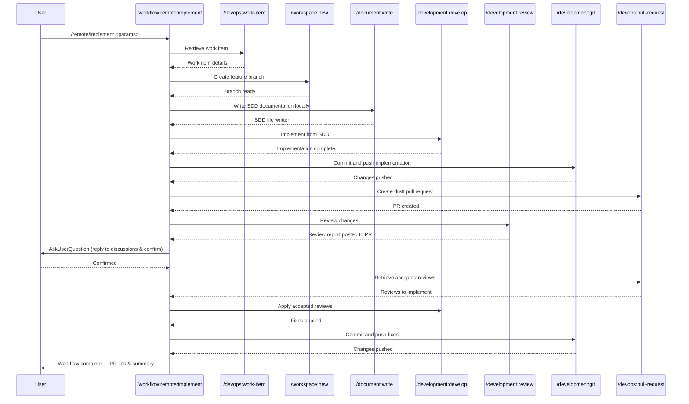

## PURPOSE

Execute a complete implementation workflow that orchestrates multiple development commands in sequence. This generic, reusable workflow enables developers to implement work items following consistent patterns from requirements retrieval through pull request creation.

## WORKFLOW PHASES

1. **Retrieve Work Item**: Fetch work item details and requirements

   - Call `/devops:work-item` with workitem parameter
   - Obtain title, description, and acceptance criteria
   - Pass retrieved context to implementation phase
   - **MANDATORY** Must use the work item descriptions and it must not be empty and must have the SDD documentation with all ADRs

2. **Create Feature Branch**: Setup feature branch from target branch

   - Call `/workspace:new` with repository_name, target_branch, new_branch_name parameters
   - Prepare worktree for development
   - Verify branch is ready for code changes
   - Verify that the target branch is updated

3. **Write Documentation Locally**: Produce the SDD documentation from the architecture design coming from the work-items descriptions

   - Call `/document:write` to produce the documentation in local /doc folder
   - Organize following the folder and name conventions that already exist
   - Generate concise Specification Driven Design (SDD) documentation for the feature

4. **Implement Feature**: Execute development based on SDD documentation

   - Call `/development:develop` in created workspace branch_name
   - Implement functionality with comprehensive testing
   - Ensure code follows language-specific standards

5. **Commit and Push**: Stage, commit, and push implementation changes

   - Call `/development:git` with branch parameter
   - Create conventional commit message referencing work item
   - Push changes to remote origin

6. **Create Draft Pull Request**: Open draft pull request

   - Call `/devops:pull-request` with source_branch, target_branch, work-item parameters to create a draft pull request
   - Link PR to original work item

7. **Review Changes**: Review all developed changes

   - Call `/development:review` for all developed changes
   - Call `/devops:pull-request` post all reviewed results
   - Use the tool **AskUserQuestion** to ask user to reply to all Azure DevOps discussions and confirm to continue

8. **Implement Accepted Reviews**: Execute development accepted reviews in pull request discussions

   - Call `/devops:pull-request` retrieve all accepted and user created reviews to be implemented
   - Call `/development:develop` to fix or improve the code

9. **Commit and Push**: Stage, commit, and push all changes

   - Call `/development:git` with branch parameter
   - Create conventional commit message referencing work item
   - Push changes to remote origin

## DELEGATION

**MANDATORY**: Always invoke the agents defined in this command's frontmatter for their designated responsibilities. Never skip, replace, or simulate their behavior directly.

- `zzaia-task-clarifier` — Analyze work item requirements and clarify acceptance criteria
- `zzaia-repository-manager` — Manage feature branch creation and worktree setup
- `zzaia-developer-specialist` — Implement feature based on approved SDD documentation
- `zzaia-tester-specialist` — Validate build quality and test coverage

## WORKFLOW DIAGRAM



## ACCEPTANCE CRITERIA

- Work item details retrieved with non-empty SDD documentation and ADRs
- Feature branch created from target branch with correct naming
- SDD documentation written to local /doc folder following existing conventions
- Implementation executes with full work item context and SDD documentation
- Initial implementation committed and pushed before PR creation
- Draft pull request created linking feature branch to target branch with work item reference
- Review results posted to PR discussions; user confirms before proceeding
- Accepted reviews implemented and committed with conventional format referencing work item
- Workflow execution provides clear output at each phase with status and results

## EXAMPLES

```
/remote/implement --work-item 1605 --repo order-service --target-branch develop --working-branch feature/implement-providers-entities --description "Implement provider entities following order-service pattern with repository pattern and comprehensive unit tests"

/remote/implement --work-item 1606 --repo order-service --target-branch develop --working-branch feature/add-provider-api --description "Add provider API endpoints with CRUD operations, validation, and integration tests"

/remote/implement --work-item 1607 --repo order-service --target-branch main --working-branch feature/fix-authentication-bug --description "Fix authentication token refresh issue and add regression tests"
```

## OUTPUT

- Phase status reports with completion indicators
- Work item details retrieved in phase 1
- Feature branch reference and ready status
- Implementation summary with test results
- Git commit hash and push confirmation
- Pull request URL and link to work item
