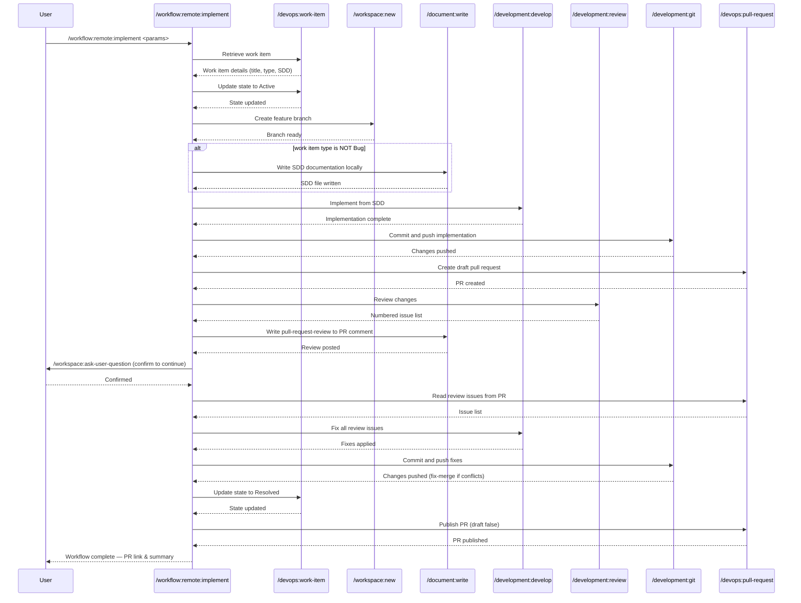

## PURPOSE

Execute a complete implementation workflow that orchestrates multiple development commands in sequence. This generic, reusable workflow enables developers to implement work items following consistent patterns from requirements retrieval through pull request creation.

## WORKFLOW PHASES

1. **Retrieve Work Item**: Fetch work item details and requirements

   - Call `/devops:work-item --id <work-item> --project <project>`
   - Obtain title, description, type (Bug or other), and acceptance criteria
   - **MANDATORY** Work item description must not be empty and must contain SDD documentation with all ADRs (skip for Bug type)
   - Change work item state to **Active** via `/devops:work-item --id <work-item> --project <project> --action update --state Active`

2. **Create Feature Branch**: Setup feature branch from target branch

   - Call `/workspace:new --repo <repo> --branch <working-branch>`
   - Verify branch is ready for code changes and target branch is up to date

3. **Write Documentation Locally**: Produce the SDD documentation from the work item architecture design

   - **SKIP this phase if work item type is Bug**
   - Call `/document:write --template service-architecture --title "<work-item-title>" --output ./docs/<feature-name>.md`
   - Organize following folder and name conventions that already exist

4. **Implement Feature**: Execute development based on SDD documentation or description

   - Call `/development:develop --task "<description + SDD content>" --repo <repo> --branch <working-branch>`
   - Implement functionality with comprehensive testing
   - Ensure code follows language-specific standards

5. **Commit and Push**: Stage, commit, and push implementation changes

   - Call `/development:git --action commit --repository <repo> --branch <working-branch> --message "feat: <description> [#<work-item>]"`
   - Push changes to remote origin

6. **Create Draft Pull Request**: Open draft pull request

   - Call `/devops:pull-request --action create --portal <portal> --project <project> --repo <repo> --source-branch <working-branch> --target-branch <target-branch> --work-item <work-item>`
   - Link PR to original work item

7. **Review Changes**: Review all developed changes and post findings to PR

   - Call `/development:review --target repo --path ./workspace/<repo>.worktrees/<working-branch>`
   - Generate numbered issue list from review output
   - Call `/document:write --template pull-request-review --title "Review: <work-item-title>" --pr <pr-id> --target-field comment` to post the review with numbered issues to the PR
   - Call `/workspace:ask-user-question --question "Review posted to PR. How would you like to proceed?" --options "Continue — read selected issues from pull-request; Continue without fixing any issue; <Any user input>"`

8. **Implement Accepted Reviews**: Apply review feedback based on user selection

   - Call `/devops:pull-request --action read --portal <portal> --project <project> --repo <repo> --pr <pr-id>` to retrieve all selected reviewed issues from PR
   - Call `/development:develop --task "Fix all review issues: <numbered-issue-list>" --repo <repo> --branch <working-branch>`

9. **Commit and Push**: Stage, commit, and push all changes

   - Call `/development:git --action commit --repository <repo> --branch <working-branch> --message "fix: apply review feedback [#<work-item>]"`
   - If merge conflicts are detected, call `/workflow:fix-merge --repo <repo> --branch <working-branch> --target-branch <target-branch>` before pushing
   - Push changes to remote origin
   - Change work item state to **Resolved** via `/devops:work-item --id <work-item> --project <project> --action update --state Resolved`

10. **Publish Pull Request**: Mark pull request as ready for review

    - Call `/devops:pull-request --action update --portal <portal> --project <project> --repo <repo> --pr <pr-id> --draft false`
    - Confirm PR is published and share PR link with user

## DELEGATION

**MANDATORY**: Always invoke the agents defined in this command's frontmatter for their designated responsibilities. Never skip, replace, or simulate their behavior directly.

- `zzaia-task-clarifier` — Analyze work item requirements and clarify acceptance criteria
- `zzaia-workspace-manager` — Manage feature branch creation and worktree setup
- `zzaia-developer-specialist` — Implement feature based on approved SDD documentation
- `zzaia-tester-specialist` — Validate build quality and test coverage

## WORKFLOW DIAGRAM



## ACCEPTANCE CRITERIA

- Work item details retrieved with non-empty SDD documentation and ADRs (except Bug type)
- Work item state changed to Active at start of workflow
- Feature branch created from target branch with correct naming
- SDD documentation written to local /doc folder following existing conventions (skipped for Bug type)
- Implementation executes with full work item context and SDD documentation
- Initial implementation committed and pushed before PR creation
- Draft pull request created linking feature branch to target branch with work item reference
- Review findings posted to PR as numbered issue list using `pull-request-review` template via `/document:write`
- User asked only to confirm to continue — no issue selection required
- All review issues implemented and committed with conventional format referencing work item
- Merge conflicts resolved via `/workflow:fix-merge` before final push
- Work item state changed to Resolved after final commit and push
- Pull request published (draft removed) after fixes are pushed
- Workflow execution provides clear output at each phase with status and results

## EXAMPLES

```
/workflow:remote:implement --work-item 1605 --portal azure --project my-project --repo order-service --target-branch develop --working-branch feature/implement-providers-entities --description "Implement provider entities following order-service pattern with repository pattern and comprehensive unit tests"

/workflow:remote:implement --work-item 1606 --portal azure --project my-project --repo order-service --target-branch develop --working-branch feature/add-provider-api --description "Add provider API endpoints with CRUD operations, validation, and integration tests"

/workflow:remote:implement --work-item 1607 --portal github --project my-org/my-project --repo order-service --target-branch main --working-branch feature/fix-authentication-bug --description "Fix authentication token refresh issue and add regression tests"
```

## OUTPUT

- Phase status reports with completion indicators
- Work item details retrieved in phase 1
- Feature branch reference and ready status
- Implementation summary with test results
- Git commit hash and push confirmation
- Pull request URL and link to work item
