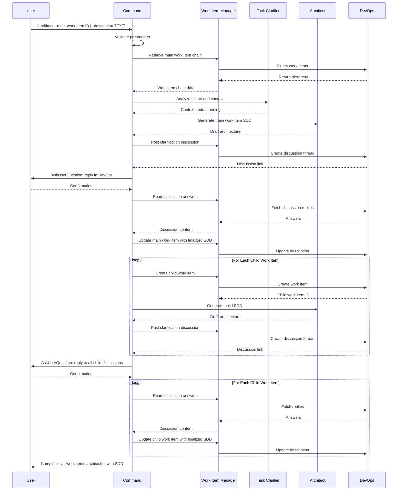

## PURPOSE

Orchestrate architectural documentation and work-item hierarchy creation for a given main work item using Specification Driven Design (SDD). Decomposes requirements into a parallelizable hierarchy of work items, each with embedded SDD documentation at the appropriate abstraction level (Epic → Feature → User Story → Task). Enables human team collaboration through Azure DevOps discussions before structural changes, supporting post-implementation orchestration with `/implement`.

## EXECUTION

1. **Retrieve Work Item Chain**
   - Call `/management:work-items` with `main-work-item` parameter to retrieve the full hierarchy
   - Collect Title, Description, Acceptance Criteria from each level (Epic → Feature → User Story → Task)
   - **MANDATORY** Main work item description and acceptance criteria must not be empty

2. **Gather Repository and Referenced Documentation**
   - Inspect local workspace repositories using the `Read` tool for file path references (source code, configs, existing docs)
   - Call `/document:read` for any local document file references (PDF, Word) found in work items or workspace
   - Call `/websearch` for any URL references found in work items
   - Enrich architectural context with retrieved repository structure and materials

3. **Generate Main Work Item Architecture**
   - Call `/development:architect` with main work item context and description parameter
   - Call `/management:work-items` to post a discussion on the main work item with all clarification questions as a numbered list
   - **MANDATORY** Do NOT create child work items or update descriptions before user responds

4. **Validate Main Work Item**
   - Use the tool **AskUserQuestion** to ask user to reply to the Azure DevOps discussion and confirm to continue
   - Call `/management:work-items` to read all discussion answers from the main work item
   - Call `/management:work-items` to update main work item description with finalized SDD in markdown following the templates

5. **Create Child Work Items**
   - Call `/management:work-items` to create the full child hierarchy (Features, User Stories, Tasks)
   - Each level must have appropriate SDD granularity: Epic (system), Feature (component), User Story (functional), Task (implementation)
   - Leaf tasks must be designed as independent pull requests where possible
   - Call `/management:work-items` to establish dependency links (`related`, `consumes-from`) between dependent items

6. **Generate Child Work Item Architecture**
   - Call `/development:architect` to generate a draft SDD for each child work item
   - Call `/management:work-items` to post a single discussion on **each** child work item with all clarification questions as a numbered list
   - **MANDATORY** Do NOT update descriptions before user responds

7. **Validate Child Work Items**
   - Use the tool **AskUserQuestion** to ask user to reply to all Azure DevOps discussions and confirm to continue
   - Call `/management:work-items` to read discussion answers from each child work item
   - Call `/management:work-items` to update each child work item description with finalized SDD in markdown

## WORKFLOW



## ACCEPTANCE CRITERIA

- Main work item chain retrieved and understood
- Referenced documentation integrated into context
- Main work item SDD discussion posted before any structural changes
- Main work item description updated with finalized markdown SDD
- Child work items created with correct hierarchy and dependency relationships
- Each child work item includes discussion with clarification questions
- Each child work item description updated with finalized markdown SDD
- Leaf-level tasks designed as independent, parallelizable pull requests

## KEY DESIGN PRINCIPLES

- **SDD Granularity**: Epic (system-level), Feature (component), User Story (functional), Task (implementation)
- **Discussion-First**: All architectural decisions validated via DevOps discussions before structural changes
- **Parallelization**: Leaf tasks designed as independent pull requests where possible
- **Dependency Tracking**: Work-item links establish explicit dependencies between tasks
- **Human Collaboration**: Architectural decisions integrated through DevOps discussion threads, not CLI alone

## EXAMPLES

```
/architect --main-work-item 2001 --description "Multi-tenant notification service with email, SMS, and push channels"

/architect --main-work-item 1850

/architect --main-work-item 2200 --description "Refactor payment gateway integration for multiple provider support"
```

## OUTPUT

- Phase completion status at each step
- Work item chain summary with hierarchy visualization
- SDD discussion thread links for main and child work items
- Finalized work item descriptions with embedded markdown SDD
- List of created child work items with IDs, types, and dependencies
- Parallelization map indicating which tasks can run concurrently
- Dependency graph showing consumes-from and related relationships
