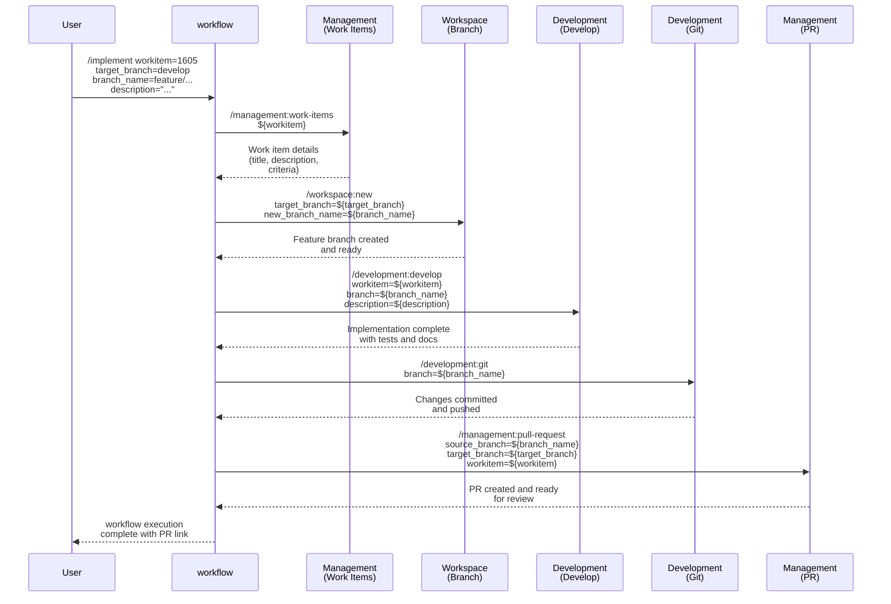

## PURPOSE

Execute a complete implementation workflow that orchestrates multiple development commands in sequence. This generic, reusable workflow enables developers to implement work items following consistent patterns from requirements retrieval through pull request creation.

## WORKFLOW PHASES 

1. **Retrieve Work Item**: Fetch work item details and requirements

   - Call `/management:work-items` with workitem parameter
   - Obtain title, description, and acceptance criteria
   - Pass retrieved context to implementation phase

2. **Create Feature Branch**: Setup feature branch from target branch

   - Call `/workspace:new` with repository_name, target_branch, new_branch_name parameters
   - Prepare worktree for development
   - Verify branch is ready for code changes

3. **Clarify Feature**: Execute development based on work item requirements

   - Call `/development:architect` with branch, work directory, and description parameters
   - Clarify all requirements with the user before implementing documentations
   - Implement all necessary Specification Driven Design (SDD) documentation to implement the feature  

4. **Wait User Approval**: Execute development based on work item requirements
   - User should make some changes to SDD before next phase

5. **Implement Feature**: Execute development based on SDD documentation

   - Call `/development:develop` with approved SDD documentation 
   - Implement functionality with comprehensive testing
   - Ensure code follows language-specific standards

6. **Commit and Push**: Stage, commit, and push all changes

   - Call `/development:git` with branch parameter
   - Create conventional commit message referencing work item
   - Push changes to remote origin

7. **Create Pull Request**: Open pull request for review

   - Call `/management:pull-request` with source_branch, target_branch, workitem parameters
   - Link PR to original work item
   - Prepare for code review and merge

## WORKFLOW DIAGRAM



## ACCEPTANCE CRITERIA

- Work item details successfully retrieved and passed to implementation phase
- Feature branch created from target branch with correct naming
- Implementation executes with full work item context and description
- All code changes committed with conventional format referencing work item
- Pull request created linking feature branch to target branch with work item reference
- workflow execution provides clear output at each phase with status and results

## EXAMPLES

```
/implement workitem=1605 target_branch=develop branch_name=feature/implement-providers-entities description="Implement provider entities following order-service pattern with repository pattern and comprehensive unit tests"

/implement workitem=1606 target_branch=develop branch_name=feature/add-provider-api description="Add provider API endpoints with CRUD operations, validation, and integration tests"

/implement workitem=1607 target_branch=main branch_name=feature/fix-authentication-bug description="Fix authentication token refresh issue and add regression tests"
```

## OUTPUT

- Phase status reports with completion indicators
- Work item details retrieved in phase 1
- Feature branch reference and ready status
- Implementation summary with test results
- Git commit hash and push confirmation
- Pull request URL and link to work item
