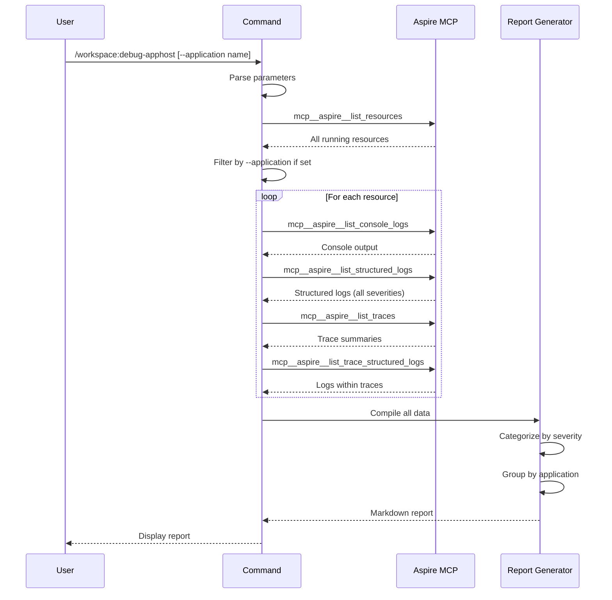

## PURPOSE

Diagnose issues in the Aspire AppHost by reading all available telemetry data via MCP tools. Generate a structured markdown report showing errors, warnings, failed traces, and unhealthy resources grouped by application with severity indicators.

This is a read-only command—no writes, no state changes.

## EXECUTION

1. **Discover Resources**: Call `mcp__aspire__list_resources` to enumerate all running resources; if `--application` is set, filter to that application only

2. **Collect Telemetry**: For each resource, gather:
   - Console logs via `mcp__aspire__list_console_logs`
   - Structured logs via `mcp__aspire__list_structured_logs` (filter Warning/Error severity)
   - Distributed traces via `mcp__aspire__list_traces`
   - Trace logs via `mcp__aspire__list_trace_structured_logs` for traces with errors

3. **Analyze & Report**: Categorize findings by severity:
   - Errors (❌)
   - Warnings (⚠️)
   - Failed traces
   - Unhealthy resources

4. **Output**: Generate consolidated markdown report with summary table at top, grouped by application

## WORKFLOW



## ACCEPTANCE CRITERIA

- Command is read-only—no writes to files or state changes
- Uses `mcp__aspire__` tools directly; does not simulate
- Supports optional `--application` parameter to filter results
- Report includes summary table with error/warning counts per application
- Severity indicators used: ❌ (Error), ⚠️ (Warning)
- Grouped output organized by application name
- Handles empty results gracefully (e.g., no errors, no warnings)
- Includes timestamp and resource health status where available

## EXAMPLES

```
/workspace:debug-apphost
/workspace:debug-apphost --application api-service
/workspace:debug-apphost --application web-ui
```

## OUTPUT

- Consolidated markdown report
- Summary table: Application | Errors | Warnings | Failed Traces | Status
- Sections per application with categorized findings
- Direct output to stdout (no file write)
