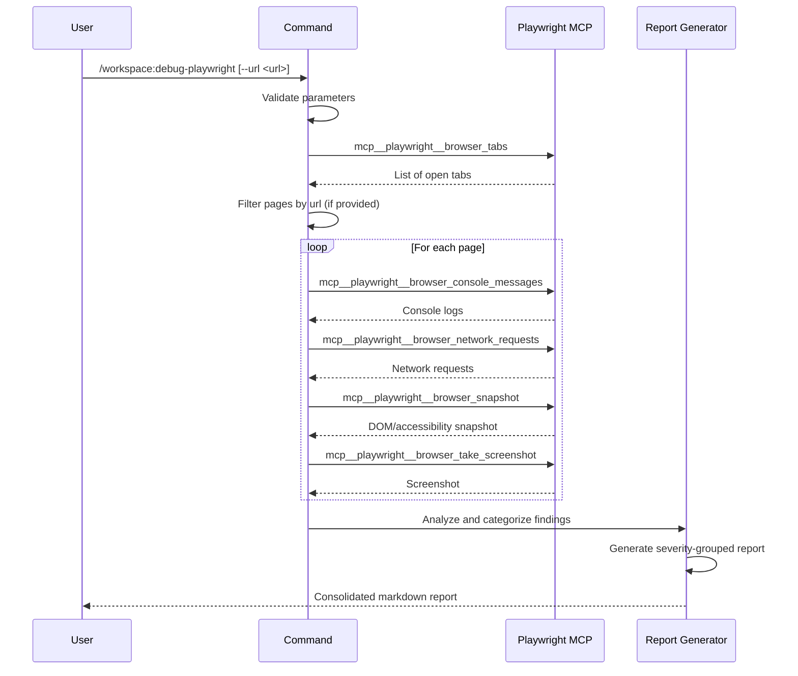

## PURPOSE

Diagnose browser-based issues by collecting console output, network errors, and page snapshots from active Playwright sessions. Generates consolidated markdown report categorized by severity and grouped by page URL.

## EXECUTION

1. **Discover Pages** — Call `mcp__playwright__browser_tabs` to list all open tabs. Filter to matching tab if `--url` is provided.

   - Enumerate all browser pages in session
   - Identify target page(s) for analysis

2. **Collect Console Logs** — Call `mcp__playwright__browser_console_messages` to retrieve all console output. Separate by level: errors, warnings, info.

   - Extract error messages
   - Extract warning messages
   - Extract info/log messages

3. **Collect Network Requests** — Call `mcp__playwright__browser_network_requests` to retrieve all requests. Flag failed (4xx/5xx) and blocked requests.

   - Identify failed requests
   - Identify blocked requests
   - Capture request/response details

4. **Capture Page State** — Call `mcp__playwright__browser_snapshot` for DOM/accessibility state. Call `mcp__playwright__browser_take_screenshot` for visual context.

   - Collect DOM structure snapshot
   - Collect accessibility tree
   - Capture current screenshot

5. **Analyze & Report** — Categorize findings by severity. Generate consolidated markdown report grouped by page URL.

   - Errors (❌)
   - Warnings (⚠️)
   - Failed Requests (🔴)
   - Blocked Requests (🚫)

## DELEGATION

**MANDATORY**: Invoke the agents defined in this command's frontmatter for their designated responsibilities. Never skip, replace, or simulate their behavior directly.

- `zzaia-workspace-manager` — Directly call MCP Playwright tools to collect session data and generate diagnostic report

## WORKFLOW



## ACCEPTANCE CRITERIA

- Retrieves all console messages from active Playwright session
- Captures failed and blocked network requests with status codes
- Collects DOM snapshots and screenshots for all targeted pages
- Categorizes findings by severity level (errors, warnings, requests)
- Generates single consolidated markdown report grouped by page URL
- Handles optional `--url` filter correctly
- Read-only operation with no state changes

## EXAMPLES

```
/workspace:debug-playwright
/workspace:debug-playwright --url https://localhost:3000/dashboard
/workspace:debug-playwright --url https://api.example.com
```

## OUTPUT

- Consolidated markdown report with sections per page URL
- Severity-grouped findings: Errors, Warnings, Failed Requests, Blocked Requests
- Console messages with log levels
- Network request details with status codes and blocked indicators
- Screenshots and DOM snapshots for page state context
