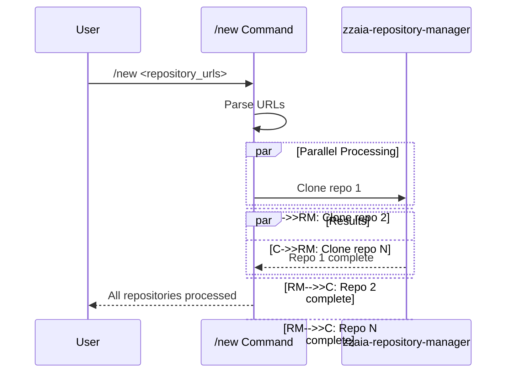

## PURPOSE

Handle two primary operations:
1. Clone new project repositories into the workspace folder
2. Create new worktree branches in existing repository folders

## EXECUTION

### Repository Cloning Mode
1. **URL Processing**
   - Parse multiple repository URLs
   - Validate URL formats

2. **Parallel Agent Dispatch**
   - Call zzaia-repository-manager for each repository URL
   - Execute repository cloning operations in parallel

3. **Result Aggregation**
   - Collect results from all parallel operations
   - Report success/failure status for each repository

### Branch Creation Mode
1. **Input Parsing**
   - Extract repository name and branch name
   - Validate existing worktree structure
   - Default remote branch master/main
   - If branch is specified check in remote for it before creating new local one 

2. **Agent Dispatch**
   - Call zzaia-repository-manager for branch creation
   - Create new worktree branch in existing repository

3. **Branch Setup**
   - Checkout new branch
   - Configure worktree metadata
   - Report operation status

## AGENTS

- **zzaia-repository-manager**: Handles repository cloning, worktree management, and workspace integration

## WORKFLOW



## PARAMETERS

- `input`:
  - **Repository Mode**: One or more full HTTPS or SSH git repository URLs to clone (space-separated)
  - **Branch Mode**: `repository_name branch_name` to create new worktree branch

## EXAMPLES

### Repository Cloning
```bash
# Single repository
/new https://github.com/username/repository.git

# Multiple repositories in parallel
/new https://github.com/username/repo1.git https://github.com/username/repo2.git
/new git@github.com:username/private-repo.git https://github.com/username/public-repo.git
```

### Branch Creation
```bash
# Create new branch in existing worktree
/new my-api feature/user-authentication
/new frontend bugfix/header-styling
```

## OUTPUT

### Repository Cloning
- Multiple repositories cloned in parallel to workspace folder
- Repository-specific worktrees created for each
- repository-metadata.json generated for each repository
- Aggregated status report for all operations

### Branch Creation
- New worktree branch created in existing repository
- Branch checked out and ready for development
- Worktree metadata updated
- Operation status confirmation
