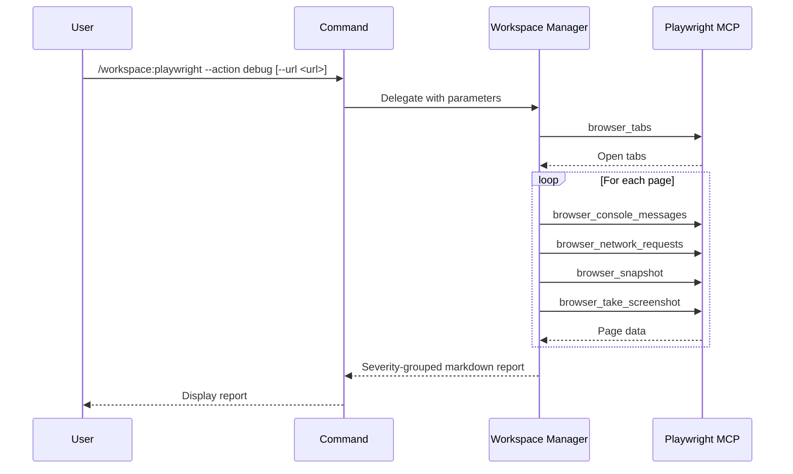

## PURPOSE

Single interface for Playwright browser session management. Routes to diagnostics based on `--action`.

## ACTIONS

| Action  | Description                                                              |
|---------|--------------------------------------------------------------------------|
| `debug` | Collect console logs, network errors, and snapshots; generate issue report |

## EXECUTION

### action=debug

1. **Discover Pages** — `mcp__playwright__browser_tabs`; filter by `--url` if set
2. **Collect Console Logs** — `mcp__playwright__browser_console_messages`; separate errors, warnings, info
3. **Collect Network Requests** — `mcp__playwright__browser_network_requests`; flag 4xx/5xx and blocked
4. **Capture Page State** — `mcp__playwright__browser_snapshot` + `mcp__playwright__browser_take_screenshot`
5. **Report** — Categorize by severity ❌ ⚠️ 🔴 🚫; group by page URL; output markdown report

## DELEGATION

**MANDATORY**: Always invoke the agents defined in this command's frontmatter for their designated responsibilities. Never skip, replace, or simulate their behavior directly.

- `zzaia-workspace-manager` — Executes all Playwright MCP tool calls and generates the diagnostic report

## WORKFLOW



## ACCEPTANCE CRITERIA

- Read-only — no writes, no state changes
- Uses `mcp__playwright__` tools only; does not simulate
- Handles optional `--url` filter
- Report grouped by page URL with severity indicators

## EXAMPLES

```
/workspace:playwright --action debug
/workspace:playwright --action debug --url https://localhost:3000/dashboard
```

## OUTPUT

- Markdown report per page URL
- Severity-grouped findings: Errors, Warnings, Failed Requests, Blocked Requests
- Console messages, network details, screenshots, and DOM snapshots
