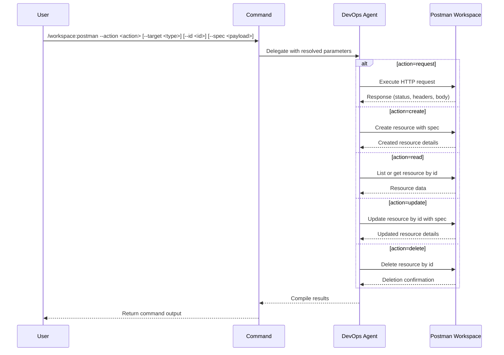

## PURPOSE

Generic Postman MCP interface for managing workspace resources and executing HTTP requests. Supports full CRUD operations on collections, requests, environments, and mocks, plus direct HTTP execution.

## ACTIONS

| Action    | Description                                      |
|-----------|--------------------------------------------------|
| `request` | Execute an HTTP call via Postman runner          |
| `create`  | Create a new resource (collection, request, env) |
| `read`    | Read/list existing resources                     |
| `update`  | Update an existing resource                      |
| `delete`  | Delete a resource by ID or name                  |

## EXECUTION

1. **Resolve Target**: Identify resource type and ID from parameters
2. **Dispatch Action**: Route to appropriate Postman MCP tool based on `--action` and `--target`
3. **Return Result**: Return structured output with operation status and data

## DELEGATION

**MANDATORY**: Always invoke the agents defined in this command's frontmatter for their designated responsibilities. Never skip, replace, or simulate their behavior directly.

- `zzaia-workspace-manager` — Execute all Postman MCP operations including CRUD on workspace resources and HTTP request execution

## WORKFLOW



## ACCEPTANCE CRITERIA

- Each action completes with structured response indicating success or failure
- `request` action returns HTTP status, headers, and body
- CRUD actions return affected resource details
- Resource follows workspace naming and folder conventions

## EXAMPLES

```
/workspace:postman --action request --spec "--method GET --url https://api.example.com/users"
/workspace:postman --action create --target request --spec "--method POST --url https://api.example.com/users --body '{\"name\":\"test\"}'"
/workspace:postman --action read --target collection
/workspace:postman --action read --target collection --id my-collection-id
/workspace:postman --action update --target request --id req-id --spec "--body '{\"name\":\"updated\"}'"
/workspace:postman --action delete --target request --id req-id
```

## OUTPUT

- Operation status (success/failure)
- Affected resource details or HTTP response
- Workspace confirmation for create/update/delete actions
