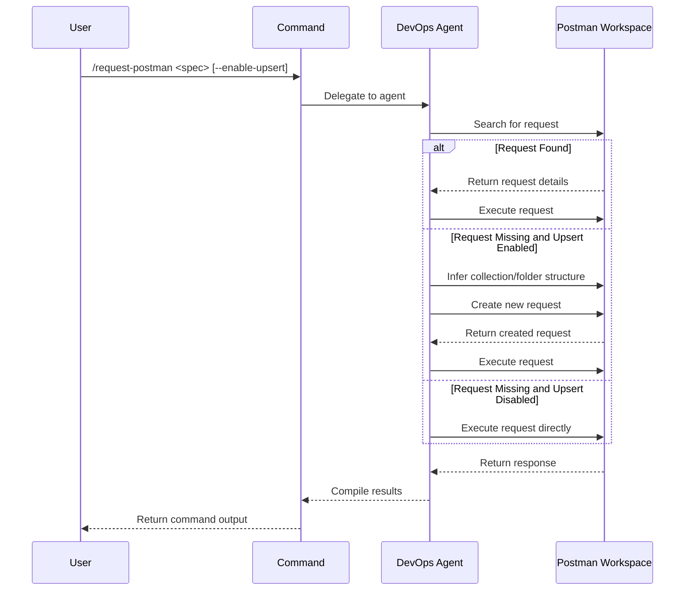

## PURPOSE

Execute HTTP requests via Postman MCP with capability to create and update requests in the Agentic Workspace. When enabled, the command first checks if a request exists, updates it if found, creates it if missing, then executes it.

## EXECUTION

1. **Search Request**: Check Postman workspace for existing request
   - Query collections by name and URL
   - Return request details if found

2. **Conditional Upsert**: If enabled and request missing
   - Infer collection and folder structure from workspace patterns
   - Create request with standard naming convention
   - Apply workspace organization rules

3. **Execute Request**: Make the HTTP call
   - Use existing or newly created request
   - Return response with status, headers, body

## DELEGATION

**MANDATORY**: Always invoke the agents defined in this command's frontmatter for their designated responsibilities. Never skip, replace, or simulate their behavior directly.

- `zzaia-devops-specialist` — Execute HTTP requests via Postman MCP tools, manage workspace collections, and handle request creation/update operations

## WORKFLOW



## ACCEPTANCE CRITERIA

- Request execution succeeds with correct response code and body
- When upsert enabled, request is searchable in workspace afterward
- Response includes HTTP status, headers, and body
- Request follows workspace naming and folder conventions

## EXAMPLES

```
/request-postman --url https://api.example.com/users --method GET
/request-postman --url https://api.example.com/users --method POST --body '{"name":"test"}' --enable-upsert
```

## OUTPUT

- HTTP response status code
- Response headers
- Response body
- Workspace persistence confirmation when upsert enabled
