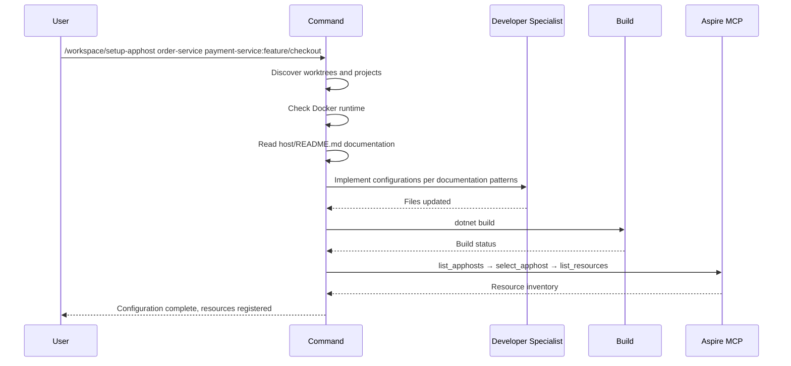

## PURPOSE

Register one or more workspace applications into the Aspire AppHost so all services start successfully with shared infrastructure.

Each application resolves to `workspace/{name}.worktrees/{branch}/` — defaults to `master` when no branch is specified.

## EXECUTION

1. **Discover Application Projects**

   - Parse each entry as `name` or `name:branch` — default branch is `master` when omitted
   - For each application, glob `workspace/{name}.worktrees/{branch}/src/**/*.csproj`
   - Identify API and BackgroundServices projects from the csproj filenames
   - Verify the worktree path exists before proceeding

2. **Ensure Docker Runtime**

   - Check Docker availability with `docker info`
   - Start Docker if not running — required for Aspire infrastructure containers

3. **Read AppHost Documentation**

   - Read `host/README.md` to understand the existing configuration patterns and conventions
   - Follow the documented patterns exactly when generating configurations

4. **Generate Configurations**

   - Use `zzaia-developer-specialist` to implement all required changes following the patterns found in the documentation
   - Ensure settings, registrations, project references, and appsettings are consistent with existing conventions

5. **Validate Build**

   - Run `dotnet build` on the AppHost solution
   - Fix any compilation errors before proceeding

6. **Verify with Aspire MCP**

   - Use `mcp__aspire__list_apphosts` to discover the AppHost
   - Use `mcp__aspire__select_apphost` to select it
   - Use `mcp__aspire__list_resources` to confirm all services appear
   - Report final status to user

## WORKFLOW



## ACCEPTANCE CRITERIA

- All application worktrees discovered and validated
- Configurations follow patterns documented in `host/README.md`
- No compilation errors after changes
- All services appear in Aspire MCP resource list
- Docker daemon is running

## EXAMPLES

```
# Default master branch
/workspace/setup-apphost order-service

# Mix of master and feature branches
/workspace/setup-apphost order-service payment-service:feature/checkout inventory-service:bugfix/stock

# All on specific branches
/workspace/setup-apphost auth-service:feature/jwt user-service:feature/profile
```

## OUTPUT

- AppHost configuration files updated per documented patterns
- Build validation result
- Aspire resource inventory confirming registered services
