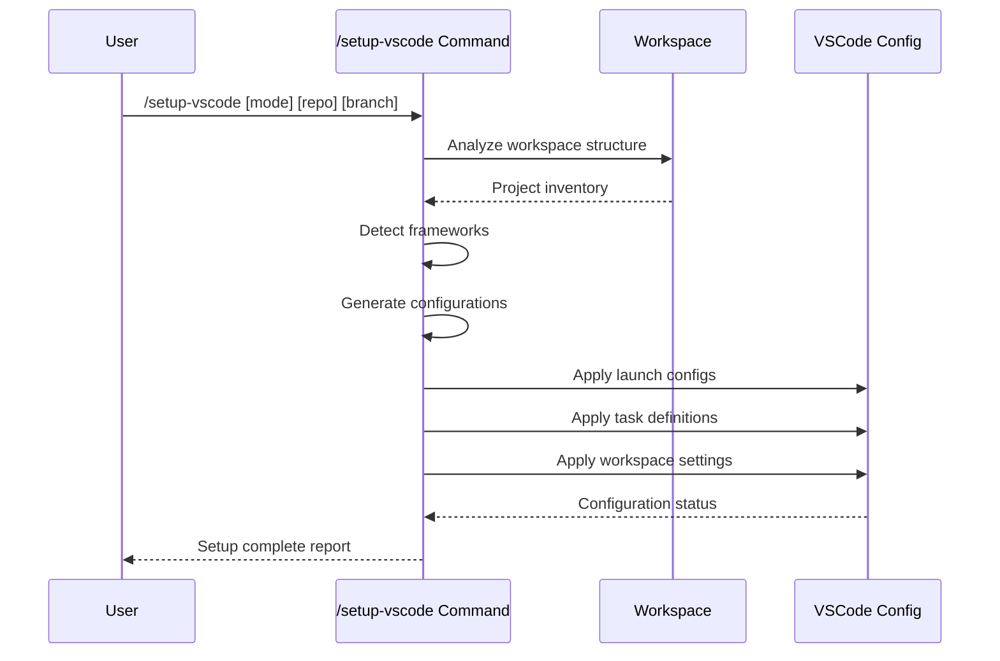

## PURPOSE

Generate and manage VSCode launch and task configurations for development environments across multiple frameworks and repositories.

## EXECUTION

1. **Workspace Analysis**
   - Scan workspace for projects
   - Identify project frameworks
   - Detect existing configurations

2. **Configuration Generation**
   - Create launch configurations
   - Generate task definitions
   - Set up extension recommendations
   - Configure workspace settings

3. **Validation & Deployment**
   - Verify configuration correctness
   - Apply configurations to workspace
   - Report generation status

## EXECUTION APPROACH

Direct VSCode configuration generation with automatic framework detection and workspace management.

## WORKFLOW



## PARAMETERS

- `mode`: Configuration mode
  - `all` - Generate configurations for all projects (default)
  - `project` - Generate configurations for specific project
  - `validate` - Validate existing configurations
  - `update` - Update existing configurations
- `repoName`: Target repository name (optional)
- `branch`: Specific branch for configuration (optional)

## EXAMPLES

```bash
# Configure all projects
/setup-vscode

# Configure specific project
/setup-vscode project compliance-hub

# Validate configurations
/setup-vscode validate

# Update configurations for specific repo and branch
/setup-vscode update compliance-hub master
```

## OUTPUT

- VSCode configuration files (.vscode/launch.json, .vscode/tasks.json)
- Extension recommendations (.vscode/extensions.json)
- Workspace settings (.vscode/settings.json)
- Configuration status report
- Framework-specific optimizations applied