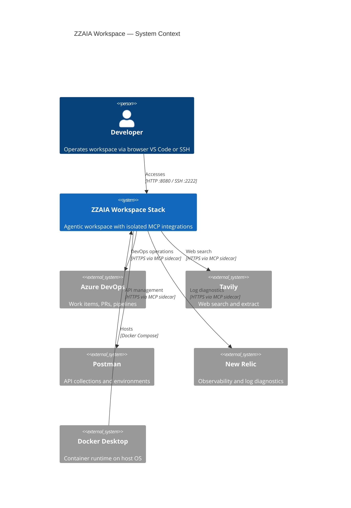
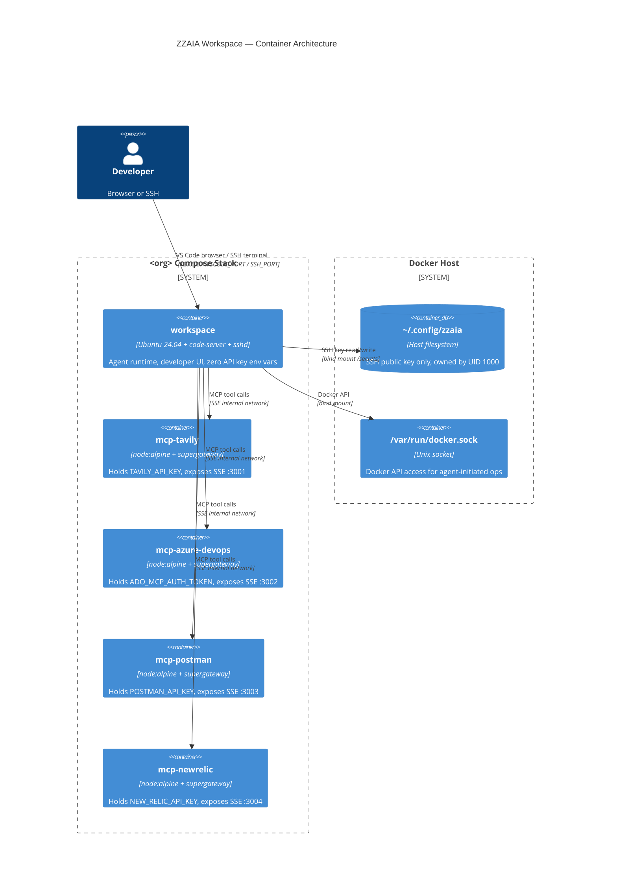

# ZZAIA Agentic Workspace — Architecture Overview

Multi-tenant agentic workspace that runs Claude Code (and future agents) inside isolated Docker containers, with secrets segregated into independent MCP sidecar containers so no secret is ever accessible from the agent's terminal, filesystem, or context.

---

## Architecture Decision Records

### Product ADRs — What the system must be

---

### PADR 001: Extensible Agent Runtime

**Decision**: This workspace is built around the Claude Code terminal agent but must not be permanently coupled to it. The agent runtime is a swappable component.

- The workspace environment (OS, tools, extensions, MCP integrations) is provisioned independently of which agent CLI is installed
- Adopting a new agent means replacing the CLI binary and updating `.mcp.json` — nothing else changes
- All capabilities (tool integrations, command hierarchy, workspace layout) remain usable across agent runtimes

**Rationale**: Locking the workspace to a single agent vendor would make every future migration a full rebuild. Treating the agent as a replaceable boundary preserves the investment in tooling and integrations.

---

### PADR 002: Multiple Concurrent Instances on the Same Machine

**Decision**: The system must support running multiple independent workspace instances simultaneously on the same host, each with its own environment variables and configuration.

- Each instance is identified by an organization name and runs on its own isolated stack
- Instances do not share networks, volumes, or port bindings
- No coordination layer is required between instances

**Rationale**: Development teams and individual developers often work across multiple organizations or projects. Forcing a single instance per machine is a hard blocker to real-world usage.

---

### PADR 003: Any OS, Zero Host Dependencies Beyond Docker

**Decision**: The workspace must run identically on Ubuntu, macOS, and Windows. The only host prerequisite is Docker Desktop. All tools, runtimes, extensions, and configurations are installed automatically inside the container.

- A developer on any OS runs one command and gets a fully provisioned environment
- No manual tool installation, version management, or OS-specific setup on the host
- Remote machine deployments follow the same single-command pattern

**Rationale**: Eliminating host dependencies removes the "works on my machine" class of problems and dramatically reduces onboarding time for new contributors and new machines.

---

### PADR 004: Segregated Execution Space for Autonomous Agents

**Decision**: Agents running in full-automatic mode (e.g. `--dangerously-skip-permissions`) must execute inside an isolated container that limits their access to the host machine.

- The container's Linux capabilities are reduced to the minimum required
- The agent cannot read host files outside explicitly mounted volumes
- The agent cannot escalate privileges beyond the container boundary
- The blast radius of an autonomous agent is confined to the workspace container

**Rationale**: Full-automatic agent execution is a necessary productivity feature. Without isolation, it is also a security risk. Containerized segregation enables autonomy without exposing the host.

---

### PADR 005: Secrets Set Once at First Startup, Inaccessible Thereafter

**Decision**: All environment variables are provided by the developer exactly once — at the first `docker compose up`. After that startup, secrets must not be readable from inside the running container by any means (terminal, env inspection, file access).

- The developer does not manage secrets files or re-enter credentials on restarts
- A running container cannot be used to exfiltrate the secrets that were used to start it
- Secret rotation requires an explicit operator action, not container restart

**Rationale**: Persistent secret accessibility inside containers is the most common vector for credential leakage in agentic systems. One-time injection with post-startup inaccessibility eliminates this class of risk without requiring an external secrets manager.

---

### PADR 006: Developer-First UX — Browser VS Code and SSH Remote

**Decision**: The workspace must be operable through a browser-accessible VS Code interface and through VS Code Remote-SSH. No local IDE installation or plugin setup should be required to start working.

- Browser access: open a URL, get a full VS Code environment with all extensions pre-installed
- SSH access: connect from any VS Code installation using standard Remote-SSH
- Both modes provide the same agentic capabilities (Claude Code, MCP tools, workspace commands)

**Rationale**: Developer experience is a first-class architectural concern. If the workspace is hard to access, it will not be used. Browser + SSH covers every developer context: local machine, remote server, CI runner, cloud VM.

---

### PADR 007: Secrets Never in Agent Context, Terminal, or SSH Session

**Decision**: API keys and sensitive credentials must never appear in the agent's context window, the vscode-server terminal, the SSH session environment, or any log. MCP servers are deployed as independent containers, each holding only its own secret, and expose tool capabilities — not credentials — to the agent.

- The agent calls tools via MCP SSE; the secret is consumed inside the sidecar and never returned
- `printenv`, shell history, and context inspection yield no API keys
- Each MCP sidecar is isolated: compromise of one sidecar does not expose other secrets

**Rationale**: Agents with access to secrets can leak them through tool calls, generated content, or context windows. The MCP sidecar pattern enforces a hard boundary: the agent has capabilities, not credentials.

---

### Implementation ADRs — How the system achieves it

---

### ADR 001: Docker Compose Project Namespacing for Multi-Tenancy

**Decision**: Each workspace instance is started with `docker compose -p $WORKSPACE_NAME`, giving every stack a unique container prefix (`<workspace>-workspace-1`, `<workspace>-mcp-tavily-1`, etc.) and an isolated bridge network.

- `WORKSPACE_NAME` is a free-form slug chosen by the developer — independent of the ADO organization name
- Different workspaces run simultaneously on the same Docker host
- Port conflicts avoided via `VSCODE_PORT` and `SSH_PORT` environment variables per stack
- Container names derived from project + service, never hardcoded

**Rationale**: Compose project namespacing is native Docker isolation with zero extra infrastructure. It supports the objective of multiple concurrent workspace instances without requiring orchestration layers like Kubernetes.

---

### ADR 002: MCP Sidecar Pattern for Secret Segregation

**Decision**: Every external API integration runs as a dedicated sidecar container (`mcp-tavily`, `mcp-azure-devops`, `mcp-postman`, `mcp-newrelic`). Each sidecar receives exactly one secret via environment variable and exposes a `supergateway` SSE endpoint on the internal `mcp` bridge network only — never on the host.

- The `workspace` container holds **zero API key environment variables**
- Agents call tools via MCP SSE (`http://mcp-tavily:3001/sse`) — the key is used inside the sidecar and the result returned
- Secrets are never in the agent's environment, terminal history, or context window
- Adding a new integration = adding one sidecar service with its own secret
- Each sidecar guards its own key at startup: if the key is empty the process exits cleanly (code 0) and does not restart — `restart: no` prevents crash loops on missing optional keys

**Rationale**: Sidecar-per-secret is the minimal surface area principle applied to secrets. Even if the agent is fully autonomous (`--dangerously-skip-permissions`), it cannot exfiltrate API keys because they are not present in its container.

---

### ADR 003: Minimal Linux Capabilities (`cap_drop: ALL`)

**Decision**: The `workspace` container drops all Linux capabilities and adds back only the minimum required: `CHOWN`, `FOWNER`, `SETGID`, `SETUID`, `AUDIT_WRITE`.

- `DAC_OVERRIDE` and `DAC_READ_SEARCH` are intentionally absent — root inside the container cannot bypass file permission checks on files it does not own
- The secrets directory is `chown`'d to `zzaia` at startup (using `CAP_CHOWN`); all subsequent access is as the non-root `zzaia` user
- `--dangerously-skip-permissions` agents operate within these capability boundaries

**Rationale**: Reducing capabilities limits the blast radius of an autonomous agent. An agent with full automation cannot escape the container's capability set, protecting the host and sibling containers.

---

### ADR 004: One-Time Secret Injection with Post-Startup Inaccessibility

**Decision**: Secrets are passed via `--env-file <(printf ...)` at `docker compose up` time. On first start, the workspace entrypoint writes only the SSH public key to `/secrets/.env` (owned by `zzaia`, mode 600, directory mode 700). On all subsequent starts, the file already exists and env vars are ignored.

- Secrets exist only in the process environment during the first startup, never written to disk in cleartext elsewhere
- `/secrets` maps to `~/.config/zzaia` on the host — a user-controlled path outside the container image
- The running container cannot re-read API keys after startup completes
- SSH terminal, vscode-server terminal, and agent shell have no access to API keys

**Rationale**: One-time injection eliminates the need for a secrets manager while maintaining the invariant that API keys are not queryable from within the workspace at any point after startup.

---

### ADR 005: Extensible Agent Runtime Interface

**Decision**: The agent runtime (currently Claude Code CLI) is treated as a swappable component. It runs as the `zzaia` user inside the workspace container and communicates with MCP servers via the `.mcp.json` configuration pointing to internal sidecar SSE endpoints.

- No coupling between the container image and a specific agent version beyond the CLI binary
- `.mcp.json` defines the tool surface available to the agent
- The container runtime (OS, tools, extensions) is provisioned independently of which agent CLI is installed
- Future agents (other CLI tools, different AI providers) replace only the agent binary and `.mcp.json` entries

**Rationale**: Decoupling the agent runtime from the workspace environment preserves investment in tooling, workspace configuration, and the MCP integration layer when adopting new agent technologies.

---

### ADR 006: Dual Developer Access — Browser VS Code + SSH

**Decision**: The workspace container runs both `code-server` (browser-accessible VS Code on port 8080) and `sshd` (SSH on port 2222), both bound to `127.0.0.1` on the host.

- Browser access (`http://localhost:<VSCODE_PORT>`) with the Claude Code extension pre-installed
- SSH access (`ssh -p <SSH_PORT> zzaia@localhost`) for terminal workflows and VS Code Remote-SSH
- Both access modes are auth-free within the local 127.0.0.1 boundary — Docker Desktop provides the isolation layer
- Remote machine deployments: replace `127.0.0.1` with the server address or use SSH tunneling

**Rationale**: Providing both access modes removes friction for developers who prefer different workflows, while keeping the surface area minimal (host-bound ports, no public exposure by default).

---

### ADR 007: Tool Provisioning via `mise` and Dockerfile

**Decision**: All workspace tools (Node.js, Python, .NET, Go, Rust, Java, etc.) are provisioned inside the Docker image via `mise.toml` and direct install steps in the Dockerfile. No tool installation is required on the host beyond Docker Desktop.

- `mise` manages language runtimes and CLI tools reproducibly
- Code-server, miniforge3, and other tools not in the mise registry are installed via their official scripts during image build
- The image is self-contained: any developer on Ubuntu, macOS, or Windows can run the workspace identically

**Rationale**: Zero-dependency host setup is the primary usability objective. A single `docker compose up` command delivers a fully provisioned development environment regardless of the host OS.

---

## C4 Context Diagram



## C4 Container Diagram



## Project Structure

```
zzaia/
├── .claude/
│   ├── agents/          # Agent definitions (meta, sub, team, analytics)
│   ├── commands/        # Command hierarchy (orchestrator → workflow → behavior → capability)
│   ├── output-styles/   # Claude response format definitions
│   └── rules/           # Language-specific coding standards
├── docker/
│   ├── Dockerfile       # Workspace image — Ubuntu 24.04 + mise + code-server + sshd
│   ├── docker-compose.yml  # Stack definition — workspace + 4 MCP sidecars
│   └── entrypoint.sh    # One-time secret init, Docker group, code-server, sshd
├── host/                # .NET Aspire AppHost for integrated local testing
├── workspace/           # Multi-repository git worktrees
├── mise.toml            # Tool versions (node, python, dotnet, go, rust, java…)
├── .mcp.json            # MCP server endpoints (SSE to internal sidecars)
├── CLAUDE.md            # System guidance for Claude Code
├── QUICKSTART.md        # Setup instructions
└── ARCHITECTURE.md      # This document
```

## Architecture Components

### Workspace Container
- **code-server**: Browser-accessible VS Code (Coder fork) with Claude Code extension pre-installed
- **sshd**: SSH server for VS Code Remote-SSH and terminal access
- **Claude Code CLI**: Agent runtime, extensible to other agent CLIs
- **mise**: Language runtime and tool version manager
- **miniforge3**: Conda environment management for Python/ML workflows

### MCP Sidecar Pattern
- **supergateway**: stdio-to-SSE bridge — wraps any stdio MCP server and exposes it over HTTP SSE
- Each sidecar: one secret → one external API → one internal SSE endpoint
- Network: `mcp` bridge, no host ports, workspace-only access

### Multi-Tenant Isolation
- **Docker Compose projects**: `-p <org>` creates fully namespaced stacks
- **Port variables**: `VSCODE_PORT` / `SSH_PORT` per stack
- **Independent networks**: each stack has its own `mcp` bridge

## Technology Stack

| Layer | Technology |
|-------|-----------|
| Container runtime | Docker Desktop (Linux / macOS / Windows) |
| Workspace OS | Ubuntu 24.04 LTS |
| Agent runtime | Claude Code CLI |
| Developer UI | code-server (Coder) + OpenSSH |
| Tool provisioning | mise + Dockerfile direct installs |
| MCP bridge | supergateway (stdio → SSE) |
| Multi-tenancy | Docker Compose project namespacing |
| Secret lifecycle | Process env → one-time file write → sealed |

## Security Model

| Threat | Mitigation |
|--------|-----------|
| Agent exfiltrates API keys | Keys never in workspace container env after startup |
| Agent modifies host filesystem | Only `/secrets` and `/host` volumes mounted; cap_drop ALL |
| Agent escapes container | No `SYS_ADMIN`, `NET_ADMIN`, or `DAC_OVERRIDE` capabilities |
| Secret visible in terminal | Env vars ephemeral; `/secrets/.env` owned by zzaia, mode 600 |
| Cross-stack secret leakage | Each stack on isolated bridge network; no shared volumes |
| Port scanning from container | MCP ports bound to internal network only |

## Related Documentation

- [QUICKSTART.md](QUICKSTART.md) — Step-by-step setup instructions
- [CLAUDE.md](CLAUDE.md) — Command hierarchy and development standards
- [docker/](docker/) — Dockerfile, Compose, and entrypoint
- [.mcp.json](.mcp.json) — MCP server configuration
