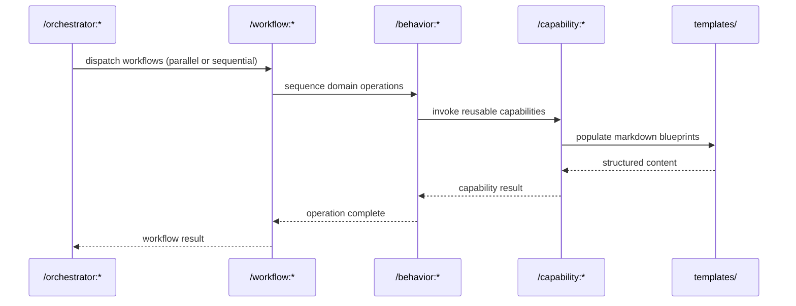
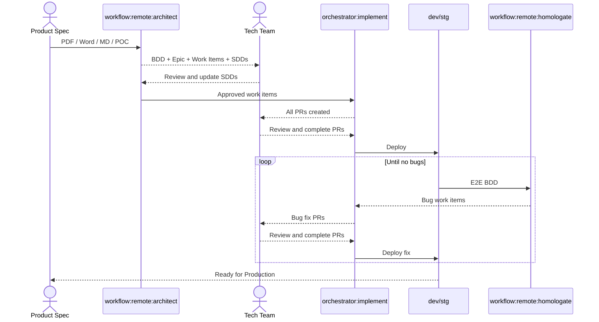

# ZZAIA Agentic Workspace

[](https://choosealicense.com/licenses/mit/)
[](https://claude.ai/code)
[](https://ai.google.dev/gemini-api/docs/gemini-cli)
[](https://openai.com/codex)
[](https://github.com/features/copilot)
[](https://coder.com/docs/code-server)
[](https://azure.microsoft.com/products/devops)

> Multi-agent agentic workspace running Claude Code, Gemini CLI, OpenAI Codex, and GitHub Copilot inside an isolated Docker container with browser-accessible VS Code Server, secret-isolated MCP integrations, and full software development lifecycle automation.

## Why ZZAIA Workspace?

| # | Benefit |
|---|---------|
| 1 | **Minimal setup time** — a single `docker compose up` installs every package, language runtime, and tool automatically. After the first pull, starting the workspace on a new machine requires no manual configuration — just fill in your secrets and go. |
| 2 | **Standardized Ubuntu environment** — the workspace runs inside a container on Ubuntu regardless of whether the host machine is Linux, macOS, or Windows. Every developer gets an identical, reproducible environment with no "works on my machine" surprises. |
| 3 | **Local and remote access** — access the full VS Code IDE from a browser tab (no local installation required), connect over SSH, or deploy remotely and reach it from any device. Supports WASM-based browser access for fully server-side execution. |
| 4 | **Long-lived authentication** — authenticate Claude Code once at deployment time using an OAuth refresh token, API key, or cloud provider credentials. Tokens auto-refresh across container restarts; you never see another login prompt during daily use. |
| 5 | **Secret isolation** — each MCP server (Tavily, Azure DevOps, Postman, New Relic) runs as its own isolated sidecar container and receives only the secret it needs. The AI agent context never has access to credentials, eliminating a whole class of accidental secret leakage. |
| 6 | **Confident agentic YOLO mode** — container isolation from the host system makes it genuinely safe to run Claude Code with `--dangerously-skip-permissions`. Autonomous agentic workflows execute without fear of unintended changes to the host or other projects. |
| 7 | **Familiar VS Code experience** — the full VS Code feature set works in-browser: extensions marketplace, profiles, themes, keybindings, and other AI coding assistants such as GitHub Copilot, Gemini, and Codex run side-by-side with Claude Code. |
| 8 | **Persistent customization** — optional admin access lets you install additional tools and change configurations inside the running container. All changes survive restarts because the home directory is backed by a persistent Docker volume. |
| 9 | **Cost-effective Pro and Max subscription support** — Claude Code works with Anthropic Pro and Max subscriptions, not only pay-per-token API keys. Teams can maximize the value of existing plans rather than paying separately for every token consumed by automation. |
| 10 | **Full development lifecycle automation** — the workspace ships with pre-composed commands and skills that cover the entire lifecycle: repository management, implementation, testing, code review, architecture documentation, and release — all in a semi-automated, agent-driven workflow. |
| 11 | **Deep Azure DevOps integration** — built-in remote commands connect directly to Azure DevOps for reading and updating work items, triggering and diagnosing pipelines, creating and reviewing pull requests, and navigating wikis — all without leaving the workspace terminal. |

## 🚀 Quick Start

Supported on **Ubuntu / WSL**, **macOS**, and **Windows**. Requires Docker Desktop.

> See [QUICKSTART.md](QUICKSTART.md) for step-by-step setup instructions.
> First time inside the workspace? Open [WELCOME.md](WELCOME.md) for a guided start.

## 🏗️ Command Hierarchy

Commands are organized in a five-layer hierarchy. Each layer calls into the next, enabling complex automation through composition:


```mermaid
sequenceDiagram
    participant O as /orchestrator:*
    participant W as /workflow:*
    participant B as /behavior:*
    participant S as /capability:*
    participant T as templates/

    O->>W: dispatch workflows (parallel or sequential)
    W->>B: sequence domain operations
    B->>S: invoke reusable capabilities
    S->>T: populate markdown blueprints
    T-->>S: structured content
    S-->>B: capability result
    B-->>W: operation complete
    W-->>O: workflow result
```

| Layer | Prefix | Responsibility |
|-------|--------|----------------|
| **Orchestrator** | `/orchestrator:*` | Multi-item coordination — dispatches workflows in parallel or sequentially based on dependency analysis |
| **Workflow** | `/workflow:*` | Sequence of behaviors for a complete task (e.g. implement a work item end-to-end) |
| **Behavior** | `/behavior:*` | Single domain operation with agent delegation (e.g. run a pipeline, create a PR) |
| **Capability** | `/capability:*` | Self-contained capability with `SKILL.md`, `template.md`, `examples/`, `scripts/` |
| **Template** | `templates/` | Markdown blueprints filled in by capabilities with real conversation context |

## ⚡ End-to-End Automation

From a product specification document to production-ready - human super-visioned automated flow.


```mermaid
sequenceDiagram
    actor U as Product Spec
    participant A as workflow:remote:architect
    actor T as Tech Team
    participant I as orchestrator:implement
    participant D as dev/stg
    participant H as workflow:remote:homologate

    U->>A: PDF / Word / MD / POC
    A-->>T: BDD + Epic + Work Items + SDDs
    T-->>A: Review and update SDDs
    A->>I: Approved work items
    I-->>T: All PRs created
    T-->>I: Review and complete PRs
    I->>D: Deploy
    loop Until no bugs
        D->>H: E2E BDD
        H-->>I: Bug work items
        I-->>T: Bug fix PRs
        T-->>I: Review and complete PRs
        I->>D: Deploy fix
    end
    D-->>U: Ready for Production
```

### Example Commands

```bash
# 1. Generate BDD, Epic, Work Items and SDDs from a product spec document
/workflow:remote:architect --selected-work-item 2001 --project MyProject --description "Feature description" --doc ./spec.pdf

# 2. Implement all approved work items in parallel — all PRs created via agent teams
/orchestrator:implement --work-items 2002,2003,2004 --portal azure --project MyProject --target-branch develop --description "Feature description"

# 3. Run E2E BDD against staging — creates test case, runs scenarios, files bugs
/workflow:remote:homologate --work-item 2001 --project MyProject --url https://staging.myapp.com --application MyApp --type e2e

# 4. If bugs found — implement all bug fix work items and create PRs
/orchestrator:implement --work-items 2010,2011 --portal azure --project MyProject --target-branch develop --description "Bug fixes"

# 5. Re-run until no bugs found
/workflow:remote:homologate --work-item 2001 --project MyProject --url https://staging.myapp.com --application MyApp --type e2e
```

This layering keeps each command focused on one responsibility and makes the system extensible without coupling between layers.

## 📋 Available Commands

All individual commands can be called by users for standalone operations; workflows combine multiple commands.

### Analytics

Machine learning dataset discovery and analysis workflows.

- [**`/workflow:analytics:explorate`**](agents/claude/.claude/commands/workflow/analytics/explorate.md) - Domain and dataset exploration
- [**`/workflow:analytics:analyze`**](agents/claude/.claude/commands/workflow/analytics/analyze.md) - Dataset analysis and visualization

### Development

Software development lifecycle operations.

- [**`/behavior:development:develop`**](agents/claude/.claude/commands/behavior/development/develop.md) - Full development workflow
- [**`/behavior:development:build`**](agents/claude/.claude/commands/behavior/development/build.md) - Multi-framework builds
- [**`/behavior:development:test`**](agents/claude/.claude/commands/behavior/development/test.md) - Comprehensive testing
- [**`/behavior:development:review`**](agents/claude/.claude/commands/behavior/development/review.md) - Code quality review
- [**`/behavior:development:migrations`**](agents/claude/.claude/commands/behavior/development/migrations.md) - Database migrations
- [**`/behavior:development:git`**](agents/claude/.claude/commands/behavior/development/git.md) - Git operations
- [**`/behavior:development:update-dotnet-packages`**](agents/claude/.claude/commands/behavior/development/update-dotnet-packages.md) - Package management

### Management

Project management and architecture coordination.

- [**`/behavior:management:business`**](agents/claude/.claude/commands/behavior/management/business.md) - Business and BDD analysis
- [**`/behavior:management:plan`**](agents/claude/.claude/commands/behavior/management/plan.md) - Project planning
- [**`/behavior:management:architect`**](agents/claude/.claude/commands/behavior/management/architect.md) - Architecture specifications
- [**`/behavior:management:clarify`**](agents/claude/.claude/commands/behavior/management/clarify.md) - Requirements clarification

### Document

Document generation operations.

- [**`/behavior:document:latex`**](agents/claude/.claude/commands/behavior/document/latex.md) - Generate PDF from markdown or JSON data via LaTeX templates with diagram auto-generation

### DevOps

DevOps platform operations across Azure DevOps and GitHub.

- [**`/behavior:devops:work-item`**](agents/claude/.claude/commands/behavior/devops/work-item.md) - Work item retrieval and management
- [**`/behavior:devops:pull-request`**](agents/claude/.claude/commands/behavior/devops/pull-request.md) - Pull request management
- [**`/behavior:devops:pipeline`**](agents/claude/.claude/commands/behavior/devops/pipeline.md) - Run or diagnose pipelines (`--action run|debug`)
- [**`/behavior:devops:new-relic`**](agents/claude/.claude/commands/behavior/devops/new-relic.md) - New Relic log diagnostics (`--action debug`)

### Workspace

Multi-repository workspace configuration.

- [**`/behavior:workspace:repo`**](agents/claude/.claude/commands/behavior/workspace/repo.md) - Clone repos or create branches (`--action new`)
- [**`/behavior:workspace:apphost`**](agents/claude/.claude/commands/behavior/workspace/apphost.md) - Aspire AppHost setup or diagnostics (`--action setup|debug`)
- [**`/behavior:workspace:vscode`**](agents/claude/.claude/commands/behavior/workspace/vscode.md) - VS Code configuration (`--action setup|validate|update`)
- [**`/behavior:workspace:agent-teams`**](agents/claude/.claude/commands/behavior/workspace/agent-teams.md) - Orchestrate teams of specialized agents in consensus or parallel mode
- [**`/behavior:workspace:ask-user-question`**](agents/claude/.claude/commands/behavior/workspace/ask-user-question.md) - Prompt user for free-form or selection input

### Capabilities

Reusable capabilities invoked by behaviors and workflows.

- [**`/capability:document:read`**](agents/claude/.claude/commands/capability/document/read/SKILL.md) - Extract PDF and Word document content
- [**`/capability:document:write`**](agents/claude/.claude/commands/capability/document/write/SKILL.md) - Write markdown documentation to targets
- [**`/capability:document:scrap`**](agents/claude/.claude/commands/capability/document/scrap/SKILL.md) - Search and download documents from web
- [**`/capability:latex:write`**](agents/claude/.claude/commands/capability/latex/write/SKILL.md) - Generate PDF from Jinja2 LaTeX templates
- [**`/capability:diagram:generate`**](agents/claude/.claude/commands/capability/diagram/generate/SKILL.md) - Render Mermaid or Graphviz diagrams to PNG
- [**`/capability:playwright`**](agents/claude/.claude/commands/capability/playwright/SKILL.md) - Browser session management, diagnostics, and screenshots
- [**`/capability:postman`**](agents/claude/.claude/commands/capability/postman/SKILL.md) - Postman workspace operations (`request|create|read|update|delete`)

### Workflow

End-to-end workflows that sequence behaviors and capabilities into complete automated tasks.

- [**`/workflow:implement`**](agents/claude/.claude/commands/workflow/implement.md) - Full implementation from work item to PR
- [**`/workflow:homologate`**](agents/claude/.claude/commands/workflow/homologate.md) - Multi-app acceptance testing workflow
- [**`/workflow:fix-merge`**](agents/claude/.claude/commands/workflow/fix-merge.md) - Merge conflict resolution
- [**`/workflow:remote:fix-pipeline`**](agents/claude/.claude/commands/workflow/remote/fix-pipeline.md) - Iterative pipeline repair loop
- [**`/workflow:remote:architect`**](agents/claude/.claude/commands/workflow/remote/architect.md) - Specification Driven Design orchestration with AGILE Azure DevOps integration
- [**`/workflow:remote:implement`**](agents/claude/.claude/commands/workflow/remote/implement.md) - Remote work item to PR implementation with AGILE Azure DevOps integration
- [**`/workflow:remote:homologate`**](agents/claude/.claude/commands/workflow/remote/homologate.md) - Homologation testing workflow with BDD, live URL testing, diagnostics, and bug reporting

### Orchestrator

Multi-item coordination commands that dispatch workflows in parallel or sequentially based on dependency analysis.

- [**`/orchestrator:implement`**](agents/claude/.claude/commands/orchestrator/implement/SKILL.md) - Implement multiple work items with dependency-aware parallel or sequential dispatch

### Utils 

System utilities and information.

- [**`/behavior:warmup`**](agents/claude/.claude/commands/behavior/warmup.md) - Context-aware focus
- [**`/behavior:ask`**](agents/claude/.claude/commands/behavior/ask.md) - Context-aware Q&A
- [**`/behavior:websearch`**](agents/claude/.claude/commands/behavior/websearch.md) - Web search integration

## 🖥️ AppHost Template

The `workspace/host/` directory contains a .NET Aspire AppHost — a template for running workspace applications alongside shared infrastructure (PostgreSQL, Redis, RabbitMQ) for integrated validation and testing during development.

- Add workspace service project references to `.csproj` pointing to worktree paths
- Configure `Applications/ApplicationInjection.cs` extension methods per service
- All infrastructure settings are driven by `appsettings.json`

> See [workspace/host/README.md](workspace/host/README.md) for full setup details.

## 🐳 Container

The `docker/` directory provides an SSH-accessible Ubuntu container with all workspace tools pre-installed via `mise.toml`. MCP servers run as isolated sidecar containers — each receives only its own secret.

> See [docs/architecture-overview.md](docs/architecture-overview.md) for architectural decisions and security model.
> See [docker/DOCKER.md](docker/DOCKER.md) for full setup details.

## 🤖 Specialized Agents

Agents are organized in `agents/claude/.claude/agents/` by type, each with a distinct role in the system:

### `analytics/` — Analytics Agents

Specialized agents for domain research, problem exploration, and dataset discovery.

| Agent | Role |
| ----- | ---- |
| [**zzaia-problem-exploration**](agents/claude/.claude/agents/analytics/zzaia-problem-exploration.md) | Transform problem statements into technical research reports |
| [**zzaia-domain-exploration**](agents/claude/.claude/agents/analytics/zzaia-domain-exploration.md) | Uncover commercially viable problems across domains |
| [**zzaia-dataset-exploration**](agents/claude/.claude/agents/analytics/zzaia-dataset-exploration.md) | Discover and evaluate ML datasets from authoritative repositories |

### `meta/` — System Self-Improvement

Generate new components in standardized patterns. Used to extend the agentic system itself.

| Agent | Role |
| ----- | ---- |
| [**zzaia-meta-agent**](agents/claude/.claude/agents/meta/zzaia-meta-agent.md) | Agent definition generation |
| [**zzaia-meta-command**](agents/claude/.claude/agents/meta/zzaia-meta-command.md) | Command generation for any hierarchy layer |
| [**zzaia-meta-skill**](agents/claude/.claude/agents/meta/zzaia-meta-skill.md) | Capability generation |
| [**zzaia-meta-workflow**](agents/claude/.claude/agents/meta/zzaia-meta-workflow.md) | Workflow command generation |

### `sub/` — Specialist Working Agents

Highly specialized agents invoked by commands and workflows to perform focused tasks.

| Agent | Role |
| ----- | ---- |
| [**zzaia-task-clarifier**](agents/claude/.claude/agents/sub/zzaia-task-clarifier.md) | Requirements analysis |
| [**zzaia-developer-specialist**](agents/claude/.claude/agents/sub/zzaia-developer-specialist.md) | Multi-language implementation |
| [**zzaia-tester-specialist**](agents/claude/.claude/agents/sub/zzaia-tester-specialist.md) | Build and test validation |
| [**zzaia-code-reviewer**](agents/claude/.claude/agents/sub/zzaia-code-reviewer.md) | Code quality and static analysis |
| [**zzaia-workspace-manager**](agents/claude/.claude/agents/sub/zzaia-workspace-manager.md) | Multi-repository worktree coordination |
| [**zzaia-devops-specialist**](agents/claude/.claude/agents/sub/zzaia-devops-specialist.md) | Azure DevOps and GitHub DevOps operations |
| [**zzaia-web-searcher**](agents/claude/.claude/agents/sub/zzaia-web-searcher.md) | Tavily-powered web search and content extraction |
| [**zzaia-document-specialist**](agents/claude/.claude/agents/sub/zzaia-document-specialist.md) | PDF/Word extraction, documentation writing, and web document scraping |

### `team/` — Macro Agents for Agent Teams

High-level agents dispatched inside agent-teams sessions to lead and coordinate sub-agents.

| Agent | Role |
| ----- | ---- |
| [**zzaia-tech-leader**](agents/claude/.claude/agents/team/zzaia-tech-leader.md) | Leads task execution through a workflow using sub-agents; coordinates and returns structured results to the orchestrator |

## 📁 Structure

```
agents/
├── claude/              # Claude Code
│   ├── .claude/         # Commands, agents, output-styles
│   └── CLAUDE.md        # System guidance
├── gemini/              # Gemini CLI — .gemini/, GEMINI.md
├── codex/               # OpenAI Codex — .codex/, AGENTS.md
└── copilot/             # GitHub Copilot — .github/copilot-instructions.md
vscode/                  # VS Code workspace settings and .code-workspace
workspace/               # Multi-repository workspace
```


## 🔌 MCP Tools Integration

External service integrations via Model Context Protocol servers configured in [`.mcp.json`](agents/claude/.mcp.json).

| Tool | Purpose | Env Var |
|------|---------|---------|
| **Tavily** | Web search, extract, crawl, map | `TAVILY_API_KEY` |
| **Azure DevOps** | Work items, PRs, pipelines, repos | `ADO_MCP_AUTH_TOKEN`, `AZURE_DEVOPS_ORGANIZATION` |
| **Postman** | Collections, environments, requests | `POSTMAN_API_KEY` |
| **New Relic** | Log diagnostics and observability | `NEW_RELIC_API_KEY` |
| **GitHub** | Repositories, issues, PRs, actions | `GITHUB_PERSONAL_ACCESS_TOKEN` |
| **Playwright** | Browser automation, screenshots | None (always-on sidecar) |
| **Aspire** | AppHost resource inspection and control | None (workspace process) |
| **Aspire Dashboard** | Distributed telemetry, traces, logs | None (always-on sidecar, port 18888) |

## 🛡️ Quality Standards

- **Language Rules** - C#/.NET, Python, JavaScript/TypeScript standards
- **Zero-Skip Policy** - Mandatory workflow steps
- **Conventional Commits** - Standardized messaging
- **Comprehensive Testing** - Unit and integration coverage
- **Documentation Standards** - Hierarchical maintenance

## 💡 Usage Modes

### Local Workspace

Clone repository and use with VS Code workspace functionality for multi-repository development, this way you can improve the agentic system beside the normal development.

### Plugin

Install via Claude Code marketplace — commands, agents, and rules are available namespaced as `/zzaia-workspace:*`.

## 📄 License

MIT License - see [LICENSE](LICENSE) for details.

## 🔗 Links

- **Architecture**: [docs/architecture-overview.md](docs/architecture-overview.md)
- **Documentation**: [CLAUDE.md](agents/claude/CLAUDE.md)
- **Claude Code Docs**: [code.claude.com/docs](https://code.claude.com/docs/en/overview)
- **Marketplace**: [.claude-plugin/marketplace.json](.claude-plugin/marketplace.json)
- **Issues**: [GitHub Issues](https://github.com/zzaia/zzaia-agentic-workspace/issues)
- **Built with**: [Claude Code](https://claude.ai/code)
