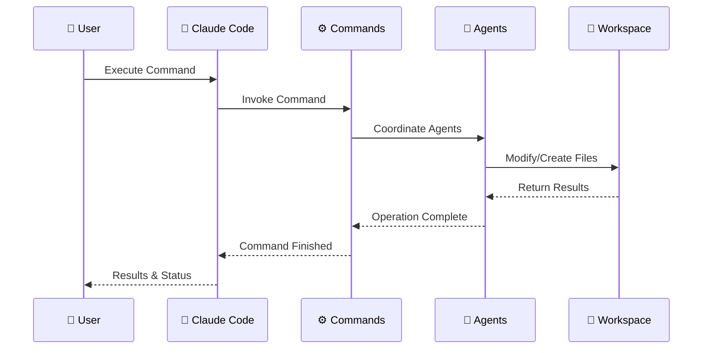

# ZZAIA Agentic Workspace

[](https://choosealicense.com/licenses/mit/)
[](https://claude.ai/code)

> Multi-agent orchestration system for software engineering workflows across analytics, development, documentation, and management.

## 🚀 Quick Start

### Optional 

1. **1Password CLI** — [Installation guide](https://developer.1password.com/docs/cli/get-started/)
2. **1Password Account** — Configure a vault with your service credentials

### Install Dependencies in Ubuntu

Run [`.claude/Install.sh`](.claude/Install.sh) to install all required tools:

```bash
bash .claude/Install.sh
```

Installs: `git`, `node.js`, `VS Code`, `Claude Code CLI`, `1Password`, `Docker`, `.NET SDK`, `Aspire workload`, `Dapr CLI`, `Aspirate`, `Anaconda`, `k6`, `pypdf`, `python-docx`

### Initialize ZZAIA Agentic Workspace

1. **Clone the Repository**
   ```bash
   git clone https://github.com/zzaia/zzaia-agentic-workspace.git
   cd zzaia-agentic-workspace
   ```

2. **Launch the Workspace**
   ```bash
   .claude/Init.sh
   ```
   When prompted, enter your 1Password vault name (e.g., `dev-secrets`)

3. **Authenticate with 1Password**
   Follow the 1Password CLI authentication prompts to enable secret injection

The workspace will automatically:
- Load your vault configuration
- Inject secrets from 1Password
- Launch Claude Code with MCP servers configured
- Enable all workspace commands and agents

### Example: Implement and Homologate a Feature

```bash
# 1. Implement a work item (creates branch, SDD doc, code, PR)
/workflow:implement work-item=1042 repos=order-service target-branches=develop working-branches=feature/add-order-status description="Add order status tracking endpoint with history log"

# 2. After implementation is merged, homologate the feature (creates test plan, runs tests against AppHost, files bugs) specially great for multi application testing
/workflow:homologate work-item=1042 repos=order-service target-branches=develop working-branches=homolog/sprint-12 description="Validate order status endpoint against acceptance criteria"

# 3. For each bug work item created in step 2, implement the fix
/workflow:implement work-item=1055 repos=order-service target-branches=develop working-branches=fix/order-status-empty-response description="Fix order status returning empty response when no history exists"
/workflow:implement work-item=1056 repos=order-service target-branches=develop working-branches=fix/order-status-403 description="Fix 403 on order status endpoint for non-admin users"
```

### Use as Remote Plugin

Add to your `.claude/plugins.json`:

```json
{
  "plugins": [
    { "name": "zzaia-workspace", "url": "https://github.com/zzaia/zzaia-agentic-workspace" }
  ]
}
```

## 📋 Available Commands

All individual commands can be called to by users to make individual operations, workflows are a combination of multiple commands.

### Analytics

Machine learning dataset discovery and analysis workflows.

- [**`/analytics:explorate`**](.claude/commands/analytics/workflow/explorate.md) - Domain and dataset exploration
- [**`/analytics:analyze`**](.claude/commands/analytics/workflow/analyze.md) - Dataset analysis and visualization

### Development

Software development lifecycle operations.

- [**`/development:develop`**](.claude/commands/development/develop.md) - Full development workflow
- [**`/development:build`**](.claude/commands/development/build.md) - Multi-framework builds
- [**`/development:test`**](.claude/commands/development/test.md) - Comprehensive testing
- [**`/development:review`**](.claude/commands/development/review.md) - Code quality review
- [**`/development:migrations`**](.claude/commands/development/migrations.md) - Database migrations
- [**`/development:git`**](.claude/commands/development/git.md) - Git operations
- [**`/development:update-dotnet-packages`**](.claude/commands/development/update-dotnet-packages.md) - Package management

### Management

Project management and architecture coordination.

- [**`/management:plan`**](.claude/commands/management/plan.md) - Project planning
- [**`/management:architect`**](.claude/commands/management/architect.md) - Architecture specifications

### DevOps

DevOps platform operations across Azure DevOps and GitHub.

- [**`/devops:work-item`**](.claude/commands/devops/work-item.md) - Work item retrieval and management
- [**`/devops:pull-request`**](.claude/commands/devops/pull-request.md) - Pull request management
- [**`/devops:debug-pipeline`**](.claude/commands/devops/debug-pipeline.md) - Pipeline log diagnostics
- [**`/devops:run-pipeline`**](.claude/commands/devops/run-pipeline.md) - Run new or existing pipelines

### Workspace

Multi-repository workspace configuration.

- [**`/workspace:new`**](.claude/commands/workspace/new.md) - Add repository
- [**`/workspace:setup-vscode`**](.claude/commands/workspace/setup-vscode.md) - VS Code configuration
- [**`/workspace:setup-apphost`**](.claude/commands/workspace/setup-apphost.md) - Aspire AppHost setup
- [**`/workspace:debug-apphost`**](.claude/commands/workspace/debug-apphost.md) - AppHost log diagnostics

### Document

Document content extraction and retrieval.

- [**`/document:read`**](.claude/commands/document/read.md) - Extract PDF and Word document content
- [**`/document:scraping`**](.claude/commands/document/scraping.md) - Search and download documents from web

### Workflow

End-to-end orchestration workflows, that are a combination of sequential minor commands, that aims to a major task automation.

- [**`/workflow:architect`**](.claude/commands/workflow/architect.md) - Specification Driven Design orchestration
- [**`/workflow:implement`**](.claude/commands/workflow/implement.md) - Full implementation from work item to PR
- [**`/workflow:homologate`**](.claude/commands/workflow/homologate.md) - Multi-app acceptance testing workflow
- [**`/workflow:fix-pipeline`**](.claude/commands/workflow/fix-pipeline.md) - Iterative pipeline repair loop

### Meta

System utilities and information.

- [**`/warmup`**](.claude/commands/warmup.md) - Context-aware focus
- [**`/ask`**](.claude/commands/ask.md) - Context-aware Q&A
- [**`/websearch`**](.claude/commands/websearch.md) - Web search integration

## 🖥️ AppHost Template

The `host/` directory contains a .NET Aspire AppHost — a template for running workspace applications alongside shared infrastructure (PostgreSQL, Redis, RabbitMQ) for integrated validation and testing during development.

- Add workspace service project references to `.csproj` pointing to worktree paths
- Configure `Applications/ApplicationInjection.cs` extension methods per service
- All infrastructure settings are driven by `appsettings.json`

> See [host/README.md](host/README.md) for full setup details.

## 🏗️ Architecture
 
The agentic system is composed a single orchestrator agent that can call other sub-agents by using simple commands (skills). 
   


```mermaid
sequenceDiagram
    participant U as 👤 User
    participant CC as 🧠 Claude Code
    participant C as ⚙️ Commands
    participant A as 🤖 Agents
    participant W as 📁 Workspace

    U->>CC: Execute Command
    CC->>C: Invoke Command
    C->>A: Coordinate Agents
    A->>W: Modify/Create Files
    W-->>A: Return Results
    A-->>C: Operation Complete
    C-->>CC: Command Finished
    CC-->>U: Results & Status
```

## 🤖 Specialized Agents

| Agent | Role |
| ----- | ---- |
| [**zzaia-task-clarifier**](.claude/agents/zzaia-task-clarifier.md) | Requirements analysis |
| [**zzaia-developer-specialist**](.claude/agents/zzaia-developer-specialist.md) | Multi-language implementation |
| [**zzaia-tester-specialist**](.claude/agents/zzaia-tester-specialist.md) | Build and test validation |
| [**zzaia-code-reviewer**](.claude/agents/zzaia-code-reviewer.md) | Code quality and static analysis |
| [**zzaia-repository-manager**](.claude/agents/zzaia-repository-manager.md) | Multi-repository worktree coordination |
| [**zzaia-devops-specialist**](.claude/agents/zzaia-devops-specialist.md) | Azure DevOps and GitHub DevOps operations |
| [**zzaia-meta-agent**](.claude/agents/meta/zzaia-meta-agent.md) | Agent generation utilities |
| [**zzaia-meta-command**](.claude/agents/meta/zzaia-meta-command.md) | Command generation utilities |
| [**zzaia-meta-workflow**](.claude/agents/meta/zzaia-meta-workflow.md) | Workflow command generation utilities |

## 📁 Structure

```
.claude/
├── agents/              # AI agent definitions
├── commands/            # Command configurations
│   ├── analytics/
│   ├── development/
│   ├── document/
│   ├── management/
│   ├── workspace/
│   └── workflow/
├── hooks/               # Lifecycle hooks and scripts
│   └── extract-document.py
├── plugins/
│   └── plugin.json      # Single plugin configuration
├── rules/               # Language-specific standards
marketplace.json         # Marketplace configuration
CLAUDE.md                # System guidance
workspace/               # Multi-repository workspace
```


## 🔌 MCP Tools Integration

External service integrations via Model Context Protocol servers configured in [`.mcp.json`](.mcp.json).

| Tool | Purpose | Secret (1Password) |
|------|---------|---------------------|
| **Tavily** | Web search, extract, crawl, map | `op://${VAULT_NAME}/tavily/credential` |
| **Azure DevOps** | Work items, PRs, pipelines, repos | `op://${VAULT_NAME}/azure-devops/pat` |
| **Playwright** | Browser automation, screenshots | None (local) |
| **Aspire** | AppHost resource inspection and control | None (local) |

## 🔐 1Password Integration

The workspace uses 1Password CLI for secure, dynamic secret management across all MCP servers and services.

### How It Works

1. **Vault Configuration**
   - The `.mcp.json` file references secrets using `op://${VAULT_NAME}/item/field` syntax
   - Vault name is set dynamically at workspace initialization

2. **Initialization Flow**
   ```
   User runs Init.sh → Prompts for vault name → Exports VAULT_NAME
   → Signs in to 1Password → Launches Claude Code → Secrets injected
   ```

3. **Secret Resolution**
   - MCP servers use `op run` command to resolve secrets at runtime
   - Secrets are never stored in files, only referenced
   - Each service retrieves its required credentials automatically

### Vault Structure

Organize your 1Password vault with items for each service:

```
your-vault/
  ├── tavily/
  │   └── credential (API key)
  └── azure-devops/
      ├── pat (Personal Access Token)
      └── organization (Organization name)
```

### Adding New Services

1. **Create 1Password Item**
   ```bash
   op item create --category=login \
     --title="service-name" \
     --vault="${VAULT_NAME}" \
     credential="your-secret-key"
   ```

2. **Update .mcp.json**
   ```json
   {
     "mcpServers": {
       "service-name": {
         "command": "op",
         "args": ["run", "--", "command"],
         "env": {
           "API_KEY": "op://${VAULT_NAME}/service-name/credential"
         }
       }
     }
   }
   ```

3. **Restart Workspace**
   Secrets are loaded at initialization

### Security Benefits

- **No Plaintext Secrets**: Credentials never stored in configuration files
- **Dynamic Resolution**: Secrets fetched only when needed
- **Vault Isolation**: Different vaults for different environments (dev, prod)
- **Audit Trail**: 1Password tracks all secret access
- **Team Sharing**: Securely share vault access without exposing secrets

## 🛡️ Quality Standards

- **Language Rules** - C#/.NET, Python, JavaScript/TypeScript standards
- **Zero-Skip Policy** - Mandatory workflow steps
- **Conventional Commits** - Standardized messaging
- **Comprehensive Testing** - Unit and integration coverage
- **Documentation Standards** - Hierarchical maintenance

## 💡 Usage Modes

### Local Workspace

Clone repository and use with VS Code workspace functionality for multi-repository development, this way you can improve the agentic system beside the normal development.

### Plugin

Single unified plugin at `.claude/plugins/plugin.json` — includes all commands, agents, rules, and hooks.

## 📄 License

MIT License - see [LICENSE](LICENSE) for details.

## 🔗 Links

- **Documentation**: [CLAUDE.md](CLAUDE.md)
- **Marketplace**: [.claude/marketplace.json](.claude/marketplace.json)
- **Issues**: [GitHub Issues](https://github.com/zzaia/zzaia-agentic-workspace/issues)
- **Built with**: [Claude Code](https://claude.ai/code)
