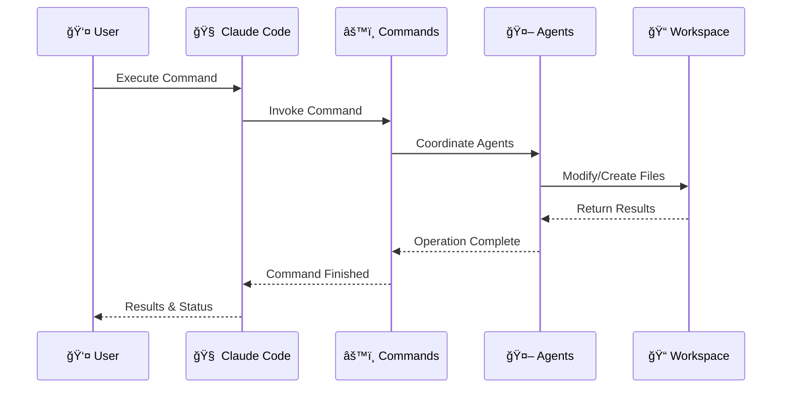

# ZZAIA Agentic Development System

[](https://choosealicense.com/licenses/mit/)
[](https://claude.ai/code)

> Multi-agent orchestration system for automated cross-repository development workflows.

## 🚀 Quick Start

```bash
git clone https://github.com/raphaelpizzaia/zzaia-agentic-development.git
cd zzaia-agentic-development
```

## 📋 Available Commands

### Development Commands

- **[`/develop`](.claude/commands/develop.md)** - Full task clarification and development workflow
- **[`/build`](.claude/commands/build.md)** - Multi-framework build with error reporting
- **[`/test`](.claude/commands/test.md)** - Comprehensive testing with coverage analysis
- **[`/migrations`](.claude/commands/migrations.md)** - EF Core migrations management

### Repository Management

- **[`/new`](.claude/commands/new.md)** - Add new project repository to workspace via git clone
- **[`/git`](.claude/commands/git.md)** - Execute comprehensive Git version control operations

### Utility Commands

- **[`/ask`](.claude/commands/ask.md)** - Interactive question-answering with context
- **[`/websearch`](.claude/commands/websearch.md)** - Web search integration
- **[`/plan`](.claude/commands/plan.md)** - Project planning and task organization
- **[`/setup-vscode`](.claude/commands/setup-vscode.md)** - VS Code environment configuration
- **[`/update-dotnet-packages`](.claude/commands/update-dotnet-packages.md)** - .NET package management
- **[`/meta-prompt`](.claude/commands/meta-prompt.md)** - Meta-prompt generation utilities

## 🏗️ Architecture



## 🤖 Specialized Agents

| Agent                                                                                | Role                    | Definition                               |
| ------------------------------------------------------------------------------------ | ----------------------- | ---------------------------------------- |
| **[zzaia-task-clarifier](.claude/agents/zzaia-task-clarifier.md)**                   | Requirements Analysis   | Task analysis and specification creation |
| **[zzaia-developer-specialist](.claude/agents/zzaia-developer-specialist.md)**       | Implementation          | Multi-language development with testing  |
| **[zzaia-documentation-architect](.claude/agents/zzaia-documentation-architect.md)** | Documentation           | Comprehensive documentation creation     |
| **[zzaia-repository-manager](.claude/agents/zzaia-repository-manager.md)**           | Repository Coordination | Multi-repository worktree operations     |
| **[zzaia-tester-specialist](.claude/agents/zzaia-tester-specialist.md)**             | Quality Assurance       | Build validation and testing             |

## 📁 Structure

```
.claude/
├── agents/              # AI agent definitions
├── commands/            # Command configurations
└── rules/              # Development standards

CLAUDE.md               # System guidance
workspace/             # Multi-repository workspace
```

## 🔄 Workflow

1. **Task Analysis** - Requirements clarification and specification
2. **Implementation** - Multi-language development with architecture patterns
3. **Testing** - Comprehensive test creation and execution
4. **Documentation** - Automated documentation generation
5. **Quality Gates** - Code review and validation
6. **Version Control** - Conventional commits and repository management

## 🛡️ Quality Standards

- **Zero-Skip Policy** - All workflow steps are mandatory
- **Conventional Commits** - Standardized commit messaging
- **Branch Prefixes** - `feature/`, `hotfix/`, `improvement/`, `refactor/`
- **Comprehensive Testing** - Unit and integration test coverage
- **Documentation Standards** - Hierarchical documentation maintenance

## 📄 License

MIT License - see [LICENSE](LICENSE) for details.

## 🔗 Links

- **Documentation**: [CLAUDE.md](CLAUDE.md)
- **Issues**: [GitHub Issues](https://github.com/raphaelpizzaia/zzaia-agentic-development/issues)
- **Built with**: [Claude Code](https://claude.ai/code)

---

**Made with ❤️ by [Raphael Pizzaia](https://github.com/raphaelpizzaia)**
