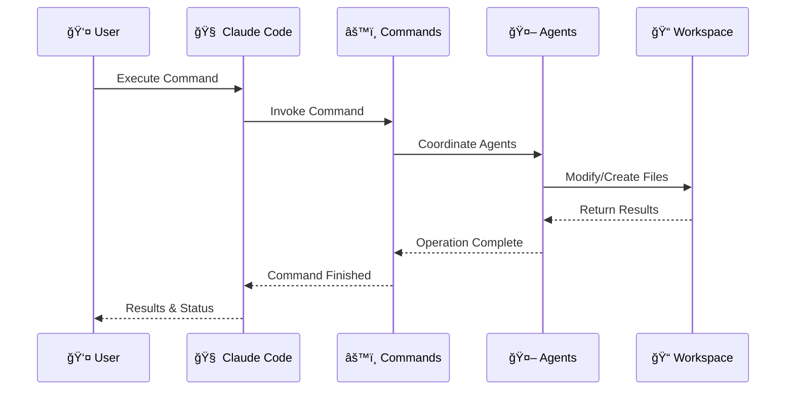

# ZZAIA Agentic Workspace

[](https://choosealicense.com/licenses/mit/)
[](https://claude.ai/code)

> Multi-agent orchestration system for software engineering workflows across analytics, development, documentation, and management.

## 🚀 Quick Start

### Clone and Use Locally
```bash
git clone https://github.com/raphaelpizzaia/transfero-agentic-workspace.git
cd transfero-agentic-workspace
```

### Use as Remote Plugin
Add to your `.claude/plugins.json`:
```json
{
  "plugins": [
    {
      "name": "zzaia-workspace",
      "url": "https://github.com/raphaelpizzaia/transfero-agentic-workspace"
    }
  ]
}
```

## 📋 Available Commands

### Analytics
Machine learning dataset discovery and analysis workflows.

- [**`/analytics:explorate`**](.claude/commands/analytics/workflows/explorate.md) - Domain and dataset exploration
- [**`/analytics:analyze`**](.claude/commands/analytics/workflows/analyze.md) - Dataset analysis and visualization

### Development
Software development lifecycle operations.

- [**`/development:develop`**](.claude/commands/development/develop.md) - Full development workflow
- [**`/development:build`**](.claude/commands/development/build.md) - Multi-framework builds
- [**`/development:test`**](.claude/commands/development/test.md) - Comprehensive testing
- [**`/development:review`**](.claude/commands/development/review.md) - Code quality review
- [**`/development:migrations`**](.claude/commands/development/migrations.md) - Database migrations
- [**`/development:git`**](.claude/commands/development/git.md) - Git operations
- [**`/development:update-dotnet-packages`**](.claude/commands/development/update-dotnet-packages.md) - Package management

### Management
Project management and work item coordination.

- [**`/management:work-items`**](.claude/commands/management/work-items.md) - Work item retrieval
- [**`/management:plan`**](.claude/commands/management/plan.md) - Project planning
- [**`/management:architect`**](.claude/commands/management/architect.md) - Architecture specifications

### Workspace
Multi-repository workspace configuration.

- [**`/workspace:new`**](.claude/commands/workspace/new.md) - Add repository
- [**`/workspace:setup-vscode`**](.claude/commands/workspace/setup-vscode.md) - VS Code configuration

### Meta
System utilities and information.

- [**`/ask`**](.claude/commands/ask.md) - Context-aware Q&A
- [**`/websearch`**](.claude/commands/websearch.md) - Web search integration

## 🏗️ Architecture



## 🤖 Specialized Agents

| Agent | Role | Definition |
|-------|------|------------|
| [**zzaia-task-clarifier**](.claude/agents/zzaia-task-clarifier.md) | Requirements Analysis | Task specifications |
| [**zzaia-developer-specialist**](.claude/agents/development/zzaia-developer-specialist.md) | Implementation | Multi-language development |
| [**zzaia-documentation-architect**](.claude/agents/zzaia-documentation-architect.md) | Documentation | Documentation creation |
| [**zzaia-repository-manager**](.claude/agents/zzaia-repository-manager.md) | Repository Coordination | Worktree operations |
| [**zzaia-tester-specialist**](.claude/agents/development/zzaia-tester-specialist.md) | Quality Assurance | Build and test validation |
| [**zzaia-code-reviewer**](.claude/agents/development/zzaia-code-reviewer.md) | Code Quality | Static analysis |

## 📁 Structure

```
.claude/
├── agents/              # AI agent definitions
├── commands/            # Command configurations
│   ├── analytics/      # ML and data analysis
│   ├── development/    # Software development
│   ├── management/     # Project management
│   ├── workspace/      # Repository management
│   └── meta/          # System utilities
├── plugins/            # Plugin configurations
│   ├── analytics.json
│   ├── development.json
│   ├── management.json
│   ├── workspace.json
│   └── meta.json
├── rules/             # Language-specific standards
│   ├── dotnet-coding-rules.md
│   ├── python-coding-rules.md
│   └── javascript-coding-rules.md
├── marketplace.json   # Marketplace configuration
└── plugin.json        # Main plugin config

CLAUDE.md              # System guidance
workspace/            # Multi-repository workspace
```

## 🔄 Workflow

1. **Task Analysis** - Requirements clarification
2. **Implementation** - Multi-language development
3. **Testing** - Comprehensive test execution
4. **Documentation** - Automated generation
5. **Quality Gates** - Code review and validation
6. **Version Control** - Conventional commits

## 🛡️ Quality Standards

- **Language Rules** - C#/.NET, Python, JavaScript/TypeScript standards
- **Zero-Skip Policy** - Mandatory workflow steps
- **Conventional Commits** - Standardized messaging
- **Comprehensive Testing** - Unit and integration coverage
- **Documentation Standards** - Hierarchical maintenance

## 💡 Usage Modes

### Local Workspace
Clone repository and use with VS Code workspace functionality for multi-repository development, this way you can improve the agentic system beside the normal development.

### Modular Plugins
Install individual plugin categories:
- **Analytics**: `.claude/plugins/analytics.json`
- **Development**: `.claude/plugins/development.json`
- **Management**: `.claude/plugins/management.json`
- **Workspace**: `.claude/plugins/workspace.json`
- **Meta**: `.claude/plugins/meta.json`

## 📄 License

MIT License - see [LICENSE](LICENSE) for details.

## 🔗 Links

- **Documentation**: [CLAUDE.md](CLAUDE.md)
- **Marketplace**: [.claude/marketplace.json](.claude/marketplace.json)
- **Issues**: [GitHub Issues](https://github.com/raphaelpizzaia/transfero-agentic-workspace/issues)
- **Built with**: [Claude Code](https://claude.ai/code)

---

**Made with ❤️ by [Raphael Pizzaia](https://github.com/raphaelpizzaia)**
