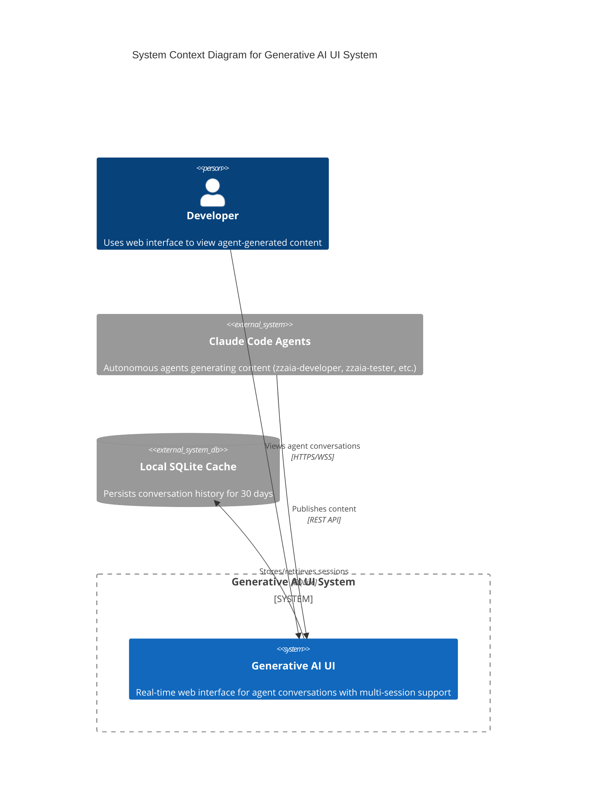

# Generative AI UI System - Architecture Overview

## System Objectives
The Generative AI UI System is a sophisticated, real-time publishing platform designed to enable seamless interaction between Claude Code agents and users through a modern, responsive web interface.

## High-Level Architecture

### Key Architectural Principles
- Event-Driven Design
- Microservice Architecture
- Real-Time Communication
- Stateless Scalability
- Comprehensive Session Management

### Technology Stack
- **Backend**: Node.js 20+ (Express.js/Fastify)
- **Frontend**: Next.js 14+ (React 18)
- **Styling**: Tailwind CSS
- **Communication**: WebSocket (ws/Socket.io)
- **Caching**: SQLite
- **Design Philosophy**: Linear-inspired Minimalism

## System Components
1. **Agent Layer**: Content generation and publishing
2. **MCP Server**: Orchestration and message brokering
3. **Next.js Frontend**: User interface and interaction
4. **Local Cache**: Persistent session storage

## C4 Context Diagram

## Architectural Decision Log
- **Session Management**: UUID-based, 30-day retention
- **Real-Time Protocol**: WebSocket with SSE fallback
- **Content Transformation**: Server-side markdown to HTML
- **Authentication**: Localhost shared secret token
- **Performance Target**: <100ms publish latency

## Security Considerations
- Content sanitization
- Localhost-only binding
- Restricted cache file permissions
- Bearer token authentication

## Performance Optimization Strategies
- Virtual scrolling
- WebSocket connection pooling
- Indexed SQLite cache
- Server-side HTML transformation

## Future Expansion Possibilities
- Multi-server support
- Enhanced authentication
- Advanced search capabilities
- Machine learning-based session recommendations