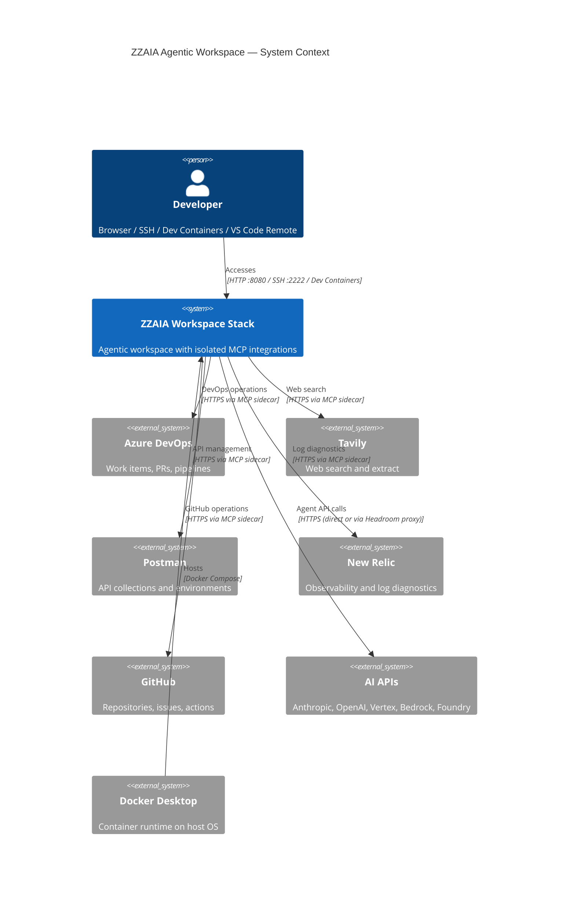
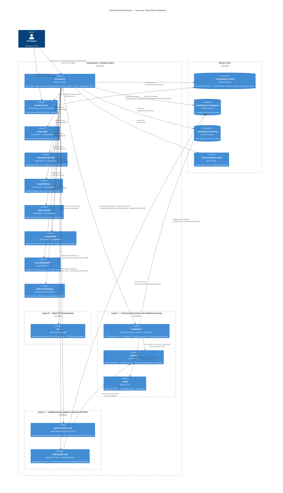

# ZZAIA Agentic Workspace — Architecture Overview

Multi-tenant agentic workspace running multiple AI coding agents (Claude Code, Gemini CLI, OpenAI Codex, GitHub Copilot) inside isolated Docker containers. Secrets are segregated into independent MCP sidecar containers so no secret is ever accessible from any agent's terminal, filesystem, or context. The workspace is accessible via browser VS Code, SSH, VS Code Remote SSH, and Dev Containers — all sharing the same VS Code profile, extensions, and agent configurations.

---

## Product ADRs — What the system must be

### PADR 001: Extensible Agent Runtime

**Decision**: The workspace supports multiple AI coding agent runtimes simultaneously — not coupled to any single agent vendor.

- Claude Code, Gemini CLI, OpenAI Codex, and GitHub Copilot are all installed and configured
- Each agent has its own native config folder and project instruction file under `agents/<agent>/`
- All agents share the same MCP tool surface via SSE endpoints
- Adopting a new agent means adding its CLI binary and native config — nothing else changes

**Rationale**: Multi-agent workspaces maximize optionality. Teams can choose the best agent for each task without reconfiguring the environment.

---

### PADR 002: Multiple Concurrent Instances on the Same Machine

**Decision**: The system supports running multiple independent workspace instances simultaneously on the same host.

- Each instance identified by `WORKSPACE_NAME` and runs on its own isolated Compose stack
- Instances do not share networks, volumes, or port bindings
- No coordination layer required between instances

**Rationale**: Development teams often work across multiple organizations or projects. A single-instance-per-machine constraint is a hard blocker to real-world usage.

---

### PADR 003: Any OS, Zero Host Dependencies Beyond Docker

**Decision**: The workspace runs identically on Ubuntu, macOS, and Windows. The only host prerequisite is Docker Desktop.

- A developer on any OS runs one command and gets a fully provisioned environment
- No manual tool installation, version management, or OS-specific setup on the host
- Remote machine deployments follow the same single-command pattern

**Rationale**: Eliminating host dependencies removes the "works on my machine" class of problems and dramatically reduces onboarding time.

---

### PADR 004: Segregated Execution Space for Autonomous Agents

**Decision**: Agents running in full-automatic mode must execute inside an isolated container that limits their access to the host machine.

- The container's Linux capabilities are reduced to the minimum required (`cap_drop: ALL` + explicit re-adds)
- The agent cannot read host files outside explicitly mounted volumes
- The blast radius of an autonomous agent is confined to the workspace container

**Rationale**: Full-automatic agent execution is a necessary productivity feature. Without isolation, it is also a security risk.

---

### PADR 005: Secrets Set Once at First Startup, Inaccessible Thereafter

**Decision**: All environment variables are provided once at the first `docker compose up`. After startup, secrets must not be readable from inside the running container.

- The developer does not manage secrets files or re-enter credentials on restarts
- Secret rotation requires an explicit operator action, not a container restart
- A running container cannot be used to exfiltrate the secrets that were used to start it

**Rationale**: Persistent secret accessibility inside containers is the most common vector for credential leakage in agentic systems.

---

### PADR 006: Developer-First UX — All Connection Types

**Decision**: The workspace must be operable through browser VS Code, SSH terminal, VS Code Remote SSH, and Dev Containers. No local IDE installation or plugin setup should be required.

- Browser access: open a URL, get a full VS Code environment with all extensions pre-installed
- SSH access: connect from any VS Code installation using standard Remote-SSH
- Dev Containers: attach to the running workspace container directly from VS Code
- All modes provide the same agentic capabilities, profile ("Main - Zzaia"), extensions, and VS Code settings

**Rationale**: Developer experience is a first-class architectural concern. Browser + SSH + Dev Containers covers every developer context.

---

### PADR 007: Secrets Never in Agent Context, Terminal, or SSH Session

**Decision**: API keys and sensitive credentials must never appear in the agent's context window, the vscode-server terminal, the SSH session environment, or any log.

- The agent calls tools via MCP SSE; the secret is consumed inside the sidecar and never returned
- `printenv`, shell history, and context inspection yield no API keys
- Each MCP sidecar is isolated: compromise of one sidecar does not expose other secrets

**Rationale**: Agents with access to secrets can leak them through tool calls, generated content, or context windows. The MCP sidecar pattern enforces a hard boundary.

---

## Implementation ADRs — How the system achieves it

### ADR 001: Docker Compose Project Namespacing for Multi-Tenancy

**Decision**: Each workspace instance is started with `docker compose -p $WORKSPACE_NAME`.

- `WORKSPACE_NAME` is a free-form slug chosen by the developer
- Port conflicts avoided via `VSCODE_PORT` and `SSH_PORT` per stack
- Three named Docker volumes scoped per workspace: `<WORKSPACE_NAME>-secrets`, `<WORKSPACE_NAME>-home`, `<WORKSPACE_NAME>-workspace`
- `WORKSPACE_NAME` is runtime-only — one image serves all workspace deployments; `{{WORKSPACE_NAME}}` placeholders in config files are substituted at container startup

**Rationale**: Compose project namespacing is native Docker isolation with zero extra infrastructure.

---

### ADR 002: MCP Sidecar Pattern for Secret Segregation

**Decision**: Every external API integration runs as a dedicated sidecar container receiving exactly one secret via environment variable.

| Sidecar | Port | Secret | Notes |
|---------|------|--------|-------|
| `mcp-tavily` | 3001 | `TAVILY_API_KEY` | Opt-in |
| `mcp-azure-devops` | 3002 | `ADO_MCP_AUTH_TOKEN` | Opt-in |
| `mcp-postman` | 3003 | `POSTMAN_API_KEY` | Opt-in |
| `mcp-newrelic` | 3004 | `NEW_RELIC_API_KEY` | Opt-in |
| `mcp-github` | 3005 | `GITHUB_PERSONAL_ACCESS_TOKEN` | Opt-in |
| `mcp-playwright` | 3006 | None | Always-on, headless Chromium |
| `aspire-mcp` | 3007 | None | Always-on, internal to workspace |
| `aspire-dashboard` | 18888 | None | Always-on, OTLP telemetry receiver |

- The `workspace` container holds zero API key environment variables for MCP integrations
- Each opt-in sidecar guards its own key: if empty, the process exits cleanly (code 0)

**Rationale**: Sidecar-per-secret is the minimal surface area principle applied to secrets.

---

### ADR 003: Minimal Linux Capabilities (`cap_drop: ALL`)

**Decision**: The `workspace` container drops all Linux capabilities and adds back only: `CHOWN`, `FOWNER`, `SETGID`, `SETUID`, `AUDIT_WRITE`.

- `DAC_OVERRIDE` and `DAC_READ_SEARCH` are intentionally absent — root inside the container cannot bypass file permission checks on files it does not own
- `--dangerously-skip-permissions` agents operate within these capability boundaries

**Rationale**: Reducing capabilities limits the blast radius of an autonomous agent.

---

### ADR 004: One-Time Secret Injection with Post-Startup Inaccessibility

**Decision**: Secrets are passed via environment variables at `docker compose up` time. On first start, only the SSH public key is written to `/secrets/.env` (mode 600). On all subsequent starts, the file already exists and env vars are ignored.

- Secrets exist only in the process environment during the first startup
- SSH terminal, vscode-server terminal, and agent shell have no access to API keys after startup

**Rationale**: One-time injection eliminates the need for a secrets manager while maintaining the invariant that API keys are not queryable from within the workspace after startup.

---

### ADR 005: Extensible Agent Runtime Interface

**Decision**: Multiple agent runtimes are installed and configured simultaneously.

| Agent | CLI Binary | Config Folder | Instruction File |
|-------|-----------|---------------|-----------------|
| Claude Code | `claude` (mise) | `agents/claude/.claude/` | `agents/claude/CLAUDE.md` |
| Gemini CLI | `gemini` (mise) | `agents/gemini/.gemini/` | `agents/gemini/GEMINI.md` |
| OpenAI Codex | `codex` (mise) | `agents/codex/.codex/` | `agents/codex/AGENTS.md` |
| GitHub Copilot | `gh copilot` | `agents/copilot/.github/` | `agents/copilot/.github/copilot-instructions.md` |

- All agents share the same MCP SSE endpoints — configured once, available everywhere

**Rationale**: Multi-agent support preserves team optionality. The shared MCP surface means integrations are configured once.

---

### ADR 006: Decoupled VS Code Server Container

**Decision**: `code serve-web` runs as a separate `vscode-server` container, not inside the `workspace` container. Both use the same Docker image.

- `workspace` entrypoint simplified to: SSH setup → credential wiring → WORKSPACE_NAME templating → Aspire MCP
- `vscode-server` uses a `command` override to run `code serve-web` only
- Watchdog restart loop removed; Docker `restart: unless-stopped` + native healthcheck (HTTP/8080) replaces it
- `vscode-server` starts after workspace is healthy (`depends_on: workspace: condition: service_healthy`)
- Browser UI is opt-in via Compose profile `vscode` — zero overhead for SSH-only or CI deployments

**Rationale**: Failure isolation, native recovery semantics, and simpler entrypoint logic. Browser UI and agent runtime have independent lifecycles.

---

### ADR 007: Tool Provisioning via `mise` and Dockerfile

**Decision**: All workspace tools are provisioned inside the Docker image via `mise.toml` and Dockerfile steps.

- `mise` manages language runtimes and CLI tools (Node.js, .NET, gh, agent CLIs)
- Miniforge3 (conda) is the sole Python provider
- The image is self-contained: any developer on Ubuntu, macOS, or Windows runs identically

**Rationale**: Zero-dependency host setup is the primary usability objective.

---

### ADR 008: Claude Code Authentication and Sudo Access

**Decision**: The workspace accepts environment variables for Claude Code authentication across five provider options (only one required).

| Priority | Provider | Variables |
|----------|----------|-----------|
| 1 | AWS Bedrock | `AWS_ACCESS_KEY_ID`, `AWS_SECRET_ACCESS_KEY`, `AWS_REGION`, `ANTHROPIC_BEDROCK_BASE_URL` |
| 2 | Anthropic API Key | `ANTHROPIC_API_KEY` |
| 3 | Pro / Max OAuth | `CLAUDE_CODE_OAUTH_TOKEN` |
| 4 | Google Vertex AI | `CLAUDE_CODE_USE_VERTEX`, `ANTHROPIC_VERTEX_PROJECT_ID`, `CLOUD_ML_REGION` |
| 5 | Azure AI Foundry | `CLAUDE_CODE_USE_FOUNDRY`, `AZURE_FOUNDRY_BASE_URL` |

- `ADMIN_PASSWORD` — if set, enables password-based sudo; if empty, sudo is unavailable

**Rationale**: Agent auth credentials must exist in the process environment — unlike MCP sidecar secrets, agent auth cannot be moved to a sidecar.

---

### ADR 009: Single Image Strategy for Profile Consistency

**Decision**: Both `workspace` and `vscode-server` containers use the same Docker image (`zzaia-agentic-workspace:latest`).

- VS Code profile ("Main - Zzaia"), extensions, and settings are baked into the image once
- Both containers mount `workspace-home` volume → single `.vscode-server/extensions` directory
- `devcontainer.json` embedded in the image mirrors the same extension list for Dev Containers attach
- No duplication, no drift between connection types

**Rationale**: Profile and extension consistency across all entry points is critical for developer experience. Single-image enforces parity at build time.

---

### ADR 010: RTK for Shell Command Output Compression (Layer 0)

**Decision**: Install RTK (Rust Token Killer) binary in the workspace container image; configure per-agent hook integrations for automatic shell command output compression.

- RTK installed via GitHub releases curl in Dockerfile — zero external dependencies, no Docker service needed
- Operates at Layer 0 (shell I/O level) **before** all API requests, complementing Headroom's Layer 1 compression
- Configured via agent hooks: Claude Code `PreToolUse`, Gemini CLI `BeforeTool`, Cursor/Windsurf/Cline via config
- Supports 100+ commands out-of-box: git, cargo/build, docker, kubectl, ls/find/grep, pytest/jest, AWS CLI, and more
- Achieves 81% average token reduction on command outputs; cargo test: 4,823→11 tokens (99% reduction), git status: 2,000→200 tokens (90% reduction)
- Passthrough guarantee: if RTK fails, original output is returned unchanged — no command execution is ever blocked
- **Stacks with Headroom**: RTK compresses raw output at shell level; Headroom compresses LLM requests at API level

**Rationale**: Layer 0 shell-level compression is the first optimization gate before API-level compression. RTK's binary-only footprint and zero-dependency design fit the workspace's minimal-host-dependencies principle. Early compression at I/O level reduces Headroom's input load. All three layers (RTK→Headroom→Agent context) can stack without interference.

---

### ADR 011: Headroom Triple-Stack Primary Layer (Always-On Default)

**Decision**: `headroom` runs as a mandatory always-on proxy implementing the primary optimization layer: context compression, automatic memory injection, and background code-graph via a proxy pipeline.

- Started with `command: headroom proxy --memory --code-graph` — single command enables all three capabilities
- `ANTHROPIC_BASE_URL=http://headroom:8787`, `OPENAI_BASE_URL=http://headroom:8787`, and `GEMINI_API_BASE=http://headroom:8787` are always set in the workspace environment
- No agent code changes required — transparent HTTP proxy; all three features applied automatically to every request
- Three active features: **context compression** (reduces tokens 34–90%, <5ms overhead), **automatic memory injection** (proxy pipeline step `search_and_format_context()` runs before every LLM forward), **background code-graph** (file watcher on workspace-repos volume; exposes MCP tools)
- Backing services: Qdrant (semantic cache + memory embeddings) + Neo4j (knowledge graph + code-graph)
- `workspace` depends on headroom healthy (`condition: service_healthy`) — Headroom readiness gates agent startup
- Headroom exposes `/health`, `/livez`, `/readyz` for orchestration; `/metrics` (Prometheus) for observability via Aspire Dashboard
- Passthrough guarantee: if compression fails, original content is forwarded unchanged — no agent call is ever dropped

**Rationale**: Triple-stack primary layer automatically optimizes every agent session without opt-in overhead. Automatic memory injection via proxy pipeline eliminates the need for agent instrumentation. Background code-graph file watcher keeps code context current without manual triggers. Qdrant + Neo4j shared by all three features eliminates redundant infrastructure.

---

### ADR 012: OpenMemory MCP — Supplementary Structured Memory (Agent-Initiated)

**Decision**: Deploy OpenMemory MCP service as supplementary layer for explicit, filtered memory queries; agents call `search_memory`, `add_memories`, and `list_memories` via MCP when they need specific context.

- OpenMemory container runs `skpassegna/openmemory-mcp:latest` on port 5005
- Postgres + Qdrant backend (same Qdrant instance used by Headroom primary layer)
- Native MCP tools available to all agent CLIs and VS Code extensions without special wiring
- Local-first architecture — no external service dependencies; memory stays on-host
- **Supplements Headroom's automatic memory injection** — agents use explicit queries for fine-grained control
- Agent-initiated retrieval prevents memory pollution — agents request exactly what they need, not auto-injected
- No lock-in to Headroom; works with any MCP client

**Rationale**: Supplementary agent-initiated memory complements Headroom's automatic injection with explicit, filtered queries. Qdrant backend shared with Headroom eliminates redundant infrastructure. MCP interface ensures compatibility across all agent toolchains without requiring Headroom integration.

---

### ADR 013: CodeGraphContext — Supplementary Code Graph (Agent-Initiated)

**Decision**: Deploy CodeGraphContext as supplementary MCP server for explicit code graph queries; agents call `find_callers`, `find_callees`, `class_hierarchy`, and `call_chain` via MCP when they need structural context.

- CodeGraphContext container runs `python:3.12-slim` with codegraphcontext package on stdio/MCP
- Tree-sitter AST parsing generates call graphs and class hierarchies in real-time; file watcher integrated into Headroom's primary layer
- Stores parsed graph in local KûzuDB or Neo4j database (`code-graph-db` named volume)
- Real-time file watching detects source changes and updates graph incrementally
- **Supplements Headroom's background code-graph** — agents use explicit queries for targeted analysis
- Agent-agnostic — any MCP client can query the workspace graph; no IDE dependency
- MCP interface makes code graph queries observable and enables reuse across all coding tools

**Rationale**: Supplementary agent-initiated code graph complements Headroom's background file watcher with explicit, filtered queries. Tree-sitter AST parsing is language-agnostic and requires no IDE. MCP interface enables reuse across all agent toolchains without Headroom coupling.

---

### ADR 014: Implementation Phases — Primary Layer (Phase 1) + Supplementary Layers (Phase 2/3)

**Decision**: Implement the two-layer triple-stack architecture in three phases: Phase 1 deploys Headroom's full triple-stack primary layer, Phase 2 adds OpenMemory MCP, Phase 3 adds CodeGraphContext MCP.

**Phase 1 — Primary Layer (Automatic via Headroom proxy)**:
- `headroom proxy --memory --code-graph` starts with all three features enabled
- Context compression: 34–90% token reduction, <5ms overhead
- Automatic memory injection: proxy pipeline `search_and_format_context()` runs before every LLM forward
- Background code-graph: file watcher on workspace-repos volume; Qdrant + Neo4j backing
- All agents benefit automatically without agent instrumentation

**Phase 2 — Supplementary Layer: OpenMemory MCP**:
- Agents explicitly call `search_memory`, `add_memories` for structured queries
- Uses same Qdrant + Postgres as Headroom's automatic layer
- Provides fine-grained control vs. automatic injection

**Phase 3 — Supplementary Layer: CodeGraphContext MCP**:
- Agents explicitly call `find_callers`, `class_hierarchy` for code analysis
- Complements Headroom's background file watcher with targeted queries

**Rationale**: Phased rollout enables validation of each layer independently. Primary layer (Headroom) provides automatic benefits to all agents. Supplementary layers (OpenMemory + CodeGraphContext) add explicit control for agents that need fine-grained access. Shared infrastructure (Qdrant + Neo4j) eliminates redundancy.

---

## C4 Context Diagram


```mermaid
C4Context
    title ZZAIA Agentic Workspace — System Context

    Person(dev, "Developer", "Browser / SSH / Dev Containers / VS Code Remote")
    System(workspace, "ZZAIA Workspace Stack", "Agentic workspace with isolated MCP integrations")
    System_Ext(ado, "Azure DevOps", "Work items, PRs, pipelines")
    System_Ext(tavily, "Tavily", "Web search and extract")
    System_Ext(postman, "Postman", "API collections and environments")
    System_Ext(newrelic, "New Relic", "Observability and log diagnostics")
    System_Ext(github, "GitHub", "Repositories, issues, actions")
    System_Ext(ai, "AI APIs", "Anthropic, OpenAI, Vertex, Bedrock, Foundry")
    System_Ext(docker, "Docker Desktop", "Container runtime on host OS")

    Rel(dev, workspace, "Accesses", "HTTP :8080 / SSH :2222 / Dev Containers")
    Rel(workspace, ado, "DevOps operations", "HTTPS via MCP sidecar")
    Rel(workspace, tavily, "Web search", "HTTPS via MCP sidecar")
    Rel(workspace, postman, "API management", "HTTPS via MCP sidecar")
    Rel(workspace, newrelic, "Log diagnostics", "HTTPS via MCP sidecar")
    Rel(workspace, github, "GitHub operations", "HTTPS via MCP sidecar")
    Rel(workspace, ai, "Agent API calls", "HTTPS (direct or via Headroom proxy)")
    Rel(docker, workspace, "Hosts", "Docker Compose")

    UpdateLayoutConfig($c4ShapeInRow="3", $c4BoundaryInRow="1")
```

## C4 Container Diagram


```mermaid
C4Container
    title ZZAIA Agentic Workspace — Two-Layer Triple-Stack Architecture

    Person(dev, "Developer", "Browser or SSH")

    System_Boundary(stack, "<workspace> Compose Stack") {
        System_Boundary(layer0, "Layer 0 — Shell I/O Compression") {
            Container(rtk, "rtk", "Rust binary in-image", "Bash hook intercepts command outputs — 81% avg compression")
        }

        Container(ws, "workspace", "Ubuntu 24.04", "SSH :2222 + agent runtime (Claude/Gemini/Codex/Copilot) + mise + Aspire MCP :3007")
        Container(vscode, "vscode-server", "Same image, command override", "code serve-web :8080 [profile: vscode]")

        System_Boundary(primary, "Layer 1 — Primary (Automatic via Headroom proxy)") {
            Container(headroom, "headroom", "Headroom proxy --memory --code-graph", "HTTP proxy :8787 — compression + memory injection + code-graph [always-on]")
            Container(qdrant, "qdrant", "Qdrant v1.17", "Vector DB :6333 — semantic cache + memory embeddings + code-graph")
            Container(neo4j, "neo4j", "Neo4j 5.15", "Graph DB :7687 — knowledge graph + code-graph")
        }

        System_Boundary(supplementary, "Layer 2 — Supplementary (Agent-initiated via MCP)") {
            Container(openmemory, "openmemory-mcp", "skpassegna/openmemory-mcp", "Structured memory queries, Postgres + Qdrant backend, MCP :5005 [Phase 2]")
            Container(codegraph, "code-graph-mcp", "python:3.12-slim + codegraphcontext", "Code graph queries — tree-sitter AST parsing, KûzuDB/Neo4j [Phase 3]")
        }

        Container(tavily, "mcp-tavily", "node:alpine + supergateway", "Holds TAVILY_API_KEY, exposes SSE :3001")
        Container(ado, "mcp-azure-devops", "node:alpine + supergateway", "Holds ADO_MCP_AUTH_TOKEN, exposes SSE :3002")
        Container(postman, "mcp-postman", "node:alpine + supergateway", "Holds POSTMAN_API_KEY, exposes SSE :3003")
        Container(newrelic, "mcp-newrelic", "node:alpine + supergateway", "Holds NEW_RELIC_API_KEY, exposes SSE :3004")
        Container(ghsidecar, "mcp-github", "node:alpine + supergateway", "Holds GITHUB_PERSONAL_ACCESS_TOKEN, exposes SSE :3005")
        Container(playwright, "mcp-playwright", "playwright/mcp", "Headless Chromium, always-on, SSE :3006")
        Container(aspireds, "aspire-dashboard", "dotnet/aspire-dashboard", "OTLP receiver + telemetry UI, always-on, :18888")
    }

    System_Boundary(host, "Docker Host") {
        ContainerDb(home, "<workspace>-home", "Named volume", "Persisted home dir — .vscode-server/, .claude/, agent configs, auth tokens")
        ContainerDb(repos, "<workspace>-workspace", "Named volume", "Git repositories and worktrees")
        ContainerDb(secrets, "<workspace>-secrets", "Named volume", "SSH host keys and public key")
        Container(dockersock, "/var/run/docker.sock", "Unix socket", "Docker API access for agent-initiated ops")
    }

    Rel(dev, ws, "SSH terminal / VS Code Remote SSH / Dev Containers", "127.0.0.1:SSH_PORT")
    Rel(dev, vscode, "VS Code browser", "127.0.0.1:VSCODE_PORT")
    Rel(ws, rtk, "Bash hook intercepts outputs", "stdin/stdout at shell level")
    Rel(ws, vscode, "Shares workspace-home volume", "named volume")
    Rel(ws, headroom, "All AI API calls (Anthropic + OpenAI + Gemini)", "ANTHROPIC_BASE_URL / OPENAI_BASE_URL / GEMINI_API_BASE :8787")
    Rel(headroom, qdrant, "Compression + memory + code-graph", "semantic search :6333")
    Rel(headroom, neo4j, "Knowledge graph + code-graph", "Bolt :7687")
    Rel(headroom, repos, "Background file watcher", "code-graph on workspace-repos volume")
    Rel(ws, openmemory, "MCP tool calls (Phase 2)", "search_memory / add_memories :5005")
    Rel(openmemory, qdrant, "Semantic memory index", "vector DB :6333")
    Rel(ws, codegraph, "MCP tool calls (Phase 3)", "find_callers / class_hierarchy / call_chain")
    Rel(codegraph, repos, "Parse source files", "named volume /home/user/workspace")
    Rel(ws, tavily, "MCP tool calls", "SSE mcp network")
    Rel(ws, ado, "MCP tool calls", "SSE mcp network")
    Rel(ws, postman, "MCP tool calls", "SSE mcp network")
    Rel(ws, newrelic, "MCP tool calls", "SSE mcp network")
    Rel(ws, ghsidecar, "MCP tool calls", "SSE mcp network")
    Rel(ws, playwright, "MCP tool calls", "SSE mcp network")
    Rel(ws, aspireds, "OTLP telemetry", "AppHost → :18889")
    Rel(ws, home, "Home directory", "named volume /home/user")
    Rel(ws, repos, "Repository storage", "named volume /home/user/workspace")
    Rel(ws, secrets, "SSH keys", "named volume /secrets")
    Rel(ws, dockersock, "Docker API", "bind mount")
    Rel(vscode, home, "Read VS Code state", "named volume /home/user")

    UpdateLayoutConfig($c4ShapeInRow="3", $c4BoundaryInRow="2")
```

## Project Structure

```
zzaia-agentic-workspace/
├── agents/                  # Per-agent configuration directories
│   ├── claude/              # Claude Code — CLAUDE.md, .mcp.json, .claudeignore, .claude/
│   ├── gemini/              # Gemini CLI — GEMINI.md, .gemini/
│   ├── codex/               # OpenAI Codex — AGENTS.md, .codex/
│   └── copilot/             # GitHub Copilot — .github/copilot-instructions.md
├── vscode/                  # VS Code profile — settings, extensions, launch configs, workspace file
├── docker/
│   ├── Dockerfile           # Single image — Ubuntu 24.04, mise, SSH, VS Code server pre-baked
│   ├── docker-compose.yml   # Stack — workspace + vscode-server + headroom (profiles) + 8 sidecars
│   ├── entrypoint.sh        # SSH setup, credential wiring, WORKSPACE_NAME templating, Aspire MCP
│   ├── mise.toml            # Tool versions — node, dotnet, agent CLIs, VS Code extensions
│   └── sshd_config          # SSH daemon hardening config
├── docs/
│   ├── architecture-overview.md  # This document
│   └── bdd-scenarios.md          # BDD scenarios for all workspace features
├── workspace/host/          # .NET Aspire AppHost for integrated local testing
├── workspace/               # Multi-repository git worktrees
├── QUICKSTART.md            # Setup instructions
└── README.md                # Project overview
```

## Architecture Components

### Deployment Units

| Container | Role | Port | Profile | Notes |
|-----------|------|------|---------|-------|
| `rtk` | Binary in workspace image | Shell command output compression | always (in-image) | N/A — Layer 0, not a compose service |
| `workspace` | SSH daemon, agent runtime, mise toolchain, Aspire MCP | 2222 (SSH) | always | |
| `vscode-server` | Browser VS Code (`code serve-web`) | 8080 | `vscode` | |
| **Layer 1 — Primary** | | | | |
| `headroom` | Triple-stack proxy: compression + memory injection + code-graph | 8787 (internal) | always |
| `qdrant` | Vector DB — semantic cache + memory embeddings + code-graph | 6333 (internal) | always |
| `neo4j` | Knowledge graph — shared by Headroom memory and code-graph | 7687 (internal) | always |
| **Layer 2 — Supplementary** | | | |
| `openmemory-mcp` | Structured memory queries (Phase 2) — Postgres + Qdrant backend | 5005 (MCP) | always |
| `code-graph-mcp` | Code graph queries (Phase 3) — tree-sitter AST parsing | stdio (MCP) | always |
| **Other MCP Adapters** | | | |
| `mcp-tavily` | Web search MCP adapter | 3001 (internal) | conditional |
| `mcp-azure-devops` | Azure DevOps MCP adapter | 3002 (internal) | conditional |
| `mcp-postman` | Postman MCP adapter | 3003 (internal) | conditional |
| `mcp-newrelic` | New Relic MCP adapter | 3004 (internal) | conditional |
| `mcp-github` | GitHub MCP adapter | 3005 (internal) | conditional |
| `mcp-playwright` | Headless Chromium MCP | 3006 (internal) | always |
| `aspire-dashboard` | OTLP telemetry receiver + UI | 18888 | always |

### Shared State (Named Volumes)

| Volume | Mount | Contents |
|--------|-------|----------|
| `<ws>-home` | `/home/user` | `.vscode-server/`, `.claude/`, agent configs, auth tokens |
| `<ws>-workspace` | `/home/user/workspace` | Git repositories and worktrees |
| `<ws>-secrets` | `/secrets` | SSH host keys and public key |
| `<ws>-headroom-qdrant` | `/qdrant/storage` | Vector embeddings for headroom and openmemory |
| `<ws>-headroom-neo4j` | `/data` | Knowledge graph for headroom retrieval |
| `<ws>-openmemory-data` | `/var/lib/postgresql/data` | OpenMemory Postgres persistent memory store |
| `<ws>-code-graph-db` | `/data/code-graph` | CodeGraphContext graph index (KûzuDB or Neo4j) |

### Connection Types

| Type | Entry Point | Notes |
|------|-------------|-------|
| SSH | `workspace:2222` | sshd with pubkey auth |
| Browser | `vscode-server:8080` | `code serve-web`, no token (profile: vscode) |
| Dev Containers | Docker socket → workspace | `devcontainer.json` in image |
| VS Code Remote SSH | `workspace:2222` | Remote SSH extension |

## Technology Stack

| Layer | Technology |
|-------|-----------|
| Container runtime | Docker Desktop (Linux / macOS / Windows) |
| Workspace OS | Ubuntu 24.04 LTS |
| Agent runtimes | Claude Code, Gemini CLI, OpenAI Codex, GitHub Copilot |
| Developer UI | `code serve-web` (Microsoft VS Code) + OpenSSH |
| Dev Containers | `devcontainer.json` embedded in workspace image |
| **Layer 0 — Shell I/O Compression** | |
| **RTK** | **Rust Token Killer binary (in-image) — 81% avg token reduction on command outputs via bash hook intercepts** |
| **Layer 1 — Primary (Automatic)** | |
| **Headroom proxy** | **Triple-stack: compression (34–90% tokens, <5ms) + memory injection + code-graph, passthrough guarantee** |
| **Vector DB (Qdrant)** | **Semantic cache (compression) + memory embeddings + code-graph index** |
| **Graph DB (Neo4j)** | **Knowledge graph (memory + code-graph), shared backing for primary layer** |
| **Layer 2 — Supplementary (Agent-Initiated, Phase 2/3)** | |
| **OpenMemory MCP** | **Structured memory queries (Phase 2) — Postgres + Qdrant backend, explicit retrieval via search_memory/add_memories** |
| **CodeGraphContext MCP** | **Code graph queries (Phase 3) — Tree-sitter AST parsing, explicit retrieval via find_callers/class_hierarchy** |
| Tool provisioning | mise (agent CLIs, node, dotnet) + Miniforge3 (Python/conda) |
| MCP bridge | supergateway (stdio → SSE) + native MCP servers (openmemory, codegraph) |
| Multi-tenancy | Docker Compose project namespacing |
| Secret lifecycle | Process env → one-time file write → sealed |
| Telemetry | .NET Aspire Standalone Dashboard (OTLP receiver) |

## Security Model

| Threat | Mitigation |
|--------|-----------|
| Agent exfiltrates API keys | Keys never in workspace container env after startup |
| Agent modifies host filesystem | Only `/secrets` and `/home/user/workspace` volumes mounted; `cap_drop: ALL` |
| Agent escapes container | No `SYS_ADMIN`, `NET_ADMIN`, or `DAC_OVERRIDE` capabilities |
| Secret visible in terminal | Env vars ephemeral after startup; SSH key persisted at `/secrets/.env` (root-owned, mode 600) |
| Cross-stack secret leakage | Each stack on isolated bridge network; no shared volumes |
| Port scanning from container | MCP ports bound to internal network only |
| VS Code server compromise | `vscode-server` container has no secrets — mounts workspace-home read-only for VS Code state |

## Related Documentation

- [QUICKSTART.md](../QUICKSTART.md) — Step-by-step setup instructions
- [README.md](../README.md) — Project overview
- [docker/](../docker/) — Dockerfile, Compose, entrypoint, and mise.toml
- [bdd-scenarios.md](bdd-scenarios.md) — BDD scenarios for all workspace features
- [agents/claude/CLAUDE.md](../agents/claude/CLAUDE.md) — Claude Code command hierarchy and standards
- [agents/claude/.mcp.json](../agents/claude/.mcp.json) — MCP server configuration
