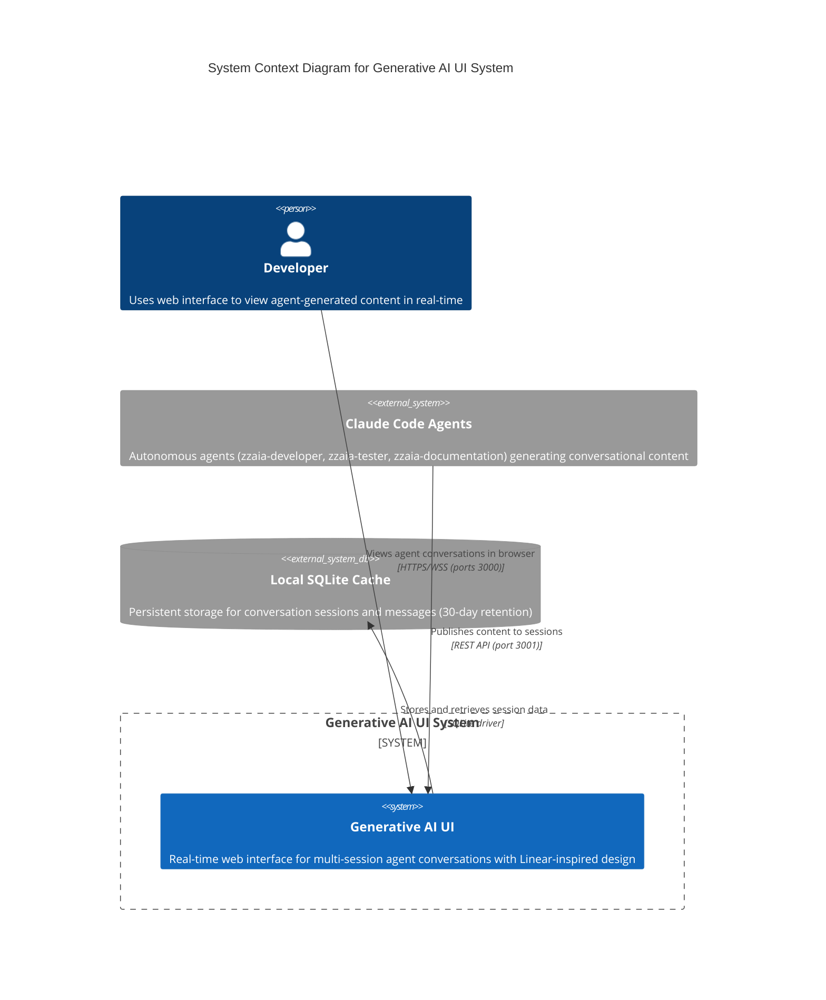
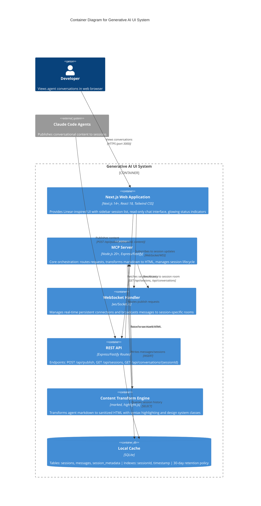
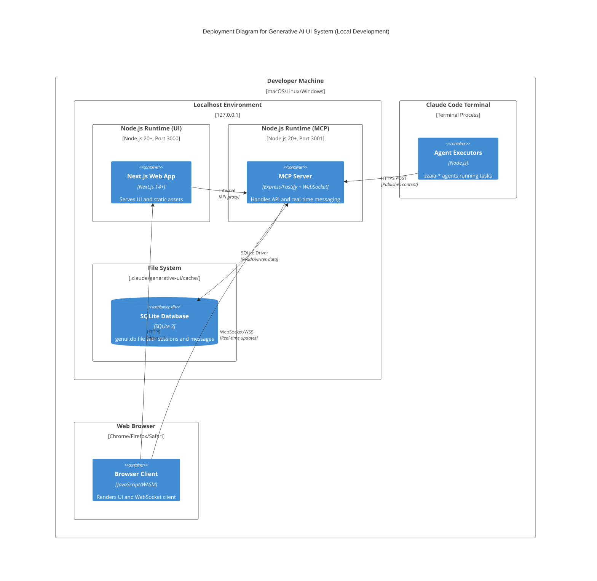

# C4 Architecture Diagrams for Generative AI UI System

## Context Diagram

## Container Diagram

## Deployment Diagram

## Architecture Decision Record (ADR)
1. **WebSocket over HTTP Polling**
   - Real-time updates
   - Low latency
   - Efficient resource utilization

2. **SQLite for Caching**
   - Lightweight
   - Zero-configuration
   - Embedded storage
   - Easy local persistence

3. **Localhost-Only Design**
   - Enhanced security
   - Development-focused architecture
   - Simplified authentication

## Key Integration Points
- Agent → MCP Server: REST Publish
- MCP Server → Frontend: WebSocket Broadcast
- Frontend → SQLite: Session Retrieval

## Performance Targets
- Publish Latency: <100ms
- Concurrent Sessions: 100+
- Message Retention: 30 days
- Virtual Scroll Performance: 1000+ messages

## Security Constraints
- Localhost binding
- Bearer token authentication
- Content sanitization
- No external data exposure