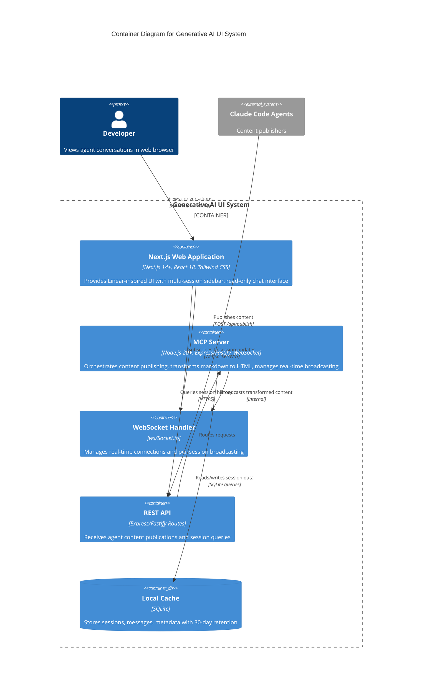

# Generative UI Service Architecture

## Service Overview
The Generative UI Service is a sophisticated real-time communication platform enabling dynamic, multi-session interactions between agents and users.

## Component Interactions

### C4 Container Diagram

## WebSocket Communication Pattern

### Publish Flow
1. Agent generates content
2. Content sent to MCP Server via REST API
3. MCP Server transforms content
4. WebSocket broadcast to active session
5. Frontend receives and renders update

### Session Management Architecture
- **Unique Identifier**: UUID-based session
- **Lifecycle**:
  - Creation on first agent interaction
  - Active for 30 days
  - Automatic archival after inactivity

## API Interaction Patterns

### Agent → MCP Server
- **Endpoint**: `/api/publish`
- **Communication**: REST POST
- **Key Headers**:
  - `X-Session-ID`
  - `X-Agent-ID`
  - `Content-Type: application/json`

### MCP Server → Frontend
- **Protocol**: WebSocket
- **Message Types**:
  - `message`: New content
  - `session_created`: New session initialization
  - `session_status`: Session state changes

## Error Handling and Resilience
- **Retry Mechanism**: 3 attempts with exponential backoff
- **Fallback Strategies**:
  - SSE (Server-Sent Events) if WebSocket fails
  - Local storage-based message queue
- **Logging**: Comprehensive error tracking

## Performance Considerations
- **Publish Latency**: <100ms target
- **Connection Management**:
  - Connection pooling
  - Automatic reconnection
- **Render Optimization**:
  - Virtual scrolling
  - Incremental rendering

## Security Constraints
- **Authentication**:
  - Localhost-only
  - Shared secret token
- **Content Security**:
  - DOMPurify sanitization
  - Strict MIME type checking
  - No direct script execution

## Scalability Considerations
- Stateless server design
- Horizontal scaling potential
- Independent component upgradability

## Monitoring and Observability
- **Metrics Tracked**:
  - WebSocket connection count
  - Message publish latency
  - Session creation rate
  - Cache hit/miss ratio
- **Logging**: Structured JSON logging
- **Tracing**: Distributed tracing support