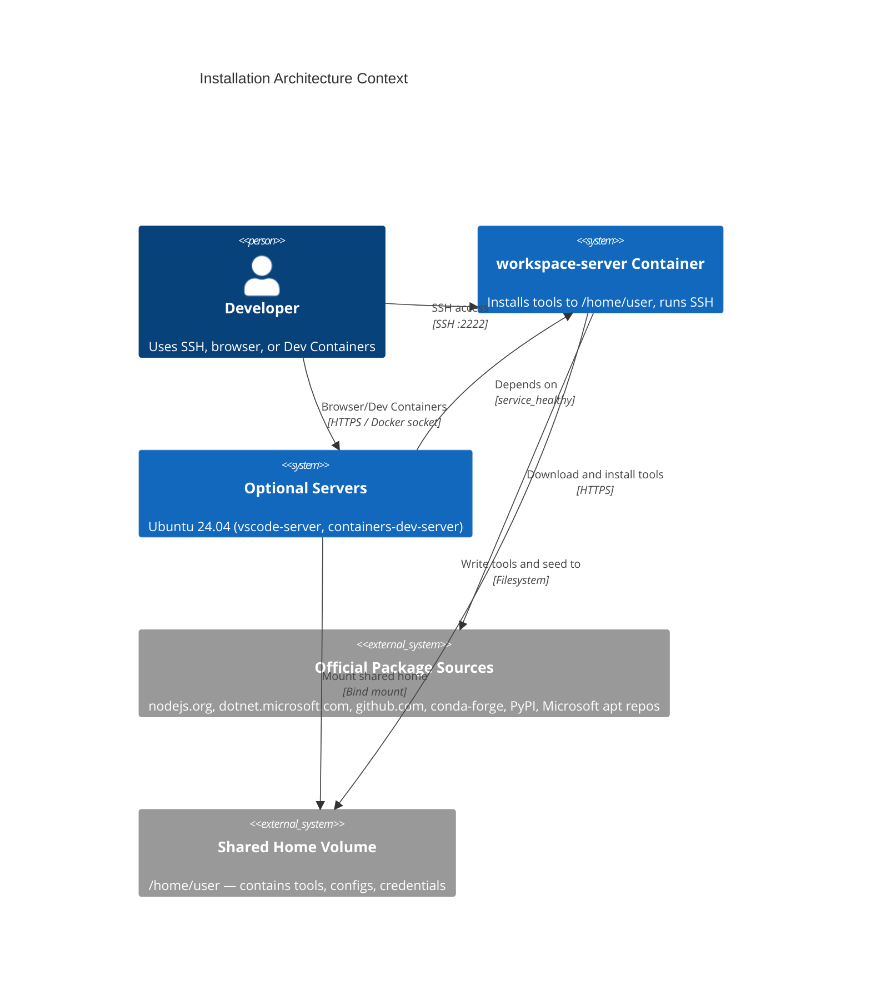
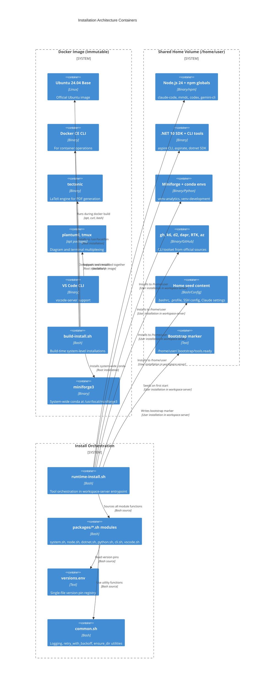

# ZZAIA Agentic Workspace — Installation Architecture

Ubuntu 24.04-based Docker container for multi-agent agentic development workspace. Tool provisioning uses Ansible roles running inside the workspace-server container at startup. Roles are organized by tool group and execute in three plays: system setup (root), user-space tools (become_user: user, INSTALL_PREFIX=/opt/tools), and credentials/GPU (root). All user-space tools install to a separate volume for easy management. Single-source version pinning via `group_vars/all.yml`.

---

### ADR 001: Ansible-based Tool Provisioning

**Decision**: Use Ansible roles for all tool provisioning, replacing mise + shell scripts. Roles run inside workspace-server container at startup via entrypoint playbook execution.

- Roles organized by tool group: `system`, `user-setup`, `vscode-cli`, `node`, `dotnet`, `python`, `cli`, `path-config`, `credentials`, `gpu`
- Three plays: system setup (root), user-space tools (become_user: user, INSTALL_PREFIX=/opt/tools), credentials/GPU (root)
- Build-time: Ansible pre-installed; playbook templates in image
- Runtime: `workspace-server` entrypoint runs Ansible playbook (`site.yml`)
- Version pins in `docker/containers/workspace-server/ansible/group_vars/all.yml` — single place to bump all versions
- Bootstrap marker at `/opt/tools/.bootstrap/tools.ready` tracks installation state; hash mismatch on startup triggers re-install
- Idempotent: Ansible ensures desired state; can re-run safely

**Rationale**: Ansible is industry-standard infrastructure automation. Replaces shell scripts + mise complexity with declarative, modular, reusable roles. Centralized version management. Role composition enables easy extension.

---

### ADR 002: Ansible Roles for Tool Organization

**Decision**: Organize tool installation into separate Ansible roles under `docker/containers/workspace-server/ansible/roles/` — one role per tool group or concern.

- `roles/system/` — apt packages, system config (build-time via root play)
- `roles/user-setup/` — user creation, home directory setup
- `roles/vscode-cli/` — VS Code CLI installation
- `roles/node/` — Node.js via NVM + npm globals (claude-code, mmdc, codex, gemini-cli)
- `roles/dotnet/` — .NET SDK + aspire + aspirate tools
- `roles/python/` — Miniforge3, pip packages, conda environments
- `roles/cli/` — gh CLI, k6, d2, dapr, RTK binary, docker CLI, azure-cli
- `roles/path-config/` — writes ~/.bashrc and ~/.profile with correct PATH
- `roles/credentials/` — Claude, GitHub, Azure authentication setup
- `roles/gpu/` — CUDA/GPU support (optional, becomes_user: root)

Each role is independently reusable, testable, and composable. Roles called in `site.yml` three-play structure.

**Rationale**: Ansible roles enforce separation of concerns. Each role has its own vars, handlers, tasks, and templates. Highly reusable; can extract to role library.

---

### ADR 003: Dual Volume Pattern for Tools and Home

**Decision**: Tools install to `/opt/tools` (INSTALL_PREFIX=/opt/tools) in a separate `<ws>-tools` volume. User configs and repos stay in `/home/user` (`<ws>-home` volume). Both volumes are shared by all server containers.

- `workspace-server` runs Ansible playbook with `INSTALL_PREFIX=/opt/tools` during entrypoint
- `<ws>-tools` volume (read-write for workspace-server, read-only for vscode-sidecar/jupyter-sidecar/etc.) holds all runtime tools: Node.js, .NET, Python, CLIs
- `<ws>-home` volume (shared read-write) holds user configs, credentials, workspace repos, and VS Code state
- Ansible `path-config` role writes `.bashrc`/`.profile` to `/home/user` — tools PATH references `/opt/tools`
- All server containers share both `/home/user` and `/opt/tools` — single consistent environment across SSH, browser, Dev Containers, Jupyter
- `workspace-server` depends on no other servers; optional sidecars depend on `workspace-server: condition: service_healthy`

**Rationale**: Separates tools (immutable after install, can be rebuilt) from user state (configs, credentials, repos). Allows optional sidecars to mount tools read-only. Simplifies home reset (delete home volume without deleting tools). Faster restart of optional sidecars (tools already present).

---

### ADR 004: Idempotent Bootstrap with Hash Marker

**Decision**: Bootstrap marker at `/opt/tools/.bootstrap/tools.ready` stores a hash of the Ansible playbook configuration. If the playbook or group_vars changes, the hash mismatch triggers a re-run on next container start.

- Idempotency: Ansible tasks are inherently idempotent; re-running does no harm if tools already installed
- Hash-based detection: marker compares SHA256 of `site.yml` + `group_vars/all.yml`; mismatch triggers full re-run
- Upgrade path: update `group_vars/all.yml` version pins; hash mismatch triggers re-install on next container start
- Explicit force: `docker exec <container> ansible-playbook -i inventory.ini site.yml` re-runs playbook manually

**Rationale**: Guarantees idempotency and freshness. Ansible's built-in check mode can detect drift. Version bumps in `group_vars/all.yml` flow through automatically on next startup.

---

### ADR 005: workspace-server Entrypoint Ansible Execution

**Decision**: Tool installation via Ansible is executed in the `workspace-server` container entrypoint, which runs: setup-user → ansible-playbook → setup-credentials → sshd.

- `workspace-server` entrypoint runs `ansible-playbook -i inventory.ini site.yml` with `INSTALL_PREFIX=/opt/tools` during startup
- Playbook execution happens as `user` account for user-space tools; root for system tools via Ansible `become:`
- Bootstrap hash marker (`/opt/tools/.bootstrap/tools.ready`) gates re-runs and detects playbook/group_vars changes
- Optional sidecars (vscode-sidecar, jupyter-sidecar, etc.) depend on `workspace-server: condition: service_healthy` — they start only after tool installation completes
- `workspace-server` owns both the `<ws>-home` and `<ws>-tools` volumes — it performs initial seeding and tool installation
- Volume mounts configured for group_vars and role discovery during playbook execution

**Rationale**: Ansible-driven pattern. `workspace-server` is the authoritative owner of shared volumes. Playbook runs once per startup; Ansible handles idempotency. Installation failures are clear in workspace-server logs. Optional sidecars have fast startup (tools already in `<ws>-tools` volume). Dual volumes allow clean home reset.

---

## C4 Context Diagram



## C4 Container Diagram



## Server Profiles

The workspace supports optional Docker Compose profiles controlled by the `DEPLOY_PROFILES` environment variable. This enables flexible deployment without hardcoding which server types run.

### Profile Types

| Profile | Server Type | Purpose |
|---------|------------|---------|
| `vscode` | `vscode-sidecar` | Browser-based VS Code IDE on `VSCODE_PORT` (8080 default) |
| `devcontainer` | `containers-dev-sidecar` | VS Code Dev Containers extension attachment |
| _(none — always starts)_ | `workspace-server` | SSH daemon, tool installation, shared home owner |

### Usage

#### Installation Scripts

Both Ubuntu and Windows installation scripts read the `DEPLOY_PROFILES` environment variable and build dynamic `--profile` flags:

```bash
# Ubuntu/Mac: deploy/ubuntu.sh
DEPLOY_PROFILES=$(bws secret list --output json | jq -r '.[] | select(.key=="DEPLOY_PROFILES") | .value')  # e.g., "vscode devcontainer"
for p in $DEPLOY_PROFILES; do
    PROFILE_FLAGS="$PROFILE_FLAGS --profile $p"
done
docker compose ... $PROFILE_FLAGS up -d
```

```powershell
# Windows: deploy/windows.ps1
$DEPLOY_PROFILES = (bws secret list --output json | ConvertFrom-Json | Where-Object { $_.key -eq "DEPLOY_PROFILES" }).value  # e.g., "vscode"
foreach ($p in ($DEPLOY_PROFILES -split '\s+')) {
    $profileArgs += '--profile', $p
}
docker compose ... @profileArgs up -d
```

#### Examples

- **SSH-only mode**: Omit `DEPLOY_PROFILES` or leave empty — only `workspace-server` starts (lightest footprint)
- **Browser IDE**: Set `DEPLOY_PROFILES` to `vscode` — start both `workspace-server` and `vscode-sidecar`
- **Dev Containers**: Set `DEPLOY_PROFILES` to `devcontainer` — start both `workspace-server` and `containers-dev-sidecar`
- **Full setup**: Set `DEPLOY_PROFILES` to `vscode devcontainer` — start all three servers

### Bitwarden Secrets Manager

**Secret Key:** `DEPLOY_PROFILES`  
**Format:** Space-separated profile names (e.g., `vscode devcontainer`)  
**Optional:** Yes — if empty or missing, only SSH access is available (workspace-server always runs)

---

## Project Structure

```
docker/
├── docker-compose.yml                 # vault-server + workspace-server + optional sidecars + headroom + MCP adapters
├── docker-compose.gpu.yml             # GPU overlay (opt-in)
├── Makefile                           # Docker build and compose helpers
├── sshd_config                        # SSH daemon config
└── containers/
    ├── vault-server/
    │   └── Dockerfile                 # HashiCorp Vault (file backend)
    ├── workspace-server/
    │   ├── Dockerfile                 # Ubuntu 24.04, system tools, Ansible
    │   ├── entrypoint.sh              # workspace-server startup: setup-user → ansible-playbook → setup-credentials → sshd
    │   ├── scripts/
    │   │   ├── setup-user.sh          # Home seed, docker socket, sudo
    │   │   └── setup-credentials.sh   # Claude, GitHub, Azure auth setup
    │   └── ansible/
    │       ├── site.yml               # Main playbook (3 plays: system, user-tools, credentials/gpu)
    │       ├── ansible.cfg            # Ansible config
    │       ├── inventory.ini           # Inventory (localhost)
    │       ├── group_vars/
    │       │   └── all.yml            # Version pins and variables for all roles
    │       └── roles/
    │           ├── system/            # System packages, config (root play)
    │           ├── user-setup/        # User creation, home directory
    │           ├── vscode-cli/        # VS Code CLI
    │           ├── node/              # Node.js + npm globals
    │           ├── dotnet/            # .NET SDK + aspire + aspirate
    │           ├── python/            # Miniforge3 + pip + conda envs
    │           ├── cli/               # gh, k6, d2, dapr, RTK, docker CLI, azure-cli
    │           ├── path-config/       # .bashrc, .profile PATH setup
    │           ├── credentials/       # Claude, GitHub, Azure auth
    │           └── gpu/               # CUDA/GPU support (optional)
    ├── ml-server/
    ├── database-qdrant/
    ├── database-neo4j/
    ├── dind-server/
    ├── mcp-{tavily,azure-devops,postman,newrelic,github,playwright,headroom}/
    └── {vscode,jupyter,containers-dev,tunnel}-sidecar/

deploy/
├── ubuntu.sh                          # Ubuntu/WSL deployment script (bws, curl, docker compose)
├── mac.sh                             # macOS deployment script (delegates to ubuntu.sh)
└── windows.ps1                        # PowerShell deployment script (bws, docker compose)
```

## Architecture Components

### Build-time Components (Docker image layer)

- **Dockerfile**: Ubuntu 24.04 base + pre-installed Ansible + playbook/role copies + other system packages
- **Ansible**: Pre-installed in image; site.yml, roles/, and group_vars/ copied into image at build time
- **supergateway@3.4.3**: Pre-installed globally for MCP container execution (streamableHttp transport)

### Runtime Components (workspace-server entrypoint)

- **workspace-server entrypoint**: Merges all initialization: `setup-user.sh` → `ansible-playbook` → `setup-credentials.sh` → sshd startup. Runs once at container startup.
- **ansible-playbook execution**: Orchestrates three-play playbook (system, user-tools, credentials/gpu). Respects version pins in `group_vars/all.yml`. Runs as `user` for user-space tools; `become: root` for system tasks.
- **group_vars/all.yml**: Single-file version pin registry for all tools (NODE_VERSION, DOTNET_VERSION, PYTHON_VERSION, etc.). Bump versions here to trigger automatic upgrade on next `workspace-server` start.
- **path-config role**: Writes canonical PATH to both `.bashrc` and `.profile` (INSTALL_PREFIX=/opt/tools). All server containers source the shared `.bashrc` on login.
- **roles/ directory**: 10 roles, each responsible for one tool category or concern (system, user-setup, node, dotnet, python, cli, vscode-cli, path-config, credentials, gpu). Added/removed independently.

### Infrastructure

- **Shared Home Volume** (`<ws>-home`, mount `/home/user`): Single Docker volume shared across all server containers (workspace-server, vscode-sidecar, jupyter-sidecar, etc.). Contains user configs, credentials, workspace repos, and VS Code state. Owned by workspace-server during initialization.
- **Shared Tools Volume** (`<ws>-tools`, mount `/opt/tools`): Read-write for workspace-server, read-only for optional sidecars. Contains all runtime tools installed by Ansible. Survives volume recreation.
- **Bootstrap Marker** (`/opt/tools/.bootstrap/tools.ready`): Stores SHA256 hash of `site.yml` + `group_vars/all.yml`. Hash mismatch on startup triggers Ansible playbook re-run, detecting spec changes.
- **entrypoint.sh** (workspace-server): Orchestrates startup sequence: `setup-user.sh` → `ansible-playbook -i inventory.ini site.yml` → `setup-credentials.sh` → sshd startup
- **Dependency ordering**: workspace-server starts immediately (no dependencies). Optional sidecars depend on `workspace-server: condition: service_healthy` and skip tool installation (tools already in shared `<ws>-tools` volume)

## Technology Stack

| Layer | Technologies |
|-------|-------------|
| Base OS | Ubuntu 24.04 LTS |
| Tool Provisioning | Ansible roles (site.yml, 3-play structure) |
| Version Pins | `ansible/group_vars/all.yml` (centralized version registry) |
| System Tools | Docker CE CLI, tectonic (LaTeX), plantuml, tmux, VS Code CLI, system miniforge3 (/usr/local/miniforge3) |
| JavaScript Runtime | Node.js 24 (nodejs.org tarball) + npm globals (claude-code, mmdc, codex, gemini-cli) |
| .NET Runtime | .NET 10 SDK (dotnet-install.sh) + aspire CLI + aspirate tool |
| Python Runtime | Miniforge (conda-forge) + pip packages + conda envs (venv-analytics, venv-development) + Azure CLI (pip) |
| CLI Tools | gh CLI (GitHub), k6 (load testing), d2 (diagrams), dapr (distributed app runtime), RTK (Rust binary), docker CLI, azure-cli |
| IDE | vscode-sidecar (browser, optional) + jupyter-sidecar (optional) + SSH daemon (always-on) |
| Orchestration | Ansible (infrastructure automation, role-based, idempotent) |
| Bootstrap | Hash-based marker detection in entrypoint; re-runs Ansible if playbook/group_vars change |

## Related Documentation

- [DOCKER.md](../docker/DOCKER.md) - Container setup and usage guide
- [QUICKSTART.md](../QUICKSTART.md) - Getting started guide
