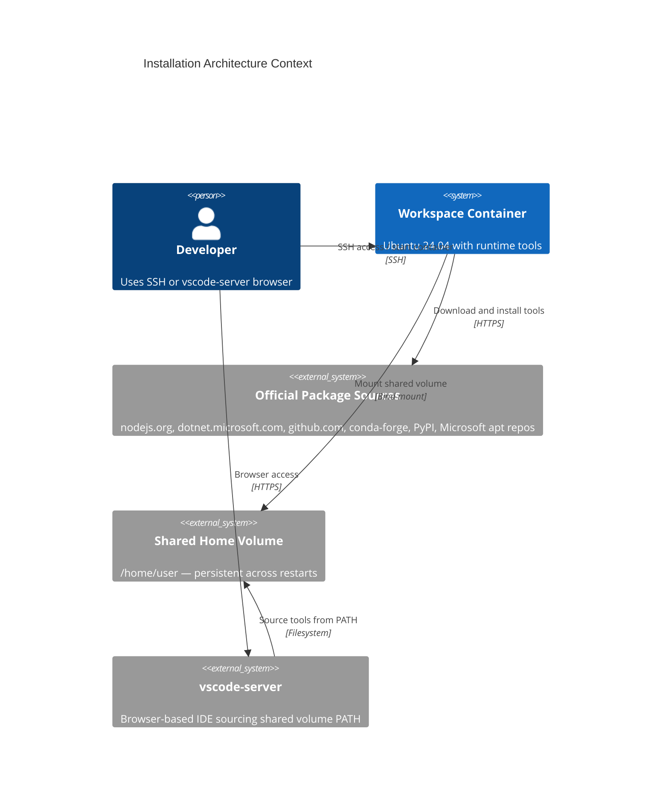
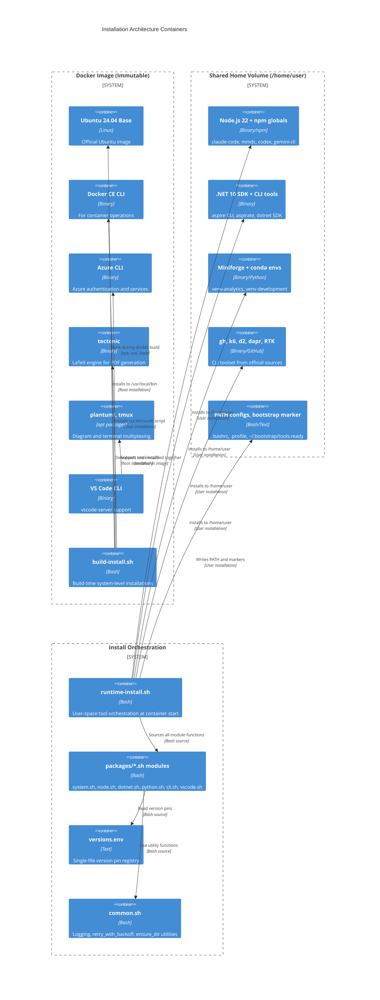

# ZZAIA Agentic Workspace — Installation Architecture

Ubuntu 24.04-based Docker container for multi-agent agentic development workspace. Removes `mise` (version manager/task runner) and replaces it with two purpose-built shell scripts using official package sources: `build-install.sh` (Dockerfile build time) and `runtime-install.sh` (container entrypoint, runtime). Single-source version pinning via `versions.env`.

---

### ADR 001: Remove mise — Two-Script Installation Model

**Decision**: Replace `mise.toml` + `mise` binary with two dedicated shell scripts: `build-install.sh` (Dockerfile build time) and `runtime-install.sh` (container entrypoint, runtime).

- `mise` conflates version management and task running into a single dependency
- Removes external apt keyring and mise GPG key from the image
- Build-time script runs as root, installs to system paths (`/usr/local/bin`, `/usr/share/keyrings`)
- Runtime script runs as user, installs to `/home/user/*` (shared Docker volume)
- Both scripts source a `versions.env` file for pinning tool versions — single place to bump
- Runtime script supports `--upgrade` flag to bypass idempotency marker

**Rationale**: Eliminates a third-party dependency from the critical startup path, makes the installation surface explicit and auditable, simplifies debugging (plain bash, no plugin resolution or trust prompts).

---

### ADR 002: Bash Module Pattern for Package Organization

**Decision**: Organize install functions into sourced module files under `scripts/packages/` — one file per tool group. Each file exposes named functions sourced by the top-level scripts.

- `packages/system.sh` — apt packages, Azure CLI, tectonic (build-time)
- `packages/node.sh` — Node.js 22 tarball + npm globals (claude-code, mmdc, codex, gemini-cli)
- `packages/dotnet.sh` — .NET 10 SDK + aspire CLI + aspirate tool
- `packages/python.sh` — Miniforge, pip packages, conda envs (venv-analytics, venv-development)
- `packages/cli.sh` — gh CLI, k6, d2, dapr, RTK binary
- `packages/vscode.sh` — VS Code extensions installer

Adding or removing a package = add/remove one function in the relevant module + one call in the orchestrating script.

**Rationale**: Mirrors class-per-responsibility in OOP. Each module is independently readable, testable, and editable without touching other tools.

---

### ADR 003: Shared Volume PATH Management

**Decision**: All runtime tools install exclusively under `/home/user/` (the shared Docker volume). A `configure_path()` function writes a single canonical PATH block to both `.bashrc` and `.profile`.

```
$HOME/.local/bin:$HOME/.npm-global/bin:$HOME/.dotnet:$HOME/.dotnet/tools:$HOME/miniforge3/bin:$HOME/.local/share/node/bin:$PATH
```

- `.bashrc` covers interactive SSH sessions
- `.profile` covers vscode-server sessions (which may not source `.bashrc`)
- Replaces mise's shim directory (`~/.local/share/mise/shims/`)
- vscode-server picks up tools without any additional configuration

**Rationale**: Makes the PATH contract explicit and ensures both workspace SSH sessions and vscode-server browser sessions see the same tools without rebuilding the image.

---

### ADR 004: Idempotent Bootstrap with Script-Hash Marker

**Decision**: Replace bootstrap marker `~/.bootstrap/mise.ready` with `~/.bootstrap/tools.ready`. The marker stores a hash of `runtime-install.sh`. If the script changes, the hash mismatch triggers a re-install on next container start.

- `runtime-install.sh --upgrade` flag bypasses the marker entirely for explicit upgrades
- Equivalent of the former `mise upgrade` task
- Existing `retry_with_backoff` utility from `common.sh` reused for flaky network installs

**Rationale**: Guarantees idempotency across restarts while detecting when the install spec itself changes — preventing stale tool state in long-running containers.

---

## C4 Context Diagram



## C4 Container Diagram



## Server Profiles

The workspace supports optional Docker Compose profiles controlled by the `server-profiles` Bitwarden secret. This enables flexible deployment without hardcoding which server types run.

### Profile Types

| Profile | Server Type | Purpose |
|---------|------------|---------|
| `vscode` | `vscode-server` | Browser-based VS Code IDE on `VSCODE_PORT` (8080 default) |
| `devcontainer` | `dev-server` | VS Code Dev Containers extension attachment |
| _(none)_ | `ssh-server` | SSH access always starts (no profile required), provides terminal-only mode |

### Usage

#### Installation Scripts

Both Ubuntu and Windows installation scripts read the `server-profiles` Bitwarden secret and build dynamic `--profile` flags:

```bash
# Ubuntu/Mac: install/ubuntu.sh
DEPLOY_PROFILES=$(fetch_secret "server-profiles")  # e.g., "vscode devcontainer"
for p in $DEPLOY_PROFILES; do
    PROFILE_FLAGS="$PROFILE_FLAGS --profile $p"
done
docker compose ... $PROFILE_FLAGS up -d
```

```powershell
# Windows: install/windows.ps1
$DEPLOY_PROFILES = Get-VaultSecret $items "server-profiles"  # e.g., "vscode"
foreach ($p in ($DEPLOY_PROFILES -split '\s+')) {
    $profileArgs += '--profile', $p
}
docker compose ... @profileArgs up -d
```

#### Examples

- **SSH-only mode**: Leave `server-profiles` empty in Bitwarden — only `ssh-server` starts (lightest footprint)
- **Browser IDE**: Set `server-profiles` to `vscode` — start both `ssh-server` and `vscode-server`
- **Dev Containers**: Set `server-profiles` to `devcontainer` — start both `ssh-server` and `dev-server`
- **Full setup**: Set `server-profiles` to `vscode devcontainer` — start all three servers

### Bitwarden Secret

**Vault Item Name:** `server-profiles`  
**Field:** `notes` or `password`  
**Format:** Space-separated profile names (e.g., `vscode devcontainer`)  
**Optional:** Yes — if empty or missing, only SSH access is available

---

## Project Structure

```
docker/containers/workspace-base/
├── Dockerfile
├── entrypoint.sh
└── scripts/
    ├── common.sh                  # logging, retry, ensure_dir utilities
    ├── versions.env               # NODE_VERSION=22, DOTNET_VERSION=10, etc.
    ├── build-install.sh           # Dockerfile RUN target (root, system paths)
    ├── runtime-install.sh         # Entrypoint (user, shared volume /home/user)
    ├── setup-user.sh              # SSH daemon, home seed, docker socket, sudo
    ├── setup-credentials.sh       # Claude, GitHub, Azure auth setup
    └── packages/
        ├── system.sh              # apt packages, Azure CLI, tectonic
        ├── node.sh                # Node.js 22 tarball + npm globals
        ├── dotnet.sh              # .NET 10 SDK + aspire + aspirate
        ├── python.sh              # Miniforge, pip, conda environments
        ├── cli.sh                 # gh, k6, d2, dapr, RTK
        └── vscode.sh              # VS Code extensions
```

## Architecture Components

### Build-time Components (Docker image layer)

- **build-install.sh**: Installs system-level tools during `docker build` as root. Sources `packages/system.sh`. Runs once during image construction.
- **VS Code CLI**: Downloaded from update.code.visualstudio.com, placed in `/usr/local/bin` for vscode-server support
- **Azure CLI**: Installed via official Microsoft curl|bash script to `/usr/local/bin`
- **tectonic**: LaTeX engine from drop.tectonic-typesetting.org, moved to `/usr/local/bin` for document rendering
- **plantuml, tmux**: Installed via apt as system packages for diagram rendering and terminal multiplexing

### Runtime Components (shared volume, container startup)

- **runtime-install.sh**: Orchestrates user-space tool installation at every container start. Sources all `packages/*.sh` modules and respects `versions.env` pins.
- **versions.env**: Single-file version pin registry for all tools. Bump version here to trigger automatic upgrade on container restart.
- **configure_path()**: Function that writes canonical PATH to both `.bashrc` and `.profile`, replacing mise shims. Ensures SSH and vscode-server sessions see identical PATH.
- **packages/*.sh modules**: Six sourced modules, each responsible for one tool category. Added/removed independently without affecting other installations.

### Infrastructure

- **Shared Home Volume** (`/home/user`): Docker volume persisted across container restarts. All runtime tool installs target this volume for container-agnostic state.
- **Bootstrap Marker** (`~/.bootstrap/tools.ready`): Stores SHA256 hash of `runtime-install.sh`. Hash mismatch on startup triggers full re-installation, detecting spec changes.
- **entrypoint.sh**: Orchestrates startup sequence: `setup-user.sh` → `runtime-install.sh` → `setup-credentials.sh` → SSH daemon start

## Technology Stack

| Layer | Technologies |
|-------|-------------|
| Base OS | Ubuntu 24.04 LTS |
| System Tools | Docker CE CLI, Azure CLI, tectonic (LaTeX), plantuml, tmux, VS Code CLI |
| JavaScript Runtime | Node.js 22 (nodejs.org tarball) + npm globals (claude-code, mmdc, codex, gemini-cli) |
| .NET Runtime | .NET 10 SDK (dotnet-install.sh) + aspire CLI + aspirate tool |
| Python Runtime | Miniforge (conda-forge) + pip packages + conda envs (venv-analytics, venv-development) |
| CLI Tools | gh CLI (GitHub), k6 (load testing), d2 (diagrams), dapr (distributed app runtime), RTK (Rust binary) |
| IDE | vscode-server (browser) + SSH daemon access |
| Scripting | Bash 5 with sourced module pattern, official installers for all tools |

## Related Documentation

- [DOCKER.md](../docker/DOCKER.md) - Container setup and usage guide
- [QUICKSTART.md](../QUICKSTART.md) - Getting started guide
