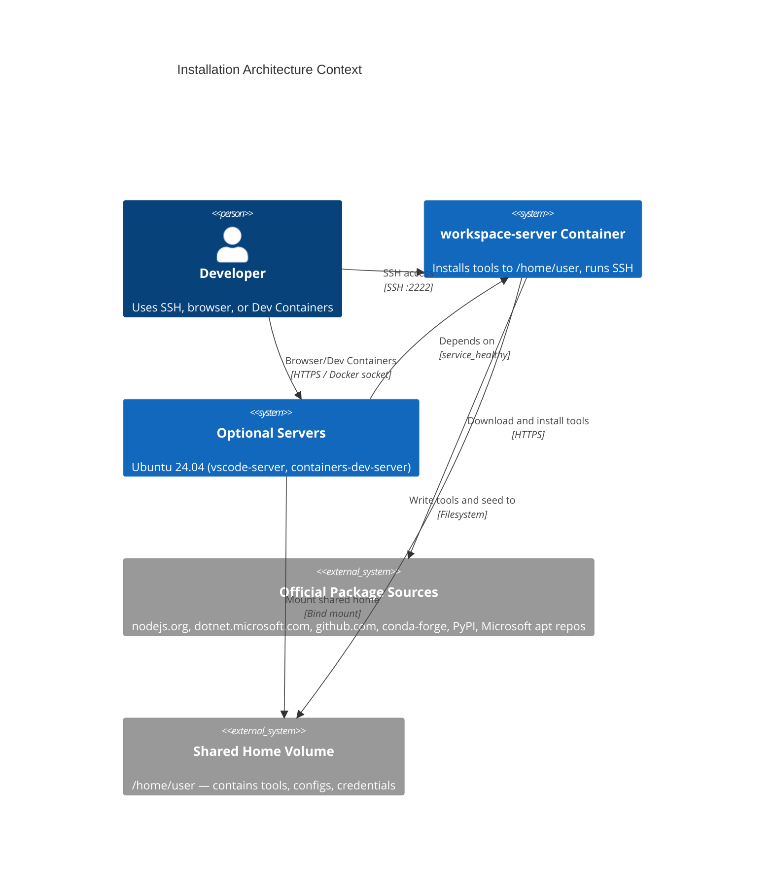
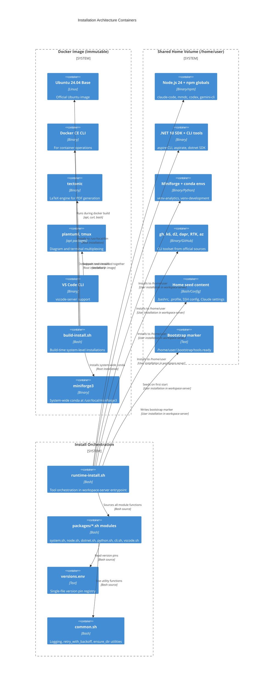

# ZZAIA Agentic Workspace — Installation Architecture

Ubuntu 24.04-based Docker container for multi-agent agentic development workspace. Removes `mise` (version manager/task runner) and replaces it with two purpose-built shell scripts using official package sources: `build-install.sh` (Dockerfile build time) and `runtime-install.sh` (workspace-server entrypoint, installs to /home/user). Single-source version pinning via `versions.env`.

---

### ADR 001: Remove mise — Two-Script Installation Model

**Decision**: Replace `mise.toml` + `mise` binary with two dedicated shell scripts: `build-install.sh` (Dockerfile build time) and `runtime-install.sh` (workspace-server entrypoint, installs to /home/user).

- `mise` conflates version management and task running into a single dependency
- Removes external apt keyring and mise GPG key from the image
- Build-time script runs as root, installs to system paths (`/usr/local/bin`, `/usr/share/keyrings`)
- Runtime script runs as user in `workspace-server` container entrypoint, installs to `/home/user` (shared Docker volume mounted by all server containers)
- Both scripts source a `versions.env` file for pinning tool versions — single place to bump
- Runtime script supports `--upgrade` flag to bypass idempotency marker

**Rationale**: Eliminates a third-party dependency from the critical startup path, makes the installation surface explicit and auditable, simplifies debugging (plain bash, no plugin resolution or trust prompts).

---

### ADR 002: Bash Module Pattern for Package Organization

**Decision**: Organize install functions into sourced module files under `scripts/packages/` — one file per tool group. Each file exposes named functions sourced by the top-level scripts.

- `packages/system.sh` — apt packages, Azure CLI, tectonic (build-time)
- `packages/node.sh` — Node.js 22 tarball + npm globals (claude-code, mmdc, codex, gemini-cli)
- `packages/dotnet.sh` — .NET 10 SDK + aspire CLI + aspirate tool
- `packages/python.sh` — Miniforge, pip packages, conda envs (venv-analytics, venv-development)
- `packages/cli.sh` — gh CLI, k6, d2, dapr, RTK binary
- `packages/vscode.sh` — VS Code extensions installer

Adding or removing a package = add/remove one function in the relevant module + one call in the orchestrating script.

**Rationale**: Mirrors class-per-responsibility in OOP. Each module is independently readable, testable, and editable without touching other tools.

---

### ADR 003: INSTALL_PREFIX Pattern and Dual Volumes

**Decision**: Tools install to `/opt/tools` (INSTALL_PREFIX=/opt/tools) in a separate `workspace-tools` volume. User configs and repos stay in `/home/user` (`workspace-home` volume). Both volumes are shared by all server containers.

- `workspace-server` runs `runtime-install.sh` with `INSTALL_PREFIX=/opt/tools` and `HOME=/home/user` during entrypoint
- `workspace-tools` volume (read-write for workspace-server, read-only for vscode-server and containers-dev-server) holds all runtime tools: Node.js, .NET, Python, CLIs
- `workspace-home` volume (shared read-write) holds user configs, credentials, workspace repos, and .vscode-server state
- `configure_path()` writes `.bashrc`/`.profile` to `/home/user` — tools path references `/opt/tools`
- All server containers share both `/home/user` and `/opt/tools` — single consistent environment across SSH, browser, and Dev Containers
- `workspace-server` depends on no other servers; `vscode-server` and `containers-dev-server` depend on `workspace-server: condition: service_healthy`

**Rationale**: Separates tools (immutable after install, can be rebuilt) from user state (configs, credentials, repos). Allows vscode-server and containers-dev-server to mount tools read-only. Simplifies home reset (delete home volume without deleting tools). Faster restart of optional servers (tools already present).

---

### ADR 004: Idempotent Bootstrap with Script-Hash Marker

**Decision**: Replace bootstrap marker `~/.bootstrap/mise.ready` with `~/.bootstrap/tools.ready`. The marker stores a hash of `runtime-install.sh`. If the script changes, the hash mismatch triggers a re-install on next container start.

- `runtime-install.sh --upgrade` flag bypasses the marker entirely for explicit upgrades
- Equivalent of the former `mise upgrade` task
- Existing `retry_with_backoff` utility from `common.sh` reused for flaky network installs

**Rationale**: Guarantees idempotency across restarts while detecting when the install spec itself changes — preventing stale tool state in long-running containers.

---

### ADR 005: workspace-server Entrypoint Installation Pattern

**Decision**: Tool installation is merged into the `workspace-server` container entrypoint, which runs: setup-user → runtime-install → setup-credentials → sshd.

- `workspace-server` runs `runtime-install.sh` with `INSTALL_PREFIX=/opt/tools` and `HOME=/home/user` during entrypoint startup (as the `user` account)
- `configure_path()` writes the PATH block to `/home/user/.bashrc` and `/home/user/.profile` (referencing `/opt/tools` tools)
- Bootstrap hash marker (`/opt/tools/.bootstrap/tools.ready`) gates re-runs across volume recreations and detects spec changes
- Other servers (`vscode-server`, `containers-dev-server`) depend on `workspace-server: condition: service_healthy` — they start only after tool installation completes
- `workspace-server` owns both the `workspace-home` and `workspace-tools` volumes — it performs initial seeding and tool installation
- `flock` file locking removed entirely — there is only one installer (workspace-server)

**Rationale**: All-in-one pattern. `workspace-server` is the authoritative owner of shared volumes. No separate init container or volume orchestration needed. Installation failures are clear in workspace-server logs. Optional servers have fast startup (tools already present in workspace-tools volume). Dual volumes allow clean home reset without rebuilding tools.

---

## C4 Context Diagram



## C4 Container Diagram



## Server Profiles

The workspace supports optional Docker Compose profiles controlled by the `server-profiles` Bitwarden secret. This enables flexible deployment without hardcoding which server types run.

### Profile Types

| Profile | Server Type | Purpose |
|---------|------------|---------|
| `vscode` | `vscode-server` | Browser-based VS Code IDE on `VSCODE_PORT` (8080 default) |
| `devcontainer` | `containers-dev-server` | VS Code Dev Containers extension attachment |
| _(none — always starts)_ | `workspace-server` | SSH daemon, tool installation, shared home owner |

### Usage

#### Installation Scripts

Both Ubuntu and Windows installation scripts read the `server-profiles` Bitwarden secret and build dynamic `--profile` flags:

```bash
# Ubuntu/Mac: install/ubuntu.sh
DEPLOY_PROFILES=$(fetch_secret "server-profiles")  # e.g., "vscode devcontainer"
for p in $DEPLOY_PROFILES; do
    PROFILE_FLAGS="$PROFILE_FLAGS --profile $p"
done
docker compose ... $PROFILE_FLAGS up -d
```

```powershell
# Windows: install/windows.ps1
$DEPLOY_PROFILES = Get-VaultSecret $items "server-profiles"  # e.g., "vscode"
foreach ($p in ($DEPLOY_PROFILES -split '\s+')) {
    $profileArgs += '--profile', $p
}
docker compose ... @profileArgs up -d
```

#### Examples

- **SSH-only mode**: Leave `server-profiles` empty in Bitwarden — only `workspace-server` starts (lightest footprint)
- **Browser IDE**: Set `server-profiles` to `vscode` — start both `workspace-server` and `vscode-server`
- **Dev Containers**: Set `server-profiles` to `devcontainer` — start both `workspace-server` and `containers-dev-server`
- **Full setup**: Set `server-profiles` to `vscode devcontainer` — start all three servers

### Bitwarden Secret

**Vault Item Name:** `server-profiles`  
**Field:** `notes` or `password`  
**Format:** Space-separated profile names (e.g., `vscode devcontainer`)  
**Optional:** Yes — if empty or missing, only SSH access is available (workspace-server always runs)

---

## Project Structure

```
docker/
├── Dockerfile                         # Single image: Ubuntu 24.04 + system tools + scripts
├── entrypoint.sh                      # workspace-server startup: setup-user → runtime-install → setup-credentials → sshd
├── scripts/
│   ├── common.sh                      # logging, retry, ensure_dir utilities
│   ├── versions.env                   # NODE_VERSION=24, DOTNET_VERSION=10, etc.
│   ├── build-install.sh               # Dockerfile RUN target (root, system paths)
│   ├── runtime-install.sh             # workspace-server entrypoint (user, /home/user)
│   ├── setup-user.sh                  # Home seed, docker socket, sudo
│   ├── setup-credentials.sh           # Claude, GitHub, Azure auth setup
│   └── packages/
│       ├── system.sh                  # apt packages, tectonic
│       ├── node.sh                    # Node.js 24 tarball + npm globals
│       ├── dotnet.sh                  # .NET 10 SDK + aspire + aspirate
│       ├── python.sh                  # Miniforge, pip, conda environments, azure-cli
│       ├── cli.sh                     # gh, k6, d2, dapr, RTK
│       └── vscode.sh                  # VS Code extensions
├── docker-compose.yml                 # workspace-server + optional servers + MCP sidecars
└── sshd_config                        # SSH daemon config
```

## Architecture Components

### Build-time Components (Docker image layer)

- **build-install.sh**: Installs system-level tools during `docker build` as root. Sources `packages/system.sh`. Runs once during image construction.
- **VS Code CLI**: Downloaded from update.code.visualstudio.com, placed in `/usr/local/bin` for vscode-server support
- **tectonic**: LaTeX engine from drop.tectonic-typesetting.org, moved to `/usr/local/bin` for document rendering
- **plantuml, tmux**: Installed via apt as system packages for diagram rendering and terminal multiplexing
- **System-wide miniforge3**: Installed at `/usr/local/miniforge3` for system PATH availability at build time

### Runtime Components (workspace-server entrypoint)

- **workspace-server entrypoint**: Merges all initialization: `setup-user.sh` → `runtime-install.sh` → `setup-credentials.sh` → sshd startup. Runs once at container startup.
- **runtime-install.sh**: Orchestrates user-space tool installation. Sources all `packages/*.sh` modules and respects `versions.env` pins. Runs in `workspace-server` entrypoint with `INSTALL_PREFIX=/home/user` as the `user` account.
- **versions.env**: Single-file version pin registry for all tools. Bump version here to trigger automatic upgrade on next `workspace-server` start (delete `workspace-home` volume to force).
- **configure_path()**: Function that writes canonical PATH to both `.bashrc` and `.profile` (INSTALL_PREFIX=/home/user). All server containers source the shared `.bashrc` on login.
- **packages/*.sh modules**: Six sourced modules, each responsible for one tool category. Added/removed independently without affecting other installations.

### Infrastructure

- **Shared Home Volume** (`/home/user`): Single Docker volume shared across all server containers (workspace-server, vscode-server, containers-dev-server). Contains user configs, credentials, workspace repos, and all runtime tools. Owned by workspace-server during initialization.
- **Bootstrap Marker** (`/home/user/.bootstrap/tools.ready`): Stores SHA256 hash of `runtime-install.sh`. Hash mismatch on startup triggers full re-installation, detecting spec changes.
- **entrypoint.sh** (workspace-server): Orchestrates startup sequence: `setup-user.sh` → `runtime-install.sh` → `setup-credentials.sh` → sshd startup
- **Dependency ordering**: workspace-server starts immediately (no dependencies). vscode-server and containers-dev-server depend on `workspace-server: condition: service_healthy` and skip their own tool installation (tools already in shared home)

## Technology Stack

| Layer | Technologies |
|-------|-------------|
| Base OS | Ubuntu 24.04 LTS |
| System Tools | Docker CE CLI, tectonic (LaTeX), plantuml, tmux, VS Code CLI, system miniforge3 (/usr/local/miniforge3) |
| JavaScript Runtime | Node.js 24 (nodejs.org tarball) + npm globals (claude-code, mmdc, codex, gemini-cli) |
| .NET Runtime | .NET 10 SDK (dotnet-install.sh) + aspire CLI + aspirate tool |
| Python Runtime | Miniforge (conda-forge) + pip packages + conda envs (venv-analytics, venv-development) + Azure CLI (pip) |
| CLI Tools | gh CLI (GitHub), k6 (load testing), d2 (diagrams), dapr (distributed app runtime), RTK (Rust binary) |
| IDE | vscode-server (browser, optional) + SSH daemon access (always-on) |
| Scripting | Bash 5 with sourced module pattern, official installers for all tools |

## Related Documentation

- [DOCKER.md](../docker/DOCKER.md) - Container setup and usage guide
- [QUICKSTART.md](../QUICKSTART.md) - Getting started guide
