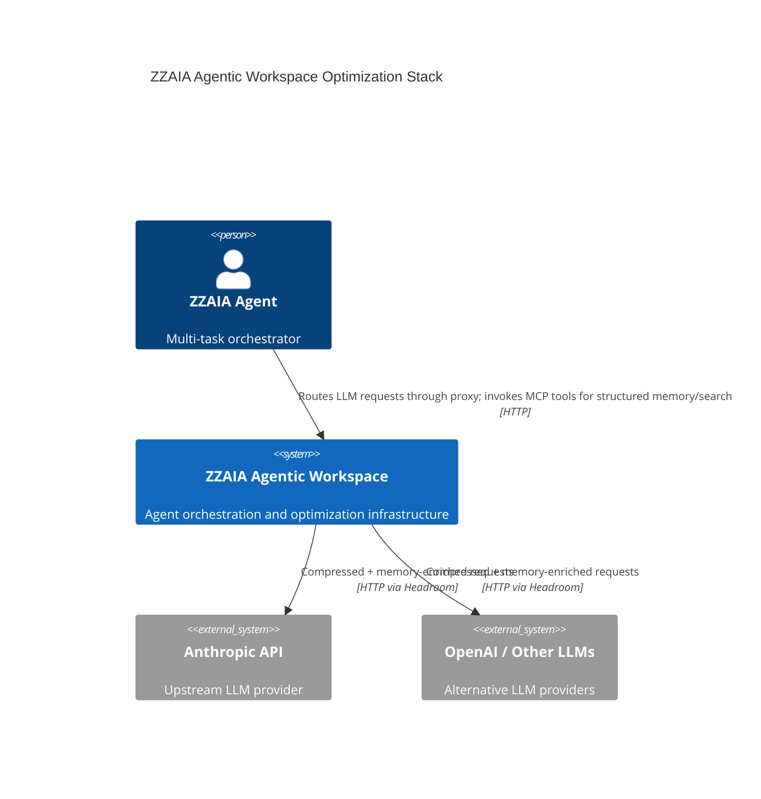

# ZZAIA Agentic Workspace — AI Optimization Stack Recommendation

Research and decision record for three LLM optimization capabilities: context compression, session memory, and workspace semantic search. Evaluated multiple solutions per capability and produced a two-layer recommendation: Headroom as the primary automatic triple-stack, with Graphiti MCP and CodeGraphContext as supplementary agent-initiated context tools.

**2026 update**: ADR 002 superseded — Graphiti MCP replaces the originally-selected OpenMemory MCP. Graphiti is Neo4j-native (this stack already runs Neo4j for Headroom; OpenMemory would have required standing up a new local Postgres). See revised ADR 002 below.

---

## Architecture Overview

The optimization stack operates in three complementary layers:

**Layer 0 — Shell I/O (RTK binary in container)**: RTK (Rust Token Killer) intercepts command outputs at shell level via agent hooks BEFORE they enter the agent context window. Reduces command output tokens by 80–90% (git, cargo, docker, kubectl, ls, grep, etc.). No service needed — single binary installed in the container image, configured per-agent via hook system.

**Layer 1 — Automatic (Proxy Pipeline)**: Headroom proxy started with `--memory --code-graph`. All clients routing through `http://headroom:8787` get compression, memory injection, and code-graph MCP tools without any agent code changes. Covers Claude Code, Gemini CLI, Codex, VS Code extensions — any client that respects the API base URL env vars.

**Layer 2 — Agent-Initiated (MCP Tools)**: Graphiti MCP and CodeGraphContext expose structured query tools agents call explicitly. These supplement Headroom's automatic layer with richer semantic search, structured memory queries, and cross-agent coordination. Graphiti shares the same Neo4j already deployed for Headroom (no new Postgres); its embedder runs locally on `ml-server` when a GPU is available, falling back to cloud OpenAI embeddings otherwise. Its LLM calls (entity/relationship extraction) route through `ml-server → bifrost-server → Anthropic`, the same compression+credential pipeline every other agent client in this workspace uses — not a direct call to Bifrost.

---

## Implementation Phases

**Phase 0 (Implement First)**: RTK — install binary in Dockerfile, configure agent hooks for Claude Code, Gemini CLI, Codex, Copilot CLI. Immediate 80–90% command output token reduction.

**Phase 1 (Implement After Phase 0)**: Headroom triple-stack — compression + proxy-side memory injection + code-graph file watcher. Single service change.

**Phase 2 (Implement After Phase 1)**: Graphiti MCP — supplementary structured memory queries via MCP tools, backed by the shared Neo4j knowledge graph.

**Phase 3 (Implement After Phase 2)**: CodeGraphContext — supplementary code graph queries via MCP tools.

---

### ADR 000: RTK (Rust Token Killer) for Shell Command Output Compression

**Decision**: Install RTK binary in the workspace container image and configure per-agent hooks to intercept command outputs before they enter agent context windows.

**What it does**:
- Intercepts command outputs at shell I/O level via agent hook system (not HTTP proxy, not MCP)
- Applies four strategies: smart filtering, grouping, truncation, deduplication
- Covers 100+ commands across 8 categories: git, cargo/build, docker, kubectl, ls/find/grep, pytest/jest, AWS CLI, Rust quality tools
- **81% average token reduction**; real examples: `cargo test` 4,823 → 11 tokens (99%), `git status` 2,000 → 200 tokens (90%)

**Agent integrations** (hook-based, no code changes in agents):
- Claude Code: `PreToolUse` hook rewrites bash commands as `rtk <command>`
- Gemini CLI: `BeforeTool` hook
- Cursor / Windsurf / Cline: agent-specific hook config files
- Copilot CLI: rule files

**Infrastructure**: Single static Rust binary — no service, no database, no network. Memory footprint <20MB, microsecond overhead per command. Exit codes preserved.

**Compression chain with Headroom**:
```
Agent executes: git status
RTK hook:       2,000 tokens → 200 tokens (90% reduction at shell level)
Agent forms prompt with compressed output
Headroom proxy: further ~30% reduction on prompt structure
LLM receives:   optimized prompt
```

**Installation in Dockerfile**:
```dockerfile
# Install RTK binary
RUN curl -fsSL https://github.com/rtk-ai/rtk/releases/latest/download/rtk-linux-amd64 \
    -o /usr/local/bin/rtk && chmod +x /usr/local/bin/rtk
```

**Claude Code hook configuration** (`.claude/settings.json`):
```json
{
  "hooks": {
    "PreToolUse": [{
      "matcher": "Bash",
      "hooks": [{ "type": "command", "command": "rtk" }]
    }]
  }
}
```

**Rationale**: RTK is the only tool operating at shell I/O level — Headroom compresses at HTTP API level, Graphiti handles memory, CodeGraphContext handles code search. None of these touch raw command outputs. RTK's 41k GitHub stars, 146 releases, and 103-case benchmark suite confirm production readiness. It stacks with all other layers without conflict.

---

### ADR 001: Headroom Triple-Stack as Primary Optimization Layer

**Decision**: Deploy Headroom proxy with `--memory --code-graph` as the always-on, automatic optimization layer. All agent API calls route through `http://headroom:8787`.

**Compression** (automatic, proxy pipeline):
- Content-aware compressors: AST, JSON, logs, text, images
- 34–90% token reduction; <5ms overhead
- Passthrough guarantee: compression failure always forwards original unchanged
- CCR (Compress-Cache-Retrieve): originals stored by hash, fully reversible via `headroom_retrieve(hash)`

**Memory** (automatic, proxy pipeline — enabled by `--memory` flag):
- Proxy pipeline step `search_and_format_context()` runs on every request before forwarding to LLM
- Injects relevant prior memories into the prompt automatically
- Extracts and stores new memories from LLM responses
- Storage: embedded SQLite + HNSW vector index + FTS5 full-text search (all in-process)
- Scoped by `x-headroom-user-id` header (per-agent, per-user, or shared)

**Code-Graph** (background watcher + MCP tools — enabled by `--code-graph` flag):
- Background file watcher rebuilds codebase index on file changes
- Exposes `headroom_compress`, `headroom_retrieve`, `headroom_stats` as MCP tools
- Code structure available for agents to query on demand

**Infrastructure**: Qdrant (semantic cache) + Neo4j (knowledge graph) — same as original architecture.

**Deployment**:
```yaml
headroom:
  image: ghcr.io/chopratejas/headroom:latest
  command: headroom proxy --memory --code-graph
  environment:
    - ANTHROPIC_API_KEY=${ANTHROPIC_API_KEY:-}
    - OPENAI_API_KEY=${OPENAI_API_KEY:-}
    - GEMINI_API_KEY=${GEMINI_API_KEY:-}
    - QDRANT_URL=http://qdrant:6333
    - NEO4J_URI=bolt://neo4j:7687
    - NEO4J_USERNAME=neo4j
    - NEO4J_PASSWORD=${ADMIN_PASSWORD:-headroom}
    - PORT=8787
```

**Rationale**: Source code confirms memory injection is a proxy pipeline stage (`proxy/handlers/anthropic.py`: `memory_handler.search_and_format_context()` runs before every upstream forward). `headroom wrap` is a convenience launcher — in Docker, starting the proxy with `--memory --code-graph` gives all clients automatic coverage. No subprocess wrapping needed; all CLIs and VS Code extensions get the full stack by routing through the proxy URL.

---

### ADR 002 (revised): Graphiti MCP as Supplementary Structured Memory Layer

**Supersedes**: the original ADR 002 selected OpenMemory MCP (mem0.ai). Re-evaluated because OpenMemory's default backend is Postgres + Qdrant, and this stack has no local Postgres — only `database-qdrant` and `database-neo4j`. Graphiti (getzep/graphiti) is Neo4j-native, ships a production MCP server (v1.0, 20k+ stars, Apache 2.0), and needs zero new infrastructure.

**Decision**: Deploy Graphiti MCP as a supplementary session memory service (`mcp-graphiti`). Agents invoke `add_episode`, `search_memory_nodes`, and `search_memory_facts` via MCP discovery when they need structured, queryable, temporal memory beyond what Headroom's automatic injection provides.

- **Architecture**: Neo4j (shared with Headroom, `database-neo4j`) as the knowledge-graph backend — no Postgres. Native MCP server, HTTP transport (`http://mcp-graphiti:8000/mcp/`).
- **Retrieval**: Agent-initiated via MCP tool calls — temporal knowledge graph with validity windows ("what was true when"), entity/relationship extraction from conversation episodes.
- **LLM (entity extraction)**: Always routed through `http://ml-server:8787` (Headroom), which forwards to `bifrost-server`'s Anthropic-compatible endpoint — the same compression + credential-pooling pipeline every other agent client in this workspace already uses (see `workspace-server`'s `ANTHROPIC_BASE_URL` convention). Never calls Bifrost directly, so entity-extraction requests get Headroom's compression too.
- **Embedder (semantic search over memory)**: GPU-gated dual path —
  - `GPU_ENABLED=true`: local `nomic-embed-text-v1.5` served by a small FastAPI/sentence-transformers process added to `ml-server` on port 8788 (reuses `ml-server`'s existing GPU allocation — no second GPU-consuming container). Zero cloud dependency, zero Vault secret for embeddings.
  - `GPU_ENABLED=false` (default): cloud OpenAI embeddings (`text-embedding-3-small`), API key fetched from Vault (`secret/data/ai`) at container start — same Vault pattern as `bifrost-server`.
- **Deployment**: Single compose service (`mcp-graphiti`) — no additional infrastructure beyond what Headroom/`ml-server` already provide.
- **Relation to Headroom memory**: Complementary — Headroom injects automatically; Graphiti gives agents explicit, temporal, structured retrieval control via its own knowledge graph.

**Rationale**: Headroom's automatic memory injection covers the common case. Graphiti adds agent-controlled, temporal, structured queries (entities, relationships, validity windows) that the automatic injection layer cannot perform. Reuses Neo4j — no new database. The embedder's GPU/CPU split keeps the workspace cloud-independent when a GPU is present, while still working out of the box on CPU-only hosts via the existing Vault-backed OpenAI path.

**Rejected alternative — OpenMemory MCP (mem0.ai)**: still viable in isolation (defaults to SQLite, not strictly Postgres-locked) but loses the Neo4j-native fit and temporal knowledge-graph reasoning Graphiti provides; would also duplicate Qdrant's vector role that Headroom already occupies.

---

### ADR 003: CodeGraphContext as Supplementary Code Intelligence Layer

**Decision**: Deploy CodeGraphContext as a supplementary MCP server for structured code graph queries. Agents invoke `find_callers`, `find_callees`, `class_hierarchy`, `call_chain` when they need precise code structure navigation beyond Headroom's background index.

- **Architecture**: Tree-sitter AST parsing → KûzuDB embedded graph (no separate service)
- **Retrieval**: Agent-initiated via MCP tools — precise call graph traversal, symbol resolution
- **Code-awareness**: 14 languages; real-time file watching via `cgc watch`
- **Agent-agnostic**: Any MCP client (Claude Code, Gemini CLI, Codex, VS Code extensions)
- **Relation to Headroom code-graph**: Complementary — Headroom's `--code-graph` maintains a background index for compression context scoring; CodeGraphContext gives agents explicit, structured graph query tools

**Deployment**: Community image `mekayelanik/codegraphcontext-mcp:stable` (HTTP on port 8045, correct transport for Docker Compose — unlike stdio-only `cgc mcp start`).

**Rationale**: Headroom's `--code-graph` is a background file watcher that improves compression context scoring and exposes basic MCP tools. CodeGraphContext provides deeper, documented graph query tools (call chains, class hierarchies, dead code detection) that complement Headroom's index for agent-initiated code intelligence tasks.

**Alternative**: `codebase-memory` (DeusData) — single static binary, 66 languages, SQLite, 14 MCP tools, 120x token reduction, peer-reviewed (arXiv 2603.27277). Preferred if token reduction at search time is the priority over call graph depth.

---

## C4 Context Diagram


```mermaid
C4Context
    title ZZAIA Agentic Workspace Optimization Stack

    Person(agent, "ZZAIA Agent", "Multi-task orchestrator")
    System(mainSystem, "ZZAIA Agentic Workspace", "Agent orchestration and optimization infrastructure")
    System_Ext(anthropicAPI, "Anthropic API", "Upstream LLM provider")
    System_Ext(openaiAPI, "OpenAI / Other LLMs", "Alternative LLM providers")

    Rel(agent, mainSystem, "Routes LLM requests through proxy; invokes MCP tools for structured memory/search", "HTTP")
    Rel(mainSystem, anthropicAPI, "Compressed + memory-enriched requests", "HTTP via Headroom")
    Rel(mainSystem, openaiAPI, "Compressed + memory-enriched requests", "HTTP via Headroom")

    UpdateLayoutConfig($c4ShapeInRow="2", $c4BoundaryInRow="2")
```

---

## C4 Container Diagram

```mermaid
C4Container
    title Optimization Stack Services and Dependencies

    System_Boundary(primary, "Primary Layer — Headroom Triple-Stack") {
        Container(headroom, "Headroom", "HTTP Reverse Proxy + Memory + Code-Graph", "Compression, proxy-side memory injection, code-graph file watcher")
        Container(qdrant, "Qdrant", "Vector DB", "Semantic cache and memory embeddings (shared)")
        Container(neo4j, "Neo4j", "Graph DB", "Knowledge graph for memory and code-graph (shared)")
    }

    System_Boundary(supplementary, "Supplementary Layer — Agent-Initiated MCP Tools") {
        Container(graphiti, "Graphiti MCP", "MCP Server", "Temporal knowledge-graph memory: add_episode, search_memory_nodes, search_memory_facts")
        Container(cgc, "CodeGraphContext", "MCP Server", "Code graph queries: find_callers, class_hierarchy, call_chain")
    }

    System_Boundary(shell, "Layer 0 — Shell I/O") {
        Container(rtk, "RTK", "Rust Binary + Agent Hooks", "Intercepts command outputs before agent context; 81% avg token reduction")
    }

    System_Boundary(workspace, "Workspace Layer") {
        Container(workspaceRepos, "Workspace Repositories", "Volume", "Source code indexed by Headroom code-graph and CodeGraphContext")
    }

    Rel(rtk, workspaceRepos, "Reads command outputs (git, cargo, docker, kubectl)", "Bash hook")
    Rel(headroom, anthropicAPI, "Forwards compressed + memory-enriched requests", "HTTP")
    Rel(headroom, qdrant, "Semantic cache and memory search", "gRPC")
    Rel(headroom, neo4j, "Knowledge graph memory and code-graph", "Bolt")
    Rel(headroom, workspaceRepos, "Code-graph file watcher", "Filesystem")
    Rel(graphiti, neo4j, "Stores/queries temporal knowledge graph", "Bolt")
    Rel(graphiti, headroom, "LLM calls (entity extraction) — compressed + credential-pooled", "HTTP")
    Rel(cgc, workspaceRepos, "Indexes files and builds call graph", "Filesystem")

    UpdateLayoutConfig($c4ShapeInRow="2", $c4BoundaryInRow="2")
```

---

## Architecture Components

### Primary Layer: Headroom Triple-Stack

- **Headroom** (`--memory --code-graph`, runs inside `ml-server`): Single proxy service handling compression (automatic), memory injection (automatic, proxy pipeline), and code-graph indexing (background watcher + MCP tools). Also serves the GPU-gated local embedding model (`nomic-embed-text-v1.5` on port 8788) for Graphiti when a GPU is available.
- **Qdrant**: Vector database for Headroom semantic cache
- **Neo4j** (+ APOC): Knowledge graph for Headroom memory relationships, code-graph structure, and Graphiti's temporal knowledge graph (shared)

### Supplementary Layer: Agent-Initiated MCP Tools

- **Graphiti MCP**: Temporal, structured memory queries — agents call `add_episode`, `search_memory_nodes`, `search_memory_facts` when they need explicit, filtered, time-aware memory retrieval. Uses shared Neo4j; embedder is local (GPU) or cloud OpenAI (CPU-only); LLM calls route through `ml-server → bifrost-server → Anthropic`.
- **CodeGraphContext**: Structured code graph queries — agents call `find_callers`, `find_callees`, `class_hierarchy`, `call_chain` when they need precise code structure navigation. Uses the shared Neo4j in this deployment.

### Workspace Layer

- **Workspace Repositories**: Volume mounted into both Headroom (code-graph watcher) and CodeGraphContext (AST indexer)

---

## Technology Stack

| Layer | Technologies |
|-------|-------------|
| **Shell I/O (Layer 0)** | RTK — Rust binary, bash hooks, 100+ commands, 81% avg token reduction |
| **Primary Proxy (Layer 1)** | Headroom (HTTP reverse proxy, `--memory --code-graph`) |
| **Primary Memory Storage** | SQLite + HNSW (in-process, Headroom) + Qdrant (semantic) + Neo4j (graph) |
| **Supplementary Memory MCP (Layer 2)** | Graphiti (native MCP tools, temporal knowledge-graph queries) |
| **Supplementary Memory Storage** | Neo4j (shared with Headroom, no new database) |
| **Supplementary Memory Embedder** | Local `nomic-embed-text-v1.5` on `ml-server:8788` (GPU) or cloud OpenAI via Vault (CPU-only) |
| **Supplementary Code Search (Layer 2)** | CodeGraphContext (MCP tools, call graphs, AST) + Neo4j (shared, this deployment) |
| **Infrastructure** | Docker Compose, shared Qdrant and Neo4j across layers |

---

## Implementation Requirements

### Phase 1: Headroom Triple-Stack

**Headroom** (primary optimization proxy — compression + memory + code-graph):
```yaml
headroom:
  image: ghcr.io/chopratejas/headroom:latest
  command: headroom proxy --memory --code-graph
  environment:
    - ANTHROPIC_API_KEY=${ANTHROPIC_API_KEY:-}
    - OPENAI_API_KEY=${OPENAI_API_KEY:-}
    - GEMINI_API_KEY=${GEMINI_API_KEY:-}
    - QDRANT_URL=http://qdrant:6333
    - NEO4J_URI=bolt://neo4j:7687
    - NEO4J_USERNAME=neo4j
    - NEO4J_PASSWORD=${ADMIN_PASSWORD:-headroom}
    - PORT=8787
  volumes:
    - workspace-repos:/workspace
  depends_on:
    qdrant:
      condition: service_healthy
    neo4j:
      condition: service_healthy
  healthcheck:
    test: ["CMD", "wget", "-qO-", "http://localhost:8787/health"]
    interval: 10s
    timeout: 5s
    retries: 5
    start_period: 30s
  networks:
    - mcp
  restart: unless-stopped
```

**Qdrant** (vector DB — Headroom semantic cache only; Graphiti uses Neo4j for its knowledge graph, and its embedder is either local `ml-server` or cloud OpenAI, not Qdrant):
```yaml
qdrant:
  image: qdrant/qdrant:v1.17.1
  volumes:
    - headroom-qdrant:/qdrant/storage
  networks:
    - mcp
  restart: unless-stopped
  healthcheck:
    test: ["CMD", "wget", "-qO-", "http://localhost:6333/readyz"]
    interval: 15s
    timeout: 5s
    retries: 3
    start_period: 20s
```

**Neo4j** (shared graph DB — Headroom knowledge graph + code-graph):
```yaml
neo4j:
  image: neo4j:5.15.0
  environment:
    - NEO4J_AUTH=neo4j/${ADMIN_PASSWORD:-headroom}
  volumes:
    - headroom-neo4j:/data
  networks:
    - mcp
  restart: unless-stopped
  healthcheck:
    test: ["CMD", "wget", "-qO-", "http://localhost:7474/"]
    interval: 15s
    timeout: 5s
    retries: 3
    start_period: 45s
```

### Phase 2: Graphiti MCP (Supplementary)

```yaml
mcp-graphiti:
  build:
    context: ..
    dockerfile: docker/containers/mcp-graphiti/Dockerfile
  image: zzaia-mcp-graphiti:latest
  environment:
    - VAULT_ADDR=http://vault-server:8200
    - GPU_ENABLED=${GPU_ENABLED:-false}
    - NEO4J_URI=bolt://database-neo4j:7687
    - NEO4J_USER=neo4j
    - NEO4J_PASSWORD=${ADMIN_PASSWORD:-zzaia1234}
    - BIFROST_WORKSPACE_KEY=sk-bf-workspace-agent-001
  depends_on:
    vault-server:
      condition: service_healthy
    database-neo4j:
      condition: service_healthy
    bifrost-server:
      condition: service_healthy
    ml-server:
      condition: service_started
  networks:
    - mcp
  restart: unless-stopped
```

No `postgres` service, no new database — `database-neo4j` and `ml-server` are already deployed. See `docker/containers/mcp-graphiti/` for the full implementation (entrypoint branches embedder config on `GPU_ENABLED`, routes LLM calls through `ml-server:8787`).

### Phase 3: CodeGraphContext MCP (Supplementary)

```yaml
code-graph:
  image: mekayelanik/codegraphcontext-mcp:stable
  volumes:
    - workspace-repos:/workspace
    - code-graph-db:/root/.codegraphcontext
  ports:
    - "8045:8045"
  networks:
    - mcp
  restart: unless-stopped
```

### Agent Configuration

All clients configured with:
```bash
ANTHROPIC_BASE_URL=http://headroom:8787
OPENAI_BASE_URL=http://headroom:8787
GEMINI_API_BASE=http://headroom:8787
```

MCP endpoints registered in workspace MCP config:
```json
{
  "mcpServers": {
    "graphiti":   { "type": "http", "url": "http://mcp-graphiti:8000/mcp/" },
    "code-graph": { "url": "http://code-graph:8045" }
  }
}
```

---

## Capability-Level Design Decisions

### Context Compression: Proxy-Level Automatic
✅ **100% transparent** — Headroom proxy compresses all requests. Passthrough on failure.

### Session Memory: Two-Layer Pattern
✅ **Automatic (Layer 1)** — Headroom injects relevant memories into every request at proxy pipeline stage. No agent action required. Scoped by `x-headroom-user-id`.

⚠️ **Agent-initiated (Layer 2)** — Agents call Graphiti `search_memory_nodes`/`search_memory_facts` for structured, temporal, filtered queries (entities, relationships, validity windows) that the automatic injection cannot perform.

### Workspace Semantic Search: Two-Layer Pattern
✅ **Background (Layer 1)** — Headroom's `--code-graph` file watcher maintains a live codebase index, improving compression context scoring automatically.

⚠️ **Agent-initiated (Layer 2)** — Agents call CodeGraphContext `find_callers`, `class_hierarchy`, `call_chain` for precise code structure navigation on demand.

---

## Evaluation Rationale

### Context Compression Candidates

| Tool | Approach | Docker | Maturity | Selection |
|---|---|---|---|---|
| **Headroom** | HTTP reverse proxy, content-aware (AST, JSON, text, images) + CCR | ✅ | Community, active | ✅ **Selected** |
| LiteLLM | Multi-provider router — no native compression | ✅ | Mature | Rejected — routing only |
| LLMlingua | Research-grade prompt compression library | ❌ no proxy mode | Research | Rejected — not production-ready as proxy |

### Session Memory Candidates

| Tool | Layer | Storage | Injection | Local-first | Maturity | Selection |
|---|---|---|---|---|---|---|
| **Headroom `--memory`** | Primary (automatic) | SQLite + HNSW + FTS5 (in-process) | Proxy pipeline (automatic) | ✅ | Community, active | ✅ **Primary** |
| **Graphiti MCP** | Supplementary (agent-initiated) | Neo4j (shared, no new DB) | Agent MCP tool calls | ✅ | Prod, 20k+ stars, Apache 2.0 | ✅ **Supplementary** |
| OpenMemory MCP (mem0.ai) | — | Postgres + Qdrant | MCP tools | ✅ | Prod, 60k+ stars | Rejected — would need a new Postgres; loses Neo4j-native/temporal fit |
| Zep (hosted) | — | Postgres + Vector DB | MCP tools | ✅ | Mature, SOC2 | Rejected — heavier deployment; Graphiti is Zep's open-source graph engine, used directly instead |
| Letta / MemGPT | — | Flexible | MCP (deprecating server-side) | ⚠️ | Architectural churn | Rejected — MCP support being deprecated in favor of client-side skills |

### Workspace Semantic Search Candidates

| Tool | Layer | Approach | Agent-agnostic | Local-first | Maturity | Selection |
|---|---|---|---|---|---|---|
| **Headroom `--code-graph`** | Primary (background) | File watcher + Neo4j graph | ✅ all proxy clients | ✅ | Community | ✅ **Primary** |
| **CodeGraphContext** | Supplementary (agent-initiated) | Tree-sitter → KûzuDB, MCP tools | ✅ any MCP client | ✅ | OSS, 3.1k stars | ✅ **Supplementary** |
| codebase-memory (DeusData) | — | Tree-sitter → SQLite FTS5, single binary | ✅ | ✅ | peer-reviewed | Alternative to CodeGraphContext |
| Continue.dev + LanceDB | — | Embeddings + LanceDB | ❌ IDE-coupled | ✅ | OSS prod | Rejected — VS Code extension dependency |
| Greptile (self-hosted) | — | AST graph + embeddings | ✅ | ⚠️ GPU needed | Prod, SOC2 | Rejected — GPU required |

---

## Related Documentation

- [RTK GitHub](https://github.com/rtk-ai/rtk) — Shell command output compression via agent hooks (Layer 0)
- [Headroom GitHub](https://github.com/chopratejas/headroom) — Triple-stack proxy (compression + memory + code-graph)
- [Headroom Memory Docs](https://raw.githubusercontent.com/chopratejas/headroom/main/docs/content/docs/memory.mdx) — Proxy-side memory injection pipeline
- [Graphiti GitHub](https://github.com/getzep/graphiti) — Supplementary temporal knowledge-graph memory MCP server (supersedes OpenMemory, see revised ADR 002)
- [Graphiti MCP Server docs](https://help.getzep.com/graphiti/getting-started/mcp-server) — Deployment, config schema, Neo4j backend setup
- [OpenMemory MCP Announcement](https://mem0.ai/blog/introducing-openmemory-mcp) — Rejected alternative, kept for reference
- [CodeGraphContext GitHub](https://github.com/CodeGraphContext/CodeGraphContext) — Supplementary code graph MCP server
- [codebase-memory (DeusData)](https://github.com/DeusData/codebase-memory-mcp) — Alternative to CodeGraphContext
- [CodeGraph Rust (suatkocar)](https://github.com/suatkocar/codegraph) — Alternative: 44 MCP tools, PageRank

---

**Document updated**: 2026-07-04
**Status**: Phase 1 (Headroom) implemented. Phase 2 (Graphiti MCP, revised ADR 002) implemented — replaces originally-planned OpenMemory MCP.
